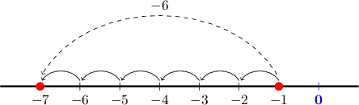
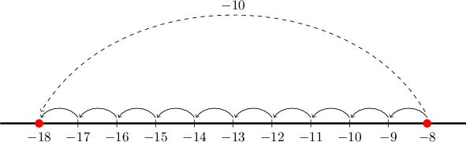

# Subtracting a Positive Number From a Negative Number

Source: https://www.mathacademy.com/topics/3720?courseId=99
Topic ID: 3720

## Prerequisites

- [Absolute Value](../grade-5/2281-absolute-value.md)

## Lesson

### Introduction

When we subtract a positive number from a negative number, we move towards the left on the number line.

For example, let's consider the following subtraction problem:

$$

-1 - 6

$$

To subtract $6$ from $-1,$ we start at $-1$ on the number line and move $6$ places to the left.

When we do this, we land at $-7.$ Therefore,

$$

-1-6 = -7.

$$

### Example: Subtracting a Positive Number From a Negative Number

#### Question

$-8-10=$

#### Explanation

To subtract $10$ from $-8$, we start at $-8$ on the number line and move $10$ places to the left.

### Larger Numbers

It is impractical to use number lines to subtract large numbers.

However, a neat trick makes subtracting a positive number from a negative number very easy!

As an example, let's consider the following subtraction problem:

$$

-37 - 52

$$

The answer will be *negative* since $-37$ is negative, and we're subtracting $52$ from it.

We start by solving an easier problem: adding their absolute values. In other words, we need to figure out

$$

37+52 .

$$

Carrying out the addition gives the following:

$$

\begin{aligned} & & & \\ & & \,\,\,\,3\,\,\,\, & \,\,\,\,7\,\,\,\, \\ \,\,\,\,+\,\,\,\, & & \,\,\,\,5\,\,\,\, & \,\,\,\,2\,\,\,\, \\ & & \,\,\,\,8\,\,\,\, & \,\,\,\,9\,\,\,\,\end{aligned}

$$

So, we have

$$

37+52 = 89.

$$

However, since our answer must be negative, we need to change the sign of the answer above.

Therefore, we conclude that

$$

-37 - 52 = -89.

$$

And that's it!

Let's use this technique to solve a problem with three-digit numbers.

### Example: Subtracting a Positive Number From a Negative Number With Larger Numbers

#### Question

$-212 - 108=$

#### Explanation

The answer will be negative since $-212$ is negative, and we're subtracting $108$ from it.

We start by solving an easier problem:

$$

212 + 108

$$

Next, we carry out the addition:

$$

\begin{aligned} & & & \,\,\,\,\,1\,\,\,\, & \\ & & \,\,\,\,2\,\,\,\, & \,\,\,\,1\,\,\,\, & \,\,\,\,2\,\,\,\, \\ \,\,\,\,+\,\,\,\, & & \,\,\,\,1\,\,\,\, & \,\,\,\,0\,\,\,\, & \,\,\,\,8\,\,\,\, \\ & & \,\,\,\,3\,\,\,\, & \,\,\,\,2\,\,\,\, & \,\,\,\,0\,\,\,\,\end{aligned}

$$

So, we have

$$

212 + 108 = 320.

$$

However, since our answer must be negative, we need to change the sign of the answer above.

Therefore, we conclude that

$$

-212 - 108 = -320.

$$
