# Measuring Quartiles and IQR From Dot Plots

Source: https://www.mathacademy.com/topics/3757?courseId=99
Topic ID: 3757

## Prerequisites

- [Range, Quartiles, and IQR](./2480-range-quartiles-and-iqr.md)
- [Measuring Centrality From Dot Plots](./2500-measuring-centrality-from-dot-plots.md)

## Lesson

### Introduction

We can compute a data set's lower and upper quartiles and interquartile range using its dot plot.

Let's compute the lower quartile of the data set with the following dot plot:

Notice that the number of data points ($9$) is odd. As a result,

- the median is the $5$th value in the data set, and

- we can separate the data into its lower and upper parts (both excluding the median) as illustrated below.

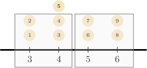

The lower quartile is the median of the lower part, so let's focus on that part only:

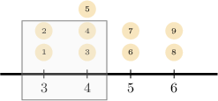

We now find the median of the lower part. Since the lower part has an even number of points, the lower quartile is the mean of the two middle numbers (the second and the third numbers in this case):

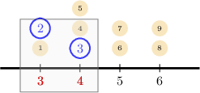

Therefore,

$$

\text{lower quartile} = \dfrac{{\color{red}3}+{\color{red}4}}{2} = \dfrac{7}{2} = 3.5.

$$

### Measuring Quartiles Using Dot Plots: Method II

We'll now consider an alternative method for computing the lower quartile that involves reconstructing the initial data set.

To demonstrate, let's consider the following dot plot once more.

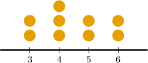

The dot plot represents the following data:

$$

3, \: 3, \: 4, \: 4, \: 4, \: 5, \: 5, \: 6, \: 6

$$

Since the number of data points is odd ($9$), the median of the data set is the middle number (the $\color{blue}5$th value). The lower part of the data contains everything below the median.

$$

\underbrace{3, \: 3, \: 4, \: 4,\:}_{\text{lower part}} {\color{blue}\,4\,}, \: 5, \: 5,\: 6, \: 6

$$

The lower quartile is the median of the lower part. In this case, it's the mean of the two middle numbers:

$$

3, \: {\color{red}{3}}, \: {\color{red}{4}}, \: 4

$$

So, the lower quartile is

$$

\textrm{lower quartile} = \dfrac{{\color{red}{3}} + {\color{red}{4}}}{2} = 3.5.

$$

Note that you can use either method to compute the median. However, the first is usually the fastest.

### Example: Finding a Quartile Given a Dot Plot: Odd Number of Data Points

#### Question

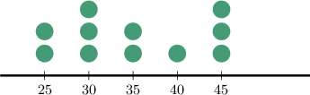

What is the upper quartile of the distribution represented by the dot plot above?

#### Explanation

****

Since we have an odd number of data points ($11$), the median of the data set is the middle number (i.e., the $\color{blue}6$th number). The upper part of the data contains everything above the median.

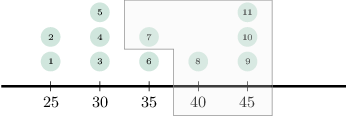

To compute the upper quartile, we find the median of the upper part. In this case, it's the middle number:

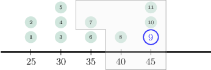

So, the upper quartile is ${\color{red}{45}}.$

****

The dot plot tells us the following:

- There are $\color{blue}2$ items corresponding to the number $25.$

- There are $\color{blue}3$ items corresponding to the number $30.$

- There are $\color{blue}2$ items corresponding to the number $35.$

- There is $\color{blue}1$ item corresponding to the number $40.$

- There are $\color{blue}3$ items corresponding to the number $45.$

So, we get the following data:

$$

25, \: 25, \: 30, \: 30, \: 30, \: 35, \: 35, \: 40, \: 45, \: 45, \: 45

$$

Since we have an odd number of data points ($11$), the median of the data set is the middle number (i.e., the $\color{blue}6$th number). The upper part of the data contains everything above the median.

$$

25, \: 25, \: 30, \: 30, \: 30, \: {\color{blue}35}, \: \underbrace{35, \: 40, \: 45, \: 45, \: 45}_{\text{upper part}}

$$

Now, we find the median of the upper part. In this case, it's the middle number:

$$

35, \: 40, \: {\color{red}\underline{45}}, \: 45, \: 45

$$

So, the upper quartile is ${\color{red}{45}}.$

### Example: Finding a Quartile Given a Dot Plot: Even Number of Data Points

#### Question

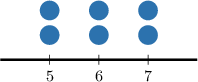

What is the upper quartile of the distribution represented by the dot plot above?

#### Explanation

****

Since we have an even number of data points ($6$), the median of the data set is the mean of the two middle numbers (i.e., the $\color{blue}3$rd and $\color{blue}4$th numbers). The upper part of the data contains the $4$th number and all numbers above it.

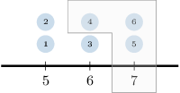

Now, we find the median of the upper part. In this case, it's just the middle number:

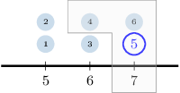

So, the upper quartile is ${\color{red}{7}}.$

****

The dot plot tells us the following:

- There are $\color{blue}2$ values equal to $5.$

- There are $\color{blue}2$ values equal to $6.$

- There are $\color{blue}2$ values equal to $7.$

So, we get the following data:

$$

5, \: 5, \: 6, \: 6, \: 7, \: 7

$$

Since we have an even number of data points ($6$), the median of the data set is the mean of the two middle numbers (i.e., the $\color{blue}3$rd and $\color{blue}4$th numbers). The upper part of the data contains the 4th number and all numbers above it.

$$

5, \: 5, \: 6, \: | \: \underbrace{6, \: 7, \: 7}_{\text{upper part}}

$$

Now, we find the median of the upper half. In this case, it's just the middle number:

$$

6, \: {\color{red}\underline{7}}, \: 7

$$

So, the upper quartile is ${\color{red}{7}}.$

### Example: Finding the Interquartile Range Given a Dot Plot

#### Question

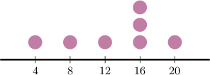

Find the interquartile range for the distribution represented by the dot plot above.

#### Explanation

****

Notice that the number of data points ($7$) is odd. As a result, we can separate the data into its lower and upper parts, as illustrated in the diagram below.

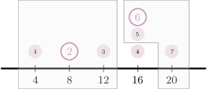

- The lower quartile is the median of the lower part. In this case, it's just the middle number. Therefore, as shown in the diagram on the left.

- The upper quartile is the median of the upper part. In this case, it's also the middle number. Therefore, as shown in the diagram on the right.

So, the interquartile range is

$$

\text{upper quartile} - \text{lower quartile} = 16 - 8 = 8.

$$

****

The dot plot represents the following data:

$$

4, \: 8, \: 12, \: 16, \: 16, \: 16, \: 20

$$

Since the number of data points is odd ($7$), the median of the data set is the middle number (the $\color{blue}4$th value).

Now, we find the quartiles.

- The lower part consists of every data point below the median:

- The lower quartile is the median of the lower half. In this case, it's just the middle number: Therefore,

- The upper part consists of every data point above the median: The upper quartile is the median of the upper part. In this case, it's also just the middle number: Therefore,

Finally, the interquartile range is

$$

\text{upper quartile} - \text{lower quartile} = 16 - 8 = 8.

$$
