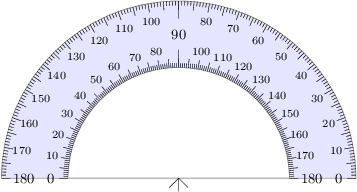
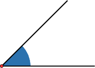
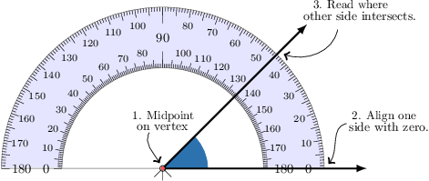
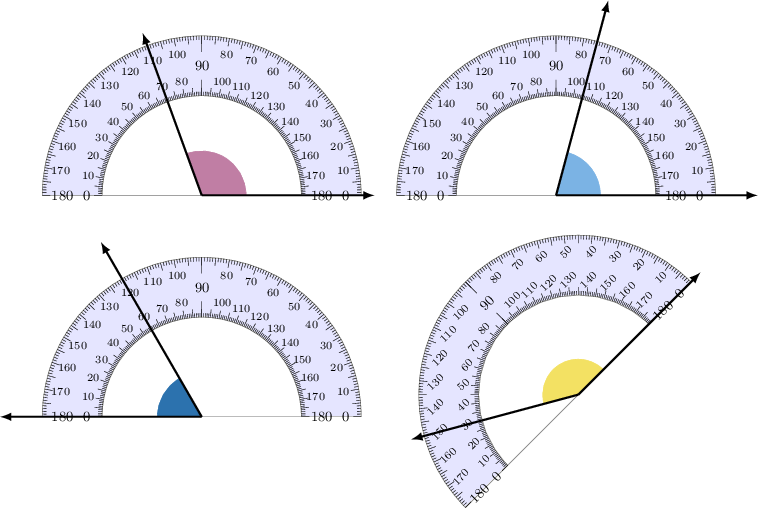
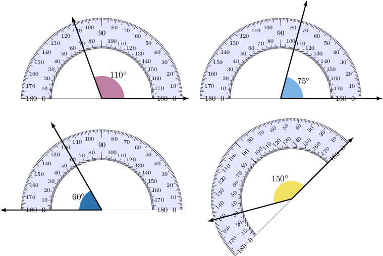
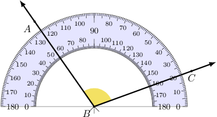
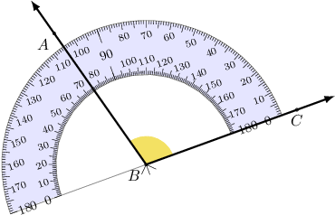

# Measuring Angles Using a Protractor

Source: https://www.mathacademy.com/topics/3980?courseId=99
Topic ID: 3980

## Prerequisites

- [Angles and Measures of Angles](./2172-angles-and-measures-of-angles.md)
- [Subtracting Two-Digit Numbers From Three-Digit Numbers](../grade-4/3906-subtracting-two-digit-numbers-from-three-digit-numbers.md)

## Lesson

### Introduction

We use a **protractor** to measure angles. A protractor is an instrument that looks as follows:

To find the measure of an angle using a protractor, we follow three steps:

1. Place the midpoint of the protractor on the vertex of the angle.

2. Align one side of the angle with the line passing through the midpoint and zero on the protractor.

3. Read off the degrees where the other side of the angle intersects the scale.

Let's measure the following angle using a protractor.

We place the midpoint of our protractor on the vertex and align a zero on the protractor with one of the sides.

Reading the protractor, we see that the angle measures $45^\circ.$

**Warning:** Protractors usually have two scales in opposite directions. Be careful which one you use. In this case, we used the *upper* scale because this is the one that starts from zero as we measure counterclockwise.

### Example: Measuring Angles Using a Protractor

#### Question

Determine the measure of the angles shown below.

#### Explanation

We will use a protractor to determine the measure of the angles.

To do this, we align one side of an angle with the zero mark (on the left or on the right side of the protractor) and read the degrees where the second side of the angle intersects the scale of numbers:

By doing this, we get the following angle measures.

### Example: Finding an Angle Measure by Taking a Difference

#### Question

Determine the measure of the angle $\angle ABC$ shown below.

#### Explanation

To find the angle, we can use either scale of the protractor.

- First, let's use the upper scale. The side $\overrightarrow{BA}$ of the angle intersects the upper scale at $125^\circ,$ and the other side $\overrightarrow{BC}$ intersects the upper scale at $20^\circ.$ To find the measure of $\angle ABC,$ we subtract the smaller reading from the larger one and get

- If we use the lower scale, we get the same result. The side $\overrightarrow{BA}$ of the angle intersects the lower scale at $55^\circ,$ and the other side $\overrightarrow{BC}$ intersects the lower scale at $160^\circ.$ Subtracting the smaller reading from the larger one, we get

We can check our result by rotating the protractor to align its zero with the side $\overrightarrow{BC},$ as shown below. This way, we can perform the usual process, taking only a single measurement. Indeed, we see that $m\angle ABC$ is equal to $105^\circ.$

