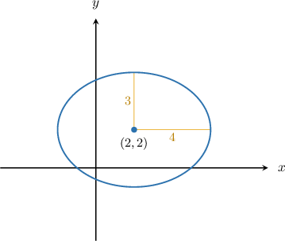
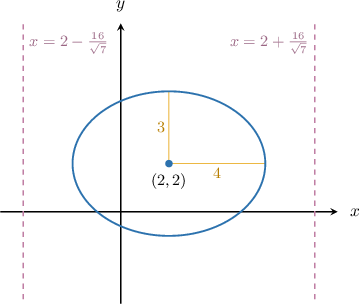
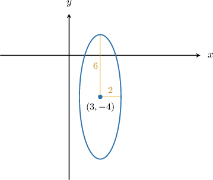
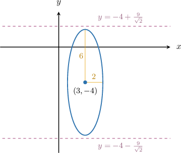
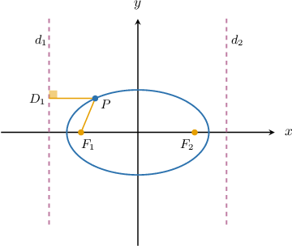

# Directrices of Ellipses

Source: https://www.mathacademy.com/topics/1028?courseId=43
Topic ID: 1028

## Prerequisites

- [Horizontal and Vertical Lines](../grade-8/97-horizontal-and-vertical-lines.md)
- [Vertices and Eccentricity of Ellipses](./1027-vertices-and-eccentricity-of-ellipses.md)

## Lesson

### Introduction

Every ellipse has a pair of parallel lines associated with it. These lines are the **directrices** of the ellipse. A single line by itself is a **directrix.**

A pair of directrices (along with some other information) uniquely defines an ellipse. We'll demonstrate how this works at the end of the lesson. But for now, let's get some practice at computing them.

The directrices of the *wide* ellipse

$$

\dfrac{(x - h)^2}{a^2} + \dfrac{(y - k)^2}{b^2} = 1, \qquad (a > b)

$$

are the two *vertical* parallel lines with equations

$$

x = h \pm \dfrac{a^2}{c},

$$

where $a$ is the semi-major axis and $c = \sqrt{|a^2 - b^2|}$ is the focal length.

For example, consider the wide ellipse below.

From the diagram, we see that the center of the ellipse is at

$$

(h,k) = (2,2),

$$

and the semi-major and semi-minor axes are $a = 4$ and $b = 3.$

Now, computing the focal length, we get

$$

\begin{aligned}𝑐 & =\sqrt{√|𝑎^{2}−𝑏^{2}|} \\ & =\sqrt{√|4^{2}−3^{2}|} \\ & =\sqrt{√7}.\end{aligned}

$$

Therefore, the equations of the directrices are as follows:

$$

\begin{aligned}𝑥 & =ℎ±\frac{𝑎^{2}}{𝑐} \\ 𝑥 & =2±\frac{4^{2}}{\sqrt{√7}} \\ 𝑥 & =2±\frac{16}{\sqrt{√7}}\end{aligned}

$$

The corresponding diagram is shown below.

Note that the directrices of an ellipse never intersect it.

### Example: Finding the Directrices of a Wide Ellipse

#### Question

Find the equations of directrices of the ellipse $\dfrac{(x-3)^2}{16} + \dfrac{(y-1)^2}{4} = 1.$

#### Explanation

For the ** ellipse

$$

\dfrac{(x-h)^2}{a^2} + \dfrac{(y-k)^2}{b^2} = 1, \qquad (a > b)

$$

the equations of the directrices are

$$

x = h \pm \dfrac{a^2}{c},

$$

where $a$ is the semi-major axis and $c = \sqrt{|a^2 - b^2|}$ is the focal length.

In our case, we have

$$

h = 3, \qquad k = 1, \qquad a^2 = 16, \qquad b^2 = 4.

$$

Now, computing the focal length, we get

$$

\begin{aligned}𝑐 & =\sqrt{√|𝑎^{2}−𝑏^{2}|} \\ & =\sqrt{√|16−4|} \\ & =\sqrt{√12} \\ & =2\sqrt{√3}.\end{aligned}

$$

Therefore, the equations of the directrices are the following:

$$

\begin{aligned}𝑥 & =ℎ±\frac{𝑎^{2}}{𝑐} \\ 𝑥 & =3±\frac{16}{2\sqrt{√3}} \\ 𝑥 & =3±\frac{8}{\sqrt{√3}}\end{aligned}

$$

### Directrices of Tall Ellipses

The directrices of the *tall* ellipse

$$

\dfrac{(x - h)^2}{a^2} + \dfrac{(y - k)^2}{b^2} = 1, \qquad (a < b)

$$

are the two *horizontal* parallel lines with equations

$$

y = k \pm \dfrac{b^2}{c},

$$

where $b$ is the semi-major axis and $c = \sqrt{|a^2 - b^2|}$ is the focal length.

For example, consider the tall ellipse below.

From the diagram, we see that the center of the ellipse is at

$$

(h,k) = (3,-4),

$$

and the semi-minor and semi-major axes are $a = 2$ and $b = 6.$

Now, computing the focal length, we get

$$

\begin{aligned}𝑐 & =\sqrt{√|𝑎^{2}−𝑏^{2}|} \\ & =\sqrt{√|2^{2}−6^{2}|} \\ & =\sqrt{√32} \\ & =4\sqrt{√2}.\end{aligned}

$$

Therefore, the equations of the directrices are the following:

$$

\begin{aligned}𝑦 & =𝑘±\frac{𝑏^{2}}{𝑐} \\ 𝑦 & =−4±\frac{6^{2}}{4\sqrt{√2}} \\ 𝑦 & =−4±\frac{36}{4\sqrt{√2}} \\ 𝑦 & =−4±\frac{9}{\sqrt{√2}}\end{aligned}

$$

The corresponding diagram is shown below:

### Example: Finding the Directrices of a Tall Ellipse

#### Question

Find the equations of directrices of the ellipse $\dfrac{(x-2)^2}{16}+\dfrac{(y-1)^2}{36}=1.$

#### Explanation

For the ** ellipse

$$

\dfrac{(x-h)^2}{a^2} + \dfrac{(y-k)^2}{b^2} = 1, \qquad (a < b)

$$

the equations of the directrices are

$$

y = k \pm \dfrac{b^2}{c},

$$

where $b$ is the semi-major axis and $c = \sqrt{|a^2 - b^2|}$ is the focal length.

In our case, we have

$$

h = 2, \qquad k = 1, \qquad a^2 = 16, \qquad b^2 = 36.

$$

Now, computing the focal length, we get

$$

\begin{aligned}𝑐 & =\sqrt{√|𝑎^{2}−𝑏^{2}|} \\ & =\sqrt{√|16−36|} \\ & =\sqrt{√20} \\ & =2\sqrt{√5}.\end{aligned}

$$

Therefore, the equations of the directrices are the following:

$$

\begin{aligned}𝑦 & =𝑘±\frac{𝑏^{2}}{𝑐} \\ 𝑦 & =1±\frac{36}{2\sqrt{√5}} \\ 𝑦 & =1±\frac{18}{\sqrt{√5}}\end{aligned}

$$

### Focus-Directrix Property of Ellipses

The directrices of an ellipse have one important property, the **focus-directrix** property:

*The ratio of the distance from any point on an ellipse to its focus and the distance from this point to the corresponding directrix equals the ellipse's eccentricity.*

Consider the point $P$ on the wide ellipse shown below, where $F_1$ and $F_2$ are the foci, and $d_1$ and $d_2$ are the directrices of the ellipse.

The focus-directrix property states that

$$

\dfrac {PF_1} {PD_1} = e

$$

where $e$ is the eccentricity of the ellipse. The same property holds for the second focus and its corresponding directrix.

An ellipse can be uniquely determined using the focus-directrix property:

*Let $F$ be a point (focus) and let $d$ be a straight line (directrix) that does not pass through the focus. Also, let $e$ be a real number such that $0 < e<1$ (eccentricity). Then, the corresponding ellipse is the set of points on the plane for which the ratio of the distances to the focus and the directrix equals the eccentricity:*

$$

𝑃

$$
