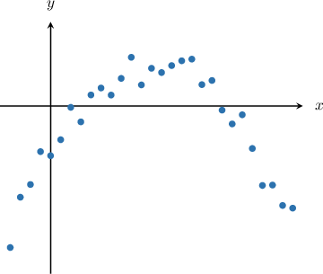
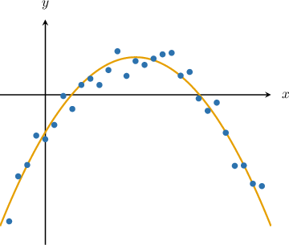
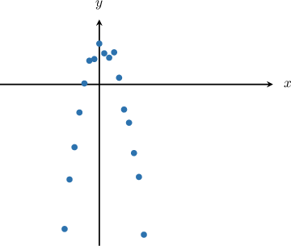
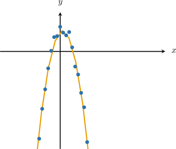
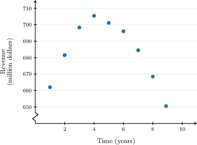
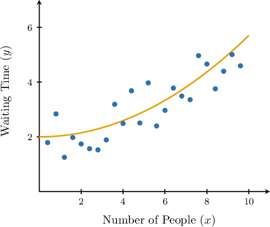
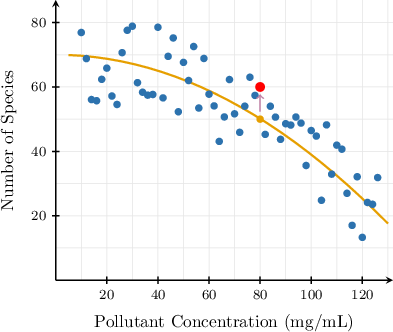

# Quadratic Regression

Source: https://www.mathacademy.com/topics/1058?courseId=43
Topic ID: 1058

## Prerequisites

- [The Axis of Symmetry of a Parabola](../algebra-i/704-the-axis-of-symmetry-of-a-parabola.md)
- [Residuals and Residual Plots](./3595-residuals-and-residual-plots.md)

## Lesson

### Introduction

Another type of regression sometimes encountered in statistics is **quadratic regression**. When a set of paired observations $(x,y)$ in a scatter plot appears to follow a parabola, the data can be approximated by a quadratic function.

The scatter plot below shows a relationship between two data sets of paired observations.

In this case, the paired observations seem to follow a parabola. Let's sketch our best fit quadratic regression curve:

Since the curve of best fit is parabolic, it must be of the form

$$

y = ax^2 + bx + c.

$$

Let's now deduce some information about the parameters $a, b,$ and $c$ from the graph:

- Since the parabola opens downward, we must have $a < 0.$

- The $y$-intercept of our parabola is negative. So, we must have $c \lt 0.$

### Example: Identifying a Possible Quadratic Curve of Best Fit

#### Question

The scatter plot above shows a relationship between two data sets of paired observations. Which of the following could be the corresponding best fit quadratic regression curve?

1. $y = -2.1x^2 + 0.7x - 1$

2. $y = -2.1x^2 + 0.7x + 1$

3. $y = 2.1x^2 + 0.7x + 1$

4. $y = 2.1x^2 - 0.7x - 1$

#### Explanation

Let's sketch our best fit quadratic regression curve:

Recall that a general parabola has the equation

$$

y = ax^2 + bx + c.

$$

Let's now examine our options in turn.

- We have a downward parabola. So, $a < 0.$ As a result, we can reject the following options:

- The $y$-intercept of our parabola is positive. So, we must have $c \gt 0.$ As a result, we also reject the following options:

Therefore, the correct answer is

$$

y = -2.1x^2 + 0.7x + 1.

$$

### Example: Identifying a Possible Quadratic Curve of Best Fit Using the Vertex Formula

#### Question

The scatterplot shows the relationship between two variables, $x$ (time) and $y$ (revenue). Of the following equations, which best models the data in the scatterplot?

1. $y=-2.28x^{2}+20.2x+652.76$

2. $y=2.28x^{2}+20.2x+652.76$

3. $y=-2.28x^{2}-20.2x+652.76$

4. $y=-2.28x^{2}+20.2x-652.76$

#### Explanation

We want to find the best model for the scatterplot data shown, in the quadratic form

$$

y = ax^2+bx+c,

$$

where $a,$ $b,$ and $c$ are constants, with $a \neq 0.$

- The data in the scatterplot appear to form a downward-opening parabola. Therefore, the leading coefficient $a$ must be negative.

- The points look symmetric about the line $x=4.$ Using the axis of symmetry formula $x=-\dfrac{b}{2a}$ and solving for $b,$ we get Since $a$ is negative, the coefficient of the linear term should be positive.

- The $y$-intercept of the quadratic model is near $(0,650).$

Therefore, of the given choices, only choice

$$

y = -2.28x^{2} + 20.2x+652.76

$$

is the best quadratic model for the data in the scatterplot.

### Example: Using Quadratic Regression To Predict the Output for a Given Observation

#### Question

The scatter plot above shows a relationship between the number of people in a particular cafeteria $(x)$ and the waiting time $(y),$ measured in minutes. The corresponding best fit quadratic model is given by

$$

y = \dfrac{1}{27} x^2+2.

$$

Estimate the waiting time if there are $9$ people in the cafeteria.

#### Explanation

To predict the waiting time when $9$ people are in the cafeteria, we need to substitute $x=9$ into the equation of the trend curve:

$$

\begin{aligned}𝑦 & =\frac{1}{27}𝑥^{2}+2 \\ & =\frac{1}{27}(9)^{2}+2 \\ & =3+2 \\ & =5\end{aligned}

$$

Therefore, the model predicts that the waiting time equals $5$ minutes when $9$ people are in the cafeteria.

### Example: Computing the Residual for a Data Point

#### Question

The scatter plot above shows a relationship between the concentration of a water pollutant ($x,$ measured in $\mathrm{mg/mL}$) and the number of animal species $(y)$ that live in some ponds in a particular region. The corresponding quadratic regression curve is also shown.

According to the regression model, what is the residual for the highlighted data point?

#### Explanation

The residual equals the difference between the actual value of the dependent variable and the value estimated using the regression model:

$$

\textrm{Residual} = \text{Actual} - \textrm{Estimated}

$$

The highlighted datapoint has coordinates $(80,60).$ So, our actual value is $y=60.$

On the other hand, the point on the regression curve that corresponds to $x=80$ has the $y$-coordinate $50.$ So, our estimated value is $\widehat{y}=50.$

As a result,

$$

\begin{aligned}Residual & =Actual−Estimated \\ & =𝑦−\overset{𝑦}{ˆ} \\ & =60−50 \\ & =10.\end{aligned}

$$

Therefore, the residual is $10$ animal species.
