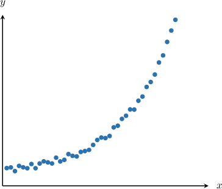
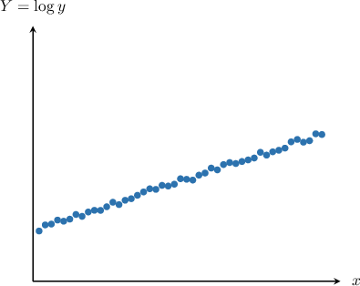
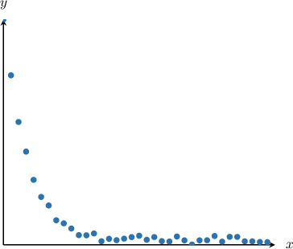
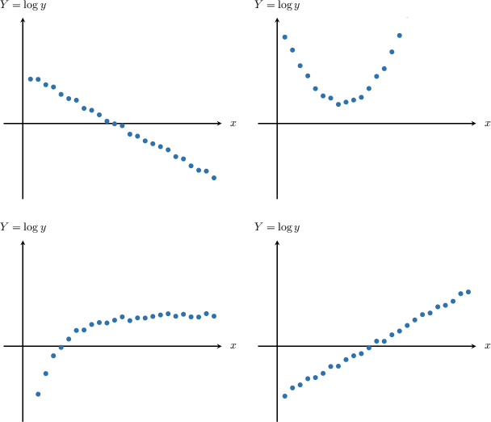
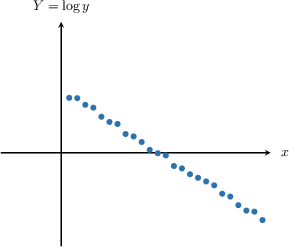
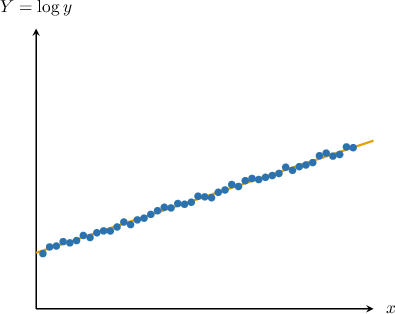
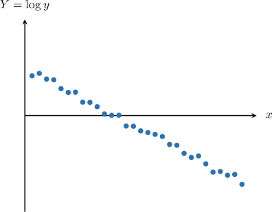

# Semi-Log Scatter Plots

Source: https://www.mathacademy.com/topics/1059?courseId=43
Topic ID: 1059

## Prerequisites

- [Selecting a Regression Model](../algebra-i/736-selecting-a-regression-model.md)
- [Solving Inequalities Involving Exponential Functions](./2857-solving-inequalities-involving-exponential-functions.md)
- [Solving Inequalities Involving Logarithmic Functions](./2858-solving-inequalities-involving-logarithmic-functions.md)

## Lesson

### Introduction

When analyzing data, we might have a data set of paired observations $(x_i, y_i)$ in which the $y$-values increase or decrease rapidly as the $x$-values increase. In these situations, we might be able to fit the data to an exponential curve.

Consider the set of paired values $(x_i, y_i),$ shown below.

This data set certainly looks like it follows an exponential trend, but how can we be sure?

If the data is exponential, then the points should be scattered along a curve of the form

$$

y=a b^x,

$$

where $a > 0$ (since the $y$-intercept of the trend-curve is positive) and $b > 1$ (since the $y$-values are increasing).

If we take the logarithm to base $10$ on both sides of this equation, we get

$$

\log(y) = \log(ab^x).

$$

Applying the product rule for logarithms, we get

$$

\log(y) = \log(a) + \log(b^x).

$$

We then apply the power rule, which yields

$$

\log(y) =\log(a) + x\cdot \log(b) \qquad\qquad(\ast)

$$

Now, we define

$$

Y = \log(y), \qquad A = \log{a}, \qquad B = \log{b}.

$$

With these definitions, equation $(\ast)$ becomes

$$

Y = A + Bx,

$$

which is a *linear* equation in the variables $x$ and $Y.$

The key takeaway here is the following:

*When a data set $(x_i, y_i)$ varies exponentially, the data set $(x_i, Y_i) = (x_i, \log(y_i))$ varies linearly.*

In this case, plotting $(x_i, Y_i)$ for all pairs in our data set gives the following graph.

This type of plot is called a **semi-log scatter plot**. Notice that the paired values $(x_i, Y_i)$ follow a linear trend, which confirms that $(x_i, y_i)$ follows an exponential trend.

### Example: Identifying a Semi-Log Scatter Plot Corresponding to an Exponential Model

#### Question

The scatter plot below represents a relationship of the form $y \approx a \cdot b^x$ between the amount of medicament $(y)$ in a person's body, in milligrams, and the number of hours $(x)$ since it was administered.

Which of the following could be the corresponding semi-log scatter plot?

#### Explanation

We have an exponential decay model of the form $y=a \cdot b^x,$ which means that $0 < b < 1.$

To get the corresponding semi-log plot, we apply $\log$ to both sides of $y = a \cdot b^x.$ This gives

$$

\begin{aligned}𝑦 & =𝑎⋅𝑏^{𝑥} \\ log⁡𝑦 & =log⁡(𝑎⋅𝑏^{𝑥}) \\ log⁡𝑦 & =log⁡𝑎+log⁡𝑏^{𝑥} \\ log⁡𝑦 & =log⁡𝑎+𝑥⋅log⁡𝑏 \\ 𝑌 & =𝐴+𝐵𝑥,\end{aligned}

$$

where

$$

Y=\log y,\qquad A=\log a,\qquad B=\log b.

$$

Now, since $0< b < 1,$ we obtain that $B=\log b < 0.$ Therefore, the line $Y = A+Bx$ must have a negative slope.

Among the given options, the only trend that represents a straight line with a negative slope is the following:

### Making Inferences From a Semi-Log Scatter Plot

Earlier, we found the following semi-log scatter plot for a data set that followed a trend of the form $y = ab^x.$

The trend line equation for our semi-log scatter plot is

$$

Y = A + Bx,

$$

where

$$

Y=\log y,\qquad A=\log a,\qquad B=\log b.

$$

From here, we can deduce the following about the constants $a$ and $b\mathbin{:}$

- Since the slope of the trend line is positive, we have $B > 0.$ Therefore, This confirms that $y = ab^x$ is an exponential growth curve.

- Since the $Y$-intercept of the trend line is positive, we have $A > 0.$ Therefore,

### Example: Identifying an Exponential Model Corresponding to a Semi-Log Scatter Plot

#### Question

The semi-log scatter plot below represents a relationship of the form $y \approx a \cdot b^x$ between the temperature $(y)$ of an oven, in Celsius degrees, and the number of minutes $(x)$ since the oven was turned off. Which of the following could be that relationship?

1. $y \approx 3 \cdot 4^x$

2. $y \approx 3 \cdot (0.4)^x$

3. $y \approx 0.3 \cdot 4^x$

#### Explanation

First, notice that the trend line $Y=A+Bx$ corresponding to the data in our semi-log scatter plot

- has a negative slope, meaning that $B < 0,$ and

- has a positive $Y$-intercept, meaning that $A >0.$

To get the corresponding semi-log plot for $y = a \cdot b^x$, we apply $\log$ to both sides of the equation and get

$$

\begin{aligned}𝑦 & =𝑎⋅𝑏^{𝑥} \\ log⁡𝑦 & =log⁡(𝑎⋅𝑏^{𝑥}) \\ log⁡𝑦 & =log⁡𝑎+log⁡𝑏^{𝑥} \\ log⁡𝑦 & =log⁡𝑎+𝑥⋅log⁡𝑏 \\ 𝑌 & =𝐴+𝐵𝑥,\end{aligned}

$$

where

$$

Y=\log y,\qquad A=\log a,\qquad B=\log b.

$$

As a result, we have

$$

\begin{aligned}𝐵 & <0 \\ log⁡𝑏 & <0 \\ 0<𝑏 & <1\end{aligned}

$$

and

$$

\begin{aligned}𝐴 & >0 \\ log⁡𝑎 & >0 \\ 𝑎 & >1.\end{aligned}

$$

Among the given options, the only exponential model that fits the description is

$$

y \approx 3 \cdot (0.4)^x.

$$
