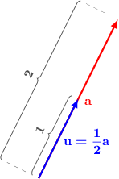
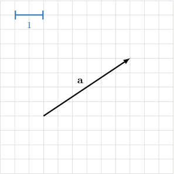
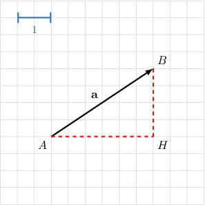
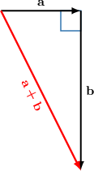

# Unit Vectors

Source: https://www.mathacademy.com/topics/1104?courseId=43
Topic ID: 1104

## Prerequisites

- [Parallel Vectors](./1103-parallel-vectors.md)

## Lesson

### Introduction

A **unit vector** is a vector whose magnitude is equal to $1.$

Given any vector $\mathbf a$, we can create a unit vector $\mathbf u$ by dividing $\mathbf a$ by its magnitude $|\, \mathbf{a} \,|,$ as follows:

$$

\mathbf{u} = \dfrac{ \mathbf{a} }{ |\,\mathbf{a}\,| }

$$

For example, if $|\,\mathbf{a}\,|=2,$ then the unit vector is

$$

\mathbf{u} = \dfrac{\mathbf{a}}{2} = \dfrac{1}{2} \mathbf{a}.

$$

### Example: Finding a Unit Vector Parallel to a Given Vector

#### Question

The vector $\mathbf{a}$ has magnitude $3.$ Find a unit vector that is parallel to $\mathbf{a}.$

#### Explanation

To obtain the unit vector that is parallel to $\mathbf{a},$ we divide $\mathbf{a}$ by its length:

$$

\mathbf{u}=\dfrac{\mathbf{a}}{|\,\mathbf{a}\,|}=\dfrac{1}{3}\mathbf{a}

$$

### Example: Finding a Unit Vector Parallel to a Given Vector in a Diagram

#### Question

Consider the picture shown above. Find a unit vector that is parallel to $\mathbf a.$

#### Explanation

In $\bigtriangleup AHB$ we have $\angle AHB = 90^\circ$, $AH=3$ and $BH=2$. So, the Pythagorean theorem gives

$$

\begin{aligned}𝐴𝐵 & =\sqrt{√𝐴𝐻^{2}+𝐵𝐻^{2}} \\ & =\sqrt{√3^{2}+2^{2}} \\ & =\sqrt{√9+4} \\ & =\sqrt{√13}.\end{aligned}

$$

Hence, the magnitude of $\mathbf{a}$ is $\sqrt{13}$. Consequently, the unit vector is

$$

\begin{aligned}𝐮 & =\frac{1}{|\,𝐚\,|}⋅𝐚 \\ & =\frac{1}{\sqrt{√13}}𝐚\end{aligned}

$$

### Example: Finding a Unit Vector Parallel to a Vector Sum

#### Question

The vector $\mathbf{a}$ is directed horizontally to the right and has magnitude $10,$ while the vector $\mathbf{b}$ is directed vertically down and has magnitude $20.$ Find a unit vector that is parallel to $\mathbf{a+b}.$

#### Explanation

First, we have to find $\mathbf{a+b}.$ According to the triangle law of addition, the resultant $\mathbf{a}+\mathbf{b}$ goes from the tail of $\mathbf{a}$ to the head of $\mathbf{b}\mathbin{:}$

To find the unit vector corresponding to $\mathbf{a+b},$ we have to divide by the magnitude:

$$

\begin{aligned}𝐮 & =\frac{𝐚+𝐛}{|𝐚+𝐛|}\end{aligned}

$$

To find the magnitude, first notice that we obtain a right triangle. So, we can use the Pythagorean theorem:

$$

\begin{aligned}|𝐚+𝐛|^{2} & =|𝐚|^{2}+|𝐛|^{2} \\ & =10^{2}+20^{2} \\ & =100+400 \\ & =500\end{aligned}

$$

Therefore, the magnitude is

$$

|\mathbf{a+b}|=\sqrt{500}=10\sqrt{5},

$$

and the corresponding unit vector is

$$

\begin{aligned}𝐮 & =\frac{𝐚+𝐛}{|𝐚+𝐛|} \\ & =\frac{1}{10\sqrt{√5}}(𝐚+𝐛).\end{aligned}

$$
