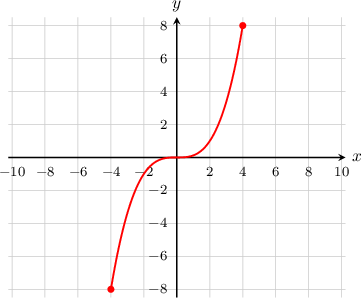

# Cartesian Equations of Parametric Curves

Source: https://www.mathacademy.com/topics/1255?courseId=43
Topic ID: 1255

## Prerequisites

- [Solving Radical Equations](../algebra-i/116-solving-radical-equations.md)
- [The Double-Angle Formula for Sine](./271-the-double-angle-formula-for-sine.md)
- [Solving Systems of Equations by Substitution](../grade-7/487-solving-systems-of-equations-by-substitution.md)
- [Graphing Curves Defined Parametrically](./803-graphing-curves-defined-parametrically.md)
- [The Double-Angle Formula for Cosine](./831-the-double-angle-formula-for-cosine.md)
- [Simplifying Trigonometric Expressions Using the Cotangent-Cosecant Identity](./1455-simplifying-trigonometric-expressions-using-the-cotangent-cosecant-identity.md)
- [Alternate Forms of the Secant-Tangent Identity](./3857-alternate-forms-of-the-secant-tangent-identity.md)

## Lesson

### Introduction

Given the parametric equations of a curve, we can find its Cartesian equation by eliminating the parameter.

For instance, consider the parametric curve given by

$$

x=2t, \,\,\, y=t^3, \quad -2 \leq t \leq 2.

$$

To find the Cartesian equation of the curve, we start with the $x$ equation and solve for $t\mathbin{:}$

$$

x=2t \quad \Rightarrow \quad t=\frac{x}{2}

$$

We now substitute this into our expression for $y\mathbin{:}$

$$

\begin{aligned}𝑦 & =𝑡^{3} \\ & =(\frac{𝑥}{2})^{3} \\ & =\frac{𝑥^{3}}{2^{3}} \\ & =\frac{𝑥^{3}}{8} \\ & =\frac{1}{8}𝑥^{3}\end{aligned}

$$

So the Cartesian equation of the curve is $y=\dfrac{1}{8}x^3.$

However, our parametric curve was subject to the constraint $-2\leq t \leq 2.$ Since $x=2t,$ the corresponding constraint for $x$ is $-4 \leq x \leq 4.$

So, the complete Cartesian equation is

$$

y=\dfrac{1}{8}x^3, \quad -4 \leq x \leq 4.

$$

The graph of this curve is shown below:

### Example: Finding the Cartesian Equation of a Curve Defined Parametrically

#### Question

Find the Cartesian equation of the curve defined parametrically by

$$

x=2t^2, \,\,\, y=t^2+1, \quad t \geq 0.

$$

#### Explanation

To find the Cartesian equation, we eliminate $t.$ First we use the $x$ equation to solve for $t^2\mathbin{:}$

$$

x=2t^2 \quad \Rightarrow\quad t^2 = \dfrac{x}{2}

$$

Now substituting $t^2=\dfrac{x}{2}$ into our expression for $y,$ we get

$$

\begin{aligned}𝑦 & =𝑡^{2}+1 \\ & =\frac{𝑥}{2}+1 \\ & =\frac{1}{2}𝑥+1.\end{aligned}

$$

So the Cartesian equation of the given curve is $y=\dfrac{1}{2}x+1.$

Finally, since $t \geq0$ and $x=2t^2,$ we must have $x \geq 0.$

So, the complete Cartesian equation is

$$

y=\dfrac{1}{2}x+1, \quad x \geq 0 .

$$

### Finding the Cartesian Equation of Curves Defined Parametrically With Trigonometric Functions

When parametric equations contain trigonometric equations, we can often eliminate the parameter using a trigonometric identity.

To demonstrate, consider the curve defined parametrically as

$$

x = \dfrac{1}{2}\cos t, \,\,\, y = \dfrac{1}{3}\sin t, \quad 0 \leq t\lt 2\pi

$$

For the sine and cosine functions, we have the following Pythagorean identity:

$$

\cos^2 t + \sin^2 t = 1

$$

First, let's make the trigonometric functions the subject of each equation:

$$

\begin{aligned}𝑥=\frac{1}{2}cos⁡𝑡\, & ⇒\,cos⁡𝑡=2𝑥 \\ 𝑦=\frac{1}{3}sin⁡𝑡\, & ⇒\,sin⁡𝑡=3𝑦\end{aligned}

$$

Substituting these values into the Pythagorean identity, we obtain

$$

\begin{aligned}(2𝑥)^{2}+(3𝑦)^{2} & =1 \\ 4𝑥^{2}+9𝑦^{2} & =1.\end{aligned}

$$

So, the Cartesian equation of the given curve is $4x^2 + 9y^2 = 1.$

### Example: Finding the Cartesian Equation of a Curve Defined Parametrically With Trigonometric Functions

#### Question

Find the Cartesian equation of the curve defined parametrically as

$$

x=\csc{t},\,\,\, y=2\cot{t}, \quad 0 < t < \dfrac{\pi}{2}.

$$

#### Explanation

First, let's make the trigonometric functions the subject of each equation:

$$

\begin{aligned}𝑥=csc⁡𝑡\, & ⇒\,csc⁡𝑡=𝑥 \\ 𝑦=2cot⁡𝑡\, & ⇒\,cot⁡𝑡=\frac{𝑦}{2}.\end{aligned}

$$

Dividing the Pythagorean identity $\sin^{2}{t}+\cos^{2}{t}=1$ by $\sin^{2}{t},$ we get

$$

\begin{aligned}\frac{sin^{2}⁡𝑡}{sin^{2}⁡𝑡}+\frac{cos^{2}⁡𝑡}{sin^{2}⁡𝑡} & =\frac{1}{sin^{2}⁡𝑡} \\ 1+(\frac{cos⁡𝑡}{sin⁡𝑡})^{2} & =(\frac{1}{sin⁡𝑡})^{2} \\ 1+cot^{2}⁡𝑡 & =csc^{2}⁡𝑡.\end{aligned}

$$

Substituting $\csc{t} = x$ and $\cot t =\dfrac{y}{2}$ into this formula, we get

$$

\begin{aligned}1+(\frac{𝑦}{2})^{2} & =𝑥^{2} \\ \frac{𝑦^{2}}{4} & =𝑥^{2}−1 \\ 𝑦^{2} & =4(𝑥^{2}−1).\end{aligned}

$$

So the Cartesian equation of the given curve is $y^2 = 4\left(x^2-1 \right).$

Finally, since $0 < t < \dfrac{\pi}{2}$ and $x=\csc t,$ the interval on the $x$-axis is $x \geq 1.$
