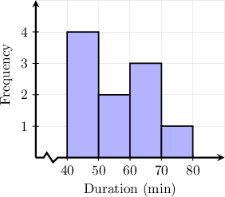

# Estimating Means and Variances For Grouped Data

Source: https://www.mathacademy.com/topics/126?courseId=43
Topic ID: 126

## Prerequisites

- [Midpoints](../grade-7/1463-midpoints.md)
- [Variance and Standard Deviation](./1632-variance-and-standard-deviation.md)
- [Histograms](../grade-6/2510-histograms.md)

## Lesson

### Introduction

In this lesson, we'll learn how to estimate the mean and variance of grouped data sets. We motivate the discussion by considering an example.

To measure member engagement, a librarian recorded the time $30$ library members spent reading in the reading room. They present their results as a frequency table, shown below:

Notice that the librarian has divided the reading time data into four **classes** with a frequency associated with each class. This frequency table gives the following information:

- $5$ members spent between $0$ minutes (inclusive) and $20$ minutes (exclusive) in the reading room.

- $10$ members spent between $20$ minutes (inclusive) and $40$ minutes (exclusive) in the reading room.

- $8$ members spent between $40$ minutes (inclusive) and $60$ minutes (exclusive) in the reading room.

- $7$ members spent between $60$ minutes (inclusive) and $80$ minutes (exclusive) in the reading room.

In this example and throughout this lesson, we'll assume the underlying data is *continuous.* This means that for any given class, the time can be any real number within that class.

For example, consider the first class:

$$

0 \leq x < 20

$$

Since the data is continuous, $x$ can assume *any* real number in this interval. In other words,

$$

x = 10.5\,\textrm{mins}, \qquad x = 2.14546\,\textrm{mins}, \qquad x = 3.141\,592\,654\ldots\,\textrm{mins},

$$

are all valid times.

### Estimating a Mean

We wish to find the mean time library members spend in the reading room.

Since we don't know exactly how long each member spent in the reading room, finding a precise answer for the mean is impossible. Therefore, the best we can do is *estimate* the mean.

To estimate the mean, we assume that the reading times within each class interval are uniformly distributed. Then, we estimate the mean time members of each class spent in the reading room. This is the same as calculating the *midpoint* of each class.

To find the midpoint of an interval we take the mean of the endpoints:

For example, we can find the midpoint of the first class which we'll denote as as follows:

Continuing this for the second, third, and fourth classes, we get the following table:

For notational convenience, we've denoted as the frequency associated with the th class.

Next, we wish to estimate the total time members in each class spent in the reading room. To do this, we multiply the midpoint of each class with the respective frequency:

Finally, to estimate the mean we sum the values in the last column (our estimate of the total time members spent in the reading room) and divide by (the total number of observations).

rounded to one decimal place.

Therefore, the mean time spent in the reading room is approximately minutes.

### A Summary of Mean Estimation for Continuous Grouped Data

Given a frequency table containing continuous data split into $K$ classes, the mean can be estimated as follows:

$$

\overline x \approx \dfrac{1}{n}\sum_{i=1}^K f_i \cdot m_{i}

$$

where

- $f_i$ is the frequency of the $i$th class,

- $m_i$ is the midpoint of the $i$th class, and

- $n$ is the total number of observations.

### Example: Estimating a Mean From Grouped Data

#### Question

A gym personal trainer recorded the duration of an exercise session for a group of gym visitors. The results are presented above in the form of a histogram. Assuming that the durations within each class interval are uniformly distributed, find an estimate of the mean duration of these exercise sessions.

#### Explanation

Given a frequency table containing continuous data split into classes, the mean can be estimated as follows: where

- is the frequency of the th class,

- is the midpoint of the th class, and

- is the total number of observations.

To estimate the mean, we add columns to our table for the midpoints of each class and the products of the midpoints and frequencies.

Finally, we sum the values in the last column and divide by (the total number of observations).

Therefore, the mean duration of these exercise sessions is approximately

### Estimating a Variance

If we have a data set that consists of the points $x_1, x_2, \ldots, x_n,$ then the variance, denoted by $\sigma^2,$ is defined as

$$

\sigma^2= \dfrac{1}{n} \sum\limits_{i=1}^n (x_i - \overline{x})^2,

$$

where $\overline{x}$ is the mean of the data set.

Given a frequency table containing continuous data split into $K$ classes, the variance can be estimated as follows:

$$

\sigma^2_n \approx \dfrac{1}{n}\sum_{i=1}^K f_i \cdot (m_{i} - \overline x)^2,

$$

where

- $f_i$ is the frequency of the $i$th class,

- $m_i$ is the midpoint of the $i$th class,

- $n$ is the total number of observations, and

- $\overline x$ is the mean.

When *estimating* a variance, we often divide by $n-1$ instead of $n$ (the reasons for this will be explained in future lessons). We write $\sigma_n^2$ here to avoid confusion about which denominator we're dividing by.

Also, note that if $\overline x$ is unknown, it must be estimated using the previously described method.

Let's see an example.

### A Worked Example

Let's once again consider the data collected by the librarian, shown below.

Earlier, we found that

$$

\overline{x}\approx 41.3333

$$

rounded to four decimal places. Also, we have $n=30$ observations, which equals the sum of the $f_i$ column.

Let's estimate the variance of this data set to one decimal place using the following formula:

$$

\sigma^2_n \approx \dfrac{1}{n}\sum_{i=1}^K f_i \cdot (m_{i} - \overline x)^2

$$

First, we calculate the deviations of each midpoint from the estimated mean, rounding to four decimal places.

Next, we square each deviation:

Then, we multiply each squared deviation by the respective frequency:

Finally, we sum the values in the last column and divide by $30$ (the total number of observations).

$$

\begin{aligned}𝜎_{2𝑛}^{} & ≈\frac{4908.8785+1284.4370+600.8936+5752.4579}{30} \\ & ≈418.2222 \\ & ≈418.2\end{aligned}

$$

rounded to one decimal place.

Finally, we can find an estimate of the standard deviation by taking the square root:

$$

\sigma_n \approx \sqrt{418.2222} \approx 20.5\,\textrm{mins}

$$

### Example: Estimating a Variance or Standard Deviation

#### Question

A retailer tracks the weekly sales of a popular product for several years. The number of units sold per week is recorded in the frequency table. Estimate the standard deviation of the sales data.

Assuming that the weekly sales within each class interval are uniformly distributed, the estimated sample mean weekly sale is units. Under these distributional assumptions, find an estimate for the standard deviation

#### Explanation

Given a frequency table containing continuous data split into classes, the variance can be estimated as follows: where

- is the frequency of the th class,

- is the midpoint of the th class,

- is the total number of observations, and

- is the mean.

To find the variance, we add columns to our table for the midpoints of each interval, the squared deviations of the midpoints from the mean, and the products of the squared deviations and frequencies.

Then, we divide the sum of all the values in the last column by the total number of observations:

Finally, the standard deviation is the square root of the variance:

Therefore, rounded to one decimal place, the standard deviation is
