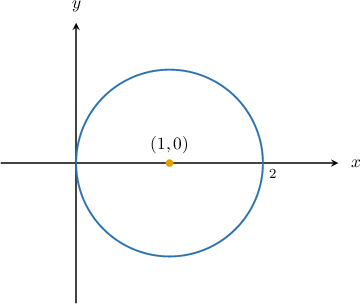
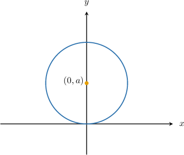
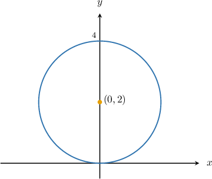
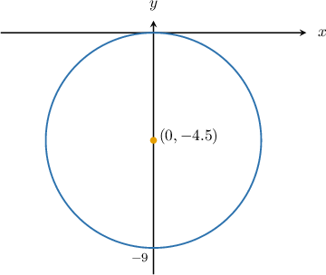
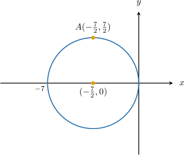
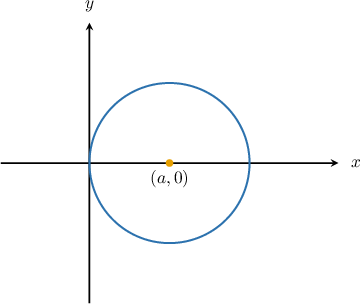
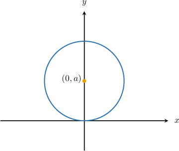

# Polar Equations of Circles Centered on the Coordinate Axes

Source: https://www.mathacademy.com/topics/1270?courseId=43
Topic ID: 1270

## Prerequisites

- [Polar Equations of Circles Centered at the Origin](./937-polar-equations-of-circles-centered-at-the-origin.md)

## Lesson

### Introduction

When a circle is not centered at the origin, we can still write its equation in polar form. In fact, the polar equation of a circle is particularly straightforward when it passes through the origin and its center lies on the $x$-axis.

For example, let $a$ be some nonzero real number, and consider a circle of radius $|a|$ with center at the point $(a,0)$.

With a little bit of geometry and trigonometry, it turns out that the equation of this circle in polar form is given by

$$

r=2a\cos\theta.

$$

We'll derive this result at the end of the lesson.

So, for instance, if $a=2$, then we have a circle of radius $2$ centered at $(2,0),$ and its polar equation is

$$

r= 4 \cos\theta.

$$

Similarly, if $a=-2,$ then we have a circle of radius $|{-2}| = 2$ centered at $(-2,0),$ and its polar equation is

$$

r= -4 \cos\theta.

$$

### Example: The Polar Equation of a Circle Centered on the X-Axis

#### Question

Plot the curve defined by the equation $r=2\cos\theta$ in polar coordinates.

#### Explanation

The polar equation $r=2a\cos\theta$ defines a circle of radius $|a|$ centered at the point $(a,0).$

In our case, we have $r=2\cos\theta,$ and therefore

$$

a = \dfrac{2}{2} = 1.

$$

Therefore, the equation $r=2\cos\theta$ gives a circle of radius $\left|1\right| = 1$ centered at the point $(1,0),$ as shown below.

### The Polar Equation of a Circle Centered on the Y-Axis

Now, let $a$ be some nonzero real number, and let's consider a circle of radius $|a|$ whose center is at the point $(0,a).$

Notice that this circle passes through the origin, and its center lies on the $y$-axis.

Again, using some geometry and trigonometry, it's possible to show that the polar equation of the circle is

$$

r=2a \sin \theta.

$$

We'll derive this result at the end of the lesson.

So, for instance, if $a=2,$ then we have a circle of radius $2$ centered at $(0,2),$ and its polar equation is

$$

r=4 \sin \theta.

$$

Similarly, if $a=-3$, then we have a circle of radius $|{-3}| = 3$ centered at $(0,-3),$ and its polar equation is

$$

r=-6 \sin \theta.

$$

### Example: The Polar Equation of a Circle Centered on the Y-Axis

#### Question

Plot the curve defined by the equation $r=4\sin\theta$ in polar coordinates.

#### Explanation

The polar equation $r=2a\sin\theta$ defines a circle of radius $|a|$ centered at the point $(0,a).$

In our case, we have $r=4\sin\theta,$ and therefore

$$

a = \dfrac{4}{2} = 2.

$$

Therefore, the equation $r=4\sin\theta$ gives a circle of radius $\left|2\right| = 2$ centered at the point $(0,2),$ as shown below.

### Example: Finding the Polar Equation of a Circle Given Its Graph

#### Question

What is the polar equation of the curve shown below?

#### Explanation

The diagram shows a circle of radius $|a| = |-4.5|=4.5$ centered at the point $(0,-4.5).$

In polar coordinates, the equation of such a circle is given by

$$

\begin{aligned}𝑟 & =2𝑎sin⁡𝜃 \\ & =2⋅(−4.5)⋅sin⁡𝜃 \\ & =−9sin⁡𝜃.\end{aligned}

$$

### Example: Finding the Polar Equation of a Circle Given a Point on the Circumference

#### Question

The polar curve $r=k\cos\theta,$ where $k$ is a constant, passes through the point $A$ with Cartesian coordinates $\left(-\dfrac72,\dfrac72\right).$ What is the value of $k?$

#### Explanation

First, we find the polar coordinates of the point $A.$ The distance from $A$ to the origin is

$$

\begin{aligned}𝑟 & =\sqrt{√𝑥^{2}+𝑦^{2}} \\ & =\sqrt{√(−\frac{7}{2})^{2}+(\frac{7}{2})^{2}} \\ & =\sqrt{√2(\frac{7}{2})^{2}} \\ & =\frac{7\sqrt{√2}}{2}.\end{aligned}

$$

Now, since $A$ lies in the second quadrant, we get

$$

\begin{aligned}𝜃 & =𝜋−arctan⁡\frac{𝑦}{𝑥} \\ & =𝜋−arctan⁡−\frac{(\frac{7}{2})}{2} \\ & =𝜋−\frac{𝜋}{4} \\ & =\frac{3𝜋}{4}.\end{aligned}

$$

So, the polar coordinates of $A$ are $\left(r, \theta\right)=\left(\dfrac{7\sqrt{2}}{2}, \dfrac{3\pi}{4}\right).$

To find the value of $k$, we substitute the polar coordinates of the point $A$ into the polar equation of the curve:

$$

\begin{aligned}𝑟 & =𝑘cos⁡𝜃 \\ \frac{7\sqrt{√2}}{2} & =𝑘cos⁡(\frac{3𝜋}{4}) \\ \frac{7\sqrt{√2}}{2} & =𝑘(−\frac{\sqrt{√2}}{2}) \\ 𝑘 & =−7\end{aligned}

$$

Therefore, the equation of the curve is $r=-7\cos\theta,$ as shown below.

### Deriving the Polar Equation of a Circle Centered at (a,0)

Suppose we want to derive the polar equation of a circle with

- center at $(a, 0)$, where $a \ne 0$, and

- radius $|a|$, so that it passes through the origin.

Let a point $P$ on the circle have polar coordinates $(r, \theta)$. Then, the Cartesian coordinates of $P$ are

$$

(x, y) = (r\cos\theta, \, r\sin\theta).

$$

The distance from $P$ to the center $(a, 0)$ is equal to the radius $|a|.$ We can describe this using the distance formula:

$$

\sqrt{(r\cos\theta - a)^2 + (r\sin\theta)^2} = |a|

$$

Squaring both sides, we get

$$

(r\cos\theta - a)^2 + (r\sin\theta)^2 = a^2.

$$

Expanding both terms yields

$$

r^2\cos^2\theta - 2ar\cos\theta + a^2 + r^2\sin^2\theta = a^2.

$$

Then, we combine like terms:

$$

r^2(\cos^2\theta + \sin^2\theta) - 2ar\cos\theta + a^2 = a^2

$$

Since $\cos^2\theta + \sin^2\theta = 1$, we can simplify the above as follows:

$$

r^2 - 2ar\cos\theta + a^2 = a^2

$$

Subtracting $a^2$ from both sides gives

$$

r^2 - 2ar\cos\theta = 0.

$$

Then, we factor our equation:

$$

r(r - 2a\cos\theta) = 0

$$

So, either $r = 0$ (which corresponds to the origin, already on the circle), or

$$

r = 2a\cos\theta,

$$

which is the desired polar equation of the circle.

### Deriving the Polar Equation of a Circle Centered at (0,a)

Suppose we want to derive the polar equation of a circle with

- center at $(0, a)$, where $a \ne 0$, and

- radius $|a|$, so that it passes through the origin.

Let a point $P$ on the circle have polar coordinates $(r, \theta)$. Then, the Cartesian coordinates of $P$ are

$$

(x, y) = (r\cos\theta, \, r\sin\theta).

$$

The distance from $P$ to the center $(0, a)$ is equal to the radius $|a|.$ We can describe this using the distance formula:

$$

\sqrt{(r\cos\theta - 0)^2 + (r\sin\theta - a)^2} = |a|

$$

Squaring both sides, we get

$$

(r\cos\theta)^2 + (r\sin\theta - a)^2 = a^2.

$$

Expanding both terms yields

$$

r^2\cos^2\theta + r^2\sin^2\theta - 2ar\sin\theta + a^2 = a^2.

$$

Then, we combine like terms:

$$

r^2(\cos^2\theta + \sin^2\theta) - 2ar\sin\theta + a^2 = a^2

$$

Since $\cos^2\theta + \sin^2\theta = 1$, we simplify:

$$

r^2 - 2ar\sin\theta + a^2 = a^2

$$

Subtracting $a^2$ from both sides gives

$$

r^2 - 2ar\sin\theta = 0.

$$

Then, we factor our equation:

$$

r(r - 2a\sin\theta) = 0

$$

So, either $r = 0$ (which corresponds to the origin, already on the circle), or

$$

r = 2a\sin\theta,

$$

which is the desired polar equation of the circle.
