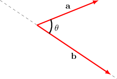
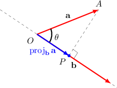
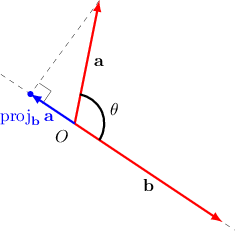
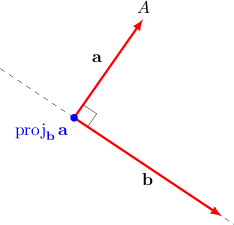

# Calculating a Vector Projection

Source: https://www.mathacademy.com/topics/1295?courseId=43
Topic ID: 1295

## Prerequisites

- [Calculating a Scalar Projection](./1285-calculating-a-scalar-projection.md)

## Lesson

### Introduction

The **vector projection** of a vector $\mathbf{a}$ onto another vector $\mathbf{b}$ is the portion that the vector $\mathbf{a}$ extends along $\mathbf{b}.$

For example, consider two vectors $\mathbf{a}$ and $\mathbf{b}$ shown below. Suppose we know that $|\mathbf{a}|=2,$ $|\mathbf{b}|=3,$ and the angle between the vectors is $\theta = \dfrac{\pi}{4}.$

The starting point of the vector projection is $O,$ and the ending point will be the point $P$ that lies on the line containing $\mathbf{b}$ with $AP \perp \mathbf{b},$ as shown below.

The vector $\overrightarrow{OP}$ is called the **vector projection** of $\mathbf{a}$ onto $\mathbf{b}.$ It is denoted as $\text{proj}_{\mathbf{b}}\,\mathbf{a},$ and it is computed as

$$

\begin{aligned}proj_{𝐛}\,𝐚 & =𝑂𝑃⋅𝐮 \\ & =comp_{𝐛}\,𝐚⋅𝐮\end{aligned}

$$

where $\text{comp}_{\mathbf{b}}\,\mathbf{a} = |\,\mathbf{a}\,| \cos\theta$ is the scalar projection of $\mathbf{a}$ onto $\mathbf{b}$ and $\mathbf{u}$ is a unit vector in the direction of $\mathbf{b}.$

First, we compute the scalar projection:

$$

\begin{aligned}comp_{𝐛}\,𝐚 & =|\,𝐚\,|cos⁡𝜃 \\ & =2cos⁡(\frac{𝜋}{4}) \\ & =\sqrt{√2}\end{aligned}

$$

Then, we compute the unit vector that is parallel to $\mathbf{b}\mathbin{:}$

$$

\mathbf{u} = \dfrac{\mathbf{b}}{|\,\mathbf{b}\,|} = \dfrac{\mathbf{b}}{3} = \dfrac{1}{3} \mathbf{b}

$$

Therefore, the vector projection of $\mathbf{a}$ onto $\mathbf{b}$ is

$$

\begin{aligned}proj_{𝐛}\,𝐚 & =comp_{𝐛}\,𝐚⋅𝐮 \\ & =\sqrt{√2}⋅\frac{1}{3}𝐛 \\ & =\frac{\sqrt{√2}}{3}𝐛.\end{aligned}

$$

### The Direction of the Projection Vector

When finding the projection of $\mathbf{a}$ onto $\mathbf{b},$ we sometimes find that the resulting projection vector points in the opposite direction to $\mathbf{b}.$ This happens when the vector $\mathbf{a}$ extends in the direction opposite to that of $\mathbf{b}.$

Consider two vectors $\mathbf{a}$ and $\mathbf{b},$ where it is known that

$$

|\,\mathbf{a}\,|=2,\qquad |\,\mathbf{b}\,|=3,\qquad \theta = 135^\circ.

$$

Let's calculate $\textrm{proj}_{\mathbf{b}}\,\mathbf{a}.$

First, notice that the angle between $\mathbf a$ and $\mathbf b$ is obtuse. This means we expect the projection vector to point in the opposite direction to that of $\mathbf b.$

Next, we compute the scalar projection:

$$

\begin{aligned}comp_{𝐛}\,𝐚 & =|\,𝐚\,|cos⁡𝜃 \\ & =2cos⁡(135^{∘}) \\ & =2⋅(−\frac{\sqrt{√2}}{2}) \\ & =−\sqrt{√2}\end{aligned}

$$

Notice that the scalar projection is negative.

Then, we find the unit vector that is parallel to $\mathbf{b}\mathbin{:}$

$$

\mathbf{u} = \dfrac{\mathbf{b}}{|\,\mathbf{b}\,|} = \dfrac{\mathbf{b}}{3} = \dfrac{1}{3} \mathbf{b}

$$

Therefore, the vector projection of $\mathbf{a}$ onto $\mathbf{b}$ is

$$

\begin{aligned}proj_{𝐛}\,𝐚 & =comp_{𝐛}\,𝐚⋅𝐮 \\ & =−\sqrt{√2}⋅\frac{1}{3}𝐛 \\ & =−\frac{\sqrt{√2}}{3}𝐛.\end{aligned}

$$

This vector points in the direction opposite to $\mathbf{b},$ as expected.

### Example: Calculating a Vector Projection Using Angle and Magnitude

#### Question

Suppose that $|\,\mathbf{a}\,|=8,|\,\mathbf{b}\,|=4$ and that the angle between the vectors is $\theta = \dfrac{5\pi}{6}.$ Find the vector projection of $\mathbf{a}$ onto $\mathbf{b}$ in terms of the vector $\mathbf{b}.$

#### Explanation

First, we find the scalar projection as follows:

$$

\begin{aligned}comp_{𝐛}\,𝐚 & =|\,𝐚\,|cos⁡𝜃 \\ & =8cos⁡(\frac{5𝜋}{6}) \\ & =8⋅(−\frac{\sqrt{√3}}{2}) \\ & =−4\sqrt{√3}\end{aligned}

$$

Now, we find the unit vector that is parallel to $\mathbf{b}\mathbin{:}$

$$

\mathbf{u} = \dfrac{\mathbf{b}}{|\,\mathbf{b}\,|} = \dfrac{\mathbf{b}}{4} = \dfrac{1}{4} \mathbf{b}

$$

Finally, we compute the vector projection as follows:

$$

\begin{aligned}proj_{𝐛}\,𝐚 & =comp_{𝐛}\,𝐚⋅𝐮 \\ & =−4\sqrt{√3}⋅\frac{1}{4}𝐛 \\ & =−\sqrt{√3}𝐛\end{aligned}

$$

### A General Formula

We have been using the following formula for the vector projection of $\mathbf{a}$ onto $\mathbf{b}\mathbin{:}$

$$

\text{proj}_{\mathbf{b}}\,\mathbf{a} =\text{comp}_{\mathbf{b}}\,\mathbf{a} \cdot \mathbf{u}

$$

However, we can write an alternative formula using the formula for the scalar projection:

$$

\begin{aligned}comp_{𝐛}\,𝐚 & =\frac{𝐚⋅𝐛}{|\,𝐛\,|}.\end{aligned}

$$

Substituting the above into the original formula for the vector projection, and also substituting $\mathbf{u} = \dfrac{\mathbf{b}}{| \, \mathbf{b} \, |},$ we get

$$

\begin{aligned}proj_{𝐛}\,𝐚 & =\frac{𝐚⋅𝐛}{|\,𝐛\,|}⋅\frac{𝐛}{|\,𝐛\,|} \\ & =\frac{𝐚⋅𝐛}{|\,𝐛\,|^{2}}𝐛 \\ & =\frac{𝐚⋅𝐛}{𝐛⋅𝐛}𝐛.\end{aligned}

$$

Therefore, another general formula for the vector projection of $\mathbf{a}$ onto $\mathbf{b}$ is

$$

\begin{aligned}proj_{𝐛}\,𝐚 & =\frac{𝐚⋅𝐛}{𝐛⋅𝐛}𝐛.\end{aligned}

$$

### Example: Calculating a Vector Projection Using Components

#### Question

Let $\mathbf{a}=\langle 1,-3,5 \rangle$ and $\mathbf{b}=\langle 5,-4,0 \rangle$. Find the vector projection of $\mathbf{a}$ onto $\mathbf{b}$.

#### Explanation

Using the formula for the vector projection, we obtain

$$

\begin{aligned}proj_{𝐛}\,𝐚 & =\frac{𝐚⋅𝐛}{𝐛⋅𝐛}𝐛 \\ & =\frac{𝑎_{𝑥}𝑏_{𝑥}+𝑎_{𝑦}𝑏_{𝑦}+𝑎_{𝑧}𝑏_{𝑧}}{𝑏_{2𝑥}^{}+𝑏_{2𝑦}^{}+𝑏_{2𝑧}^{}}𝐛 \\ & =\frac{1⋅5+(−3)⋅(−4)+5⋅0}{5^{2}+(−4)^{2}+0^{2}}𝐛 \\ & =\frac{17}{41}⟨5,−4,0⟩ \\ & =⟨\frac{85}{41},−\frac{68}{41},0⟩.\end{aligned}

$$

### Projecting Perpendicular Vectors

Notice that if two vectors $\mathbf{a}$ and $\mathbf{b}$ are perpendicular, then by projecting $\mathbf{a}$ onto $\mathbf{b}$ (or $\mathbf{b}$ onto $\mathbf{a}$), we obtain the zero vector.

For example, the projection of $\mathbf{a}$ onto a perpendicular vector $\mathbf{b}$ looks as follows:

Furthermore, we have the following fact:

*If $\mathbf{a}$ is a nonzero vector, its projection onto another nonzero vector $\mathbf{b}$ equals the zero vector if and only if the vectors are perpendicular.*

### Example: Perpendicular Vectors

#### Question

Let $\begin{aligned}1 \\ 0 \\ 1\end{aligned}$ and $\begin{aligned}1 \\ 5 \\ −1\end{aligned}$. Find the vector projection of $\mathbf{a}$ onto $\mathbf{b}$.

#### Explanation

Using the formula for the vector projection, we obtain

$$

\begin{aligned}proj_{𝐛}\,𝐚 & =\frac{𝐚⋅𝐛}{𝐛⋅𝐛}𝐛 \\ & =\frac{𝑎_{𝑥}𝑏_{𝑥}+𝑎_{𝑦}𝑏_{𝑦}+𝑎_{𝑧}𝑏_{𝑧}}{𝑏_{2𝑥}^{}+𝑏_{2𝑦}^{}+𝑏_{2𝑧}^{}}𝐛 \\ & =\frac{1⋅1+0⋅5+1⋅(−1)}{1^{2}+5^{2}+(−1)^{2}}𝐛 \\ & =\frac{0}{1^{2}+5^{2}+(−1)^{2}}𝐛 \\ & =⟨0,0,0⟩.\end{aligned}

$$
