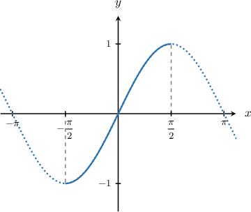
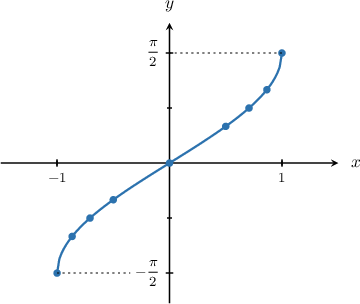
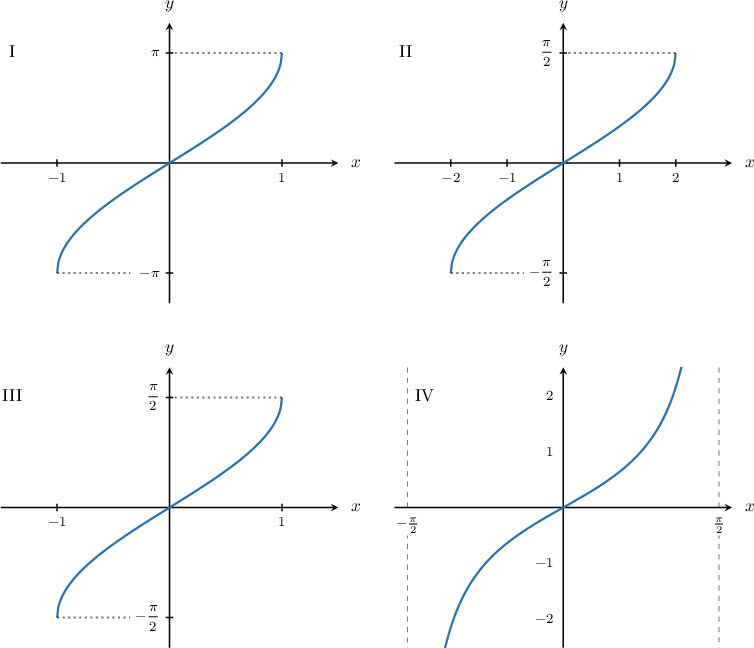

# Graphing the Inverse Sine Function

Source: https://www.mathacademy.com/topics/1483?courseId=43
Topic ID: 1483

## Prerequisites

- [Graphing Sine and Cosine](../algebra-ii/1491-graphing-sine-and-cosine.md)
- [Invertible Functions](../algebra-ii/1889-invertible-functions.md)
- [Domain and Range of Inverse Functions](../algebra-ii/3734-domain-and-range-of-inverse-functions.md)

## Lesson

### Introduction

How do we plot the graph of $y=\arcsin x?$ As usual, we can use a table of known values.

In order to determine these known values, let's first look at the graph of the sine function.

The sine function is a one-to-one function on the interval $x\in\left[-\dfrac \pi 2, \dfrac \pi 2\right].$ So if we restrict the domain to this interval, we can define the inverse function $y=\arcsin x.$

Remember that the inverse swaps the domain and range of the original function. So the domain of $y=\arcsin x$ is $x\in[-1,1],$ while the range is $y \in\left[-\dfrac \pi 2, \dfrac \pi 2\right].$ In the domain, we create a table of values:

Using this table, we can now plot the graph of $y=\arcsin x\mathbin{:}$

Some key characteristics of the graph are:

- The domain of the function is $x\in [-1, 1].$

- The range of the function is $y\in\left[-\dfrac{\pi}2, \dfrac{\pi}2\right].$

- The minimum value occurs at $x=-1.$

- The maximum value occurs at $x=1.$

- The zero occurs at $x=0.$

- The function is strictly increasing on its entire domain.

### Example: Graphing the Inverse Sine Function

#### Question

Which of the following plots is the graph of $y=\arcsin x?$

#### Explanation

Let's recall some of the basic properties of $y=\arcsin x\mathbin{:}$

- The domain of the function is $x\in [-1, 1].$

- The range of the function is $y\in\left[-\dfrac{\pi}2, \dfrac{\pi}2\right].$

- The minimum value occurs at $x=-1.$

- The maximum value occurs at $x=1.$

- The zero occurs at $x=0.$

- The function is strictly increasing on its entire domain.

Of the given functions, the only one that has all of these properties is III.

### Example: Identifying Values in the Domain of the Inverse Sine Function

#### Question

Which of the following values is in the domain of $y=\arcsin x?$

1. $-3$

2. $0$

3. $2$

#### Explanation

Let's recall the graph of $y=\arcsin x.$

Note that the domain of the function is $x=\left[-1, 1\right].$

Therefore, the value $x=0$ lies in the domain of the $y=\arcsin x,$ while the values $x=-3$ and $x=2$ do not.

### Example: Identifying Values in the Range of the Inverse Sine Function

#### Question

Which of the following values is in the range of $y=\arcsin x?$

1. $\dfrac \pi 2$

2. $\pi$

3. $-2$

#### Explanation

Let's recall the graph of $y=\arcsin x.$

Note that the range of the function is $y\in\left[-\dfrac\pi 2, \dfrac\pi 2\right].$

Therefore, the value $y=\dfrac\pi 2$ lies in the range of $y=\arcsin x,$ while the values $x=\pi$ and $x=-2$ do not.

### Example: Determining Points that Lie on the Curve of the Inverse Sine Function

#### Question

Which of the following points lies on the graph of the function $y=\arcsin x?$

1. $\left(\dfrac 1 2,\dfrac {\pi}{2}\right)$

2. $\left(0,\pi\right)$

3. $\left(\dfrac{\sqrt 2}{2},\dfrac{\pi}{4}\right)$

#### Explanation

In order for a point $(a,b)$ to lie on the graph of the function $y=\arcsin x,$ the following conditions must hold:

- The reflected point $(b,a)$ must lie on the graph of $y=\sin x,$ meaning $a=\sin b.$

- The $y$-value of the point must lie in the range of $y=\arcsin x,$ which is $y\in \left[-\dfrac{\pi}{2},\dfrac{\pi}{2}\right].$

With this in mind, let's check each of the points.

- First, we consider the point $\left(\dfrac{1}{2},\dfrac{\pi}{2}\right).$ We note the following: The point $\left(\dfrac{\pi}{2},\dfrac{1}{2}\right)$ does **** lie on the graph of $y=\sin x.$ $\quad{\color{red}{\times}}$ Therefore, the point $\left(\dfrac{1}{2},\dfrac{\pi}{2}\right)$ does **** lie on the graph of $y=\arcsin x.$

- Next, we consider the point $\left(0,\pi \right).$ We note the following: The point $\left(\pi,0\right)$ lies on the graph of $y=\sin x.\quad{\color{green}{\checkmark}}$ The range of $y=\arcsin x$ is $y\in \left[-\dfrac{\pi}{2},\dfrac{\pi}{2}\right],$ and $y=\pi$ does **** lie within this range. $\quad{\color{red}{\times}}$ Therefore, the point $\left(0,\pi\right)$ does **** lie on the graph of $y=\arcsin x.$

- Finally, we consider the point $\left(\dfrac{\sqrt 2}{2},\dfrac{\pi}{4}\right).$ We note the following: The point $\left(\dfrac{\pi}{4},\dfrac{\sqrt 2}{2}\right)$ lies on the graph of $y=\sin x.\quad{\color{green}{\checkmark}}$ The range of $y=\arcsin x$ is $y\in \left[-\dfrac{\pi}{2},\dfrac{\pi}{2}\right],$ and $y=\dfrac{\pi}{4}$ lies within this range. $\quad{\color{green}{\checkmark}}$ Therefore, the point $\left(\dfrac{\sqrt 2}{2},\dfrac{\pi}{4}\right)$ does lie on the graph of $y=\arcsin x.$
