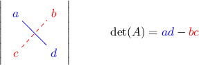

# The Determinant of a 2x2 Matrix

Source: https://www.mathacademy.com/topics/152?courseId=43
Topic ID: 152

## Prerequisites

- [Solving Two-Step Equations](../grade-7/66-solving-two-step-equations.md)
- [Factoring Perfect Square Trinomials](../algebra-i/352-factoring-perfect-square-trinomials.md)
- [Factoring Polynomials Using GCFs](../algebra-i/353-factoring-polynomials-using-gcfs.md)
- [The Power Rule for Exponents With Algebraic Expressions](../algebra-i/362-the-power-rule-for-exponents-with-algebraic-expressions.md)
- [Introduction to Matrices](./861-introduction-to-matrices.md)

## Lesson

### Introduction

The **determinant** of a general $2 \times 2$ matrix $[\begin{aligned}𝑎 & 𝑏 \\ 𝑐 & 𝑑\end{aligned}]$ is denoted $\text {det} ({A})$ and computed as

$$

\begin{aligned}𝑎 & 𝑏 \\ 𝑐 & 𝑑\end{aligned}

$$

For example, given the matrix $[\begin{aligned}2 & 1 \\ 5 & 3\end{aligned}]$ the determinant is

$$

\det(A) = {\color{blue}{2}} \cdot {\color{blue}{3}} - {\color{red}{1}} \cdot {\color{red}{5}} = 1.

$$

To remember how to compute the determinant of a $2 \times 2$ matrix, you can imagine taking the product of the diagonal of the matrix, and then subtracting the product of the off-diagonal terms, as follows:

Later, we will see that the determinant is related to the "volume" spanned by the row vectors or column vectors in a matrix. We will also see that the determinant can tell us about many other properties of a matrix.

However, in this lesson, we will just focus on computing the determinant.

### Example: Calculating the Determinant of a 2x2 Matrix With Integer Entries

#### Question

Calculate $\det(A),$ if $[\begin{aligned}3 & 2 \\ 5 & 6\end{aligned}]$

#### Explanation

For a $2 \times 2$ matrix, the determinant is given by the formula

$$

\begin{aligned}𝑎 & 𝑏 \\ 𝑐 & 𝑑\end{aligned}

$$

Using the formula, we have:

$$

\begin{aligned}det(𝐴) & =\begin{aligned}3 & 2 \\ 5 & 6\end{aligned} \\ & =3⋅6−2⋅5 \\ & =18−10 \\ & =8\end{aligned}

$$

### Example: Calculating the Determinant of a 2x2 Matrix With Non-Integer Entries

#### Question

Calculate $\det(A),$ if $[\begin{aligned}\sqrt{√2} & −2 \\ 0 & \sqrt{√3}\end{aligned}]$

#### Explanation

For a $2 \times 2$ matrix, the determinant is given by the formula

$$

\begin{aligned}𝑎 & 𝑏 \\ 𝑐 & 𝑑\end{aligned}

$$

Using the formula, we have:

$$

\begin{aligned}det(𝐴) & =\begin{aligned}\sqrt{√2} & −2 \\ 0 & \sqrt{√3}\end{aligned} \\ & =\sqrt{√2}⋅\sqrt{√3}−(−2)⋅0 \\ & =\sqrt{√6}\end{aligned}

$$

### Example: Solving for an Unknown in an Expression Involving the Determinant of a 2x2 Matrix

#### Question

If ${A} = \left\lbrack \matrix {2 & -1 \ -3 & k} \right\rbrack$ and $\det({A}) = 5$, what is the value of $k?$

#### Explanation

For a $2 \times 2$ matrix, the determinant is given by the formula

$$

\begin{aligned}𝑎 & 𝑏 \\ 𝑐 & 𝑑\end{aligned}

$$

Using the formula, we have:

$$

\begin{aligned}det(𝐴) & =\begin{aligned}2 & −1 \\ −3 & 𝑘\end{aligned} \\ & =2⋅𝑘−(−1)⋅(−3) \\ & =2𝑘−3\end{aligned}

$$

Since $\det(A)=5,$ we obtain:

$$

\begin{aligned}det(𝐴) & =5 \\ 2𝑘−3 & =5 \\ 2𝑘 & =8 \\ 𝑘 & =4\end{aligned}

$$
