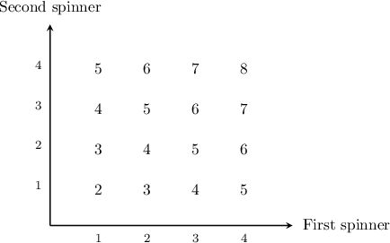
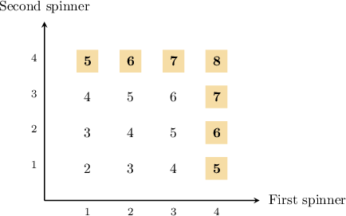

# Conditional Probabilities From Tables

Source: https://www.mathacademy.com/topics/160?courseId=43
Topic ID: 160

## Prerequisites

- [Conditional Probabilities From Venn Diagrams](../geometry/324-conditional-probabilities-from-venn-diagrams.md)

## Lesson

### Introduction

Another way to calculate the conditional probability $P(A|B)$ is to construct a table of all outcomes. From the table, we find the number of outcomes that belong to $B,$ and find the proportion of these outcomes that also belong to $A.$

For instance, the table below summarizes the sum of all possible outcomes when two fair spinners, each with four faces numbered $1$ to $4$, are thrown together.

Given that at least one spinner lands on $4,$ what is the probability that the sum of the two numbers is less than $7?$

Let's call $L$ the event "the sum of the outcomes is less than $7$" and $F$ the event "at least one spinner lands on $4$". The required probability is $P(L|F).$

Since we are assuming that $F$ has occurred, we only consider events inside $F.$ These are shaded in the table below:

We can see from the table that there are $7$ possible outcomes that belong to $F.$

$$

F = \{(1, 4),\,(2, 4),\,(3, 4),\, (4, 1),\,(4, 2),\, (4, 3),\,(4, 4)\}

$$

Among these $7$ outcomes, there are $4$ outcomes that belong to $L.$

$$

L = \{(1, 4),\,(2, 4),\, (4, 1),\,(4, 2)\}

$$

Since each outcome is equally likely, we have

$$

P(L|F) = \dfrac{4}{7}.

$$

### Example: Computing Conditional Probabilities Using the Shrunken Sample Space Method (Table Given)

#### Question

The product of the possible scores when two fair tetrahedral dice are rolled is summarized in the table above. Given that the product of the outcomes is divisible by $4,$ what is the probability that at least one die shows a $3?$

#### Explanation

Let's call $T$ the event "at least one die shows $3$" and $F$ the event "the product of the outcomes is divisible by $4.$"

We wish to compute the probability that at least one die shows $3$ ** the product of the outcomes is divisible by $4.$ Therefore, we need to compute $P(T|F).$

Since we are assuming that $F$ has occurred, we only consider events inside $F.$ These are shaded in the table below:

From the table, there are $8$ possible outcomes that belong to $F.$

$$

F = \{(1, 4),\,(2, 2),\,(2, 4),\,(3, 4),\, (4, 1),\,(4, 2),\,(4, 3),\,(4, 4)\}

$$

Among these $8$ outcomes, there are $2$ outcomes that belong to $T.$

$$

T \cap F = \{ (3, 4) ,\, (4, 3)\}

$$

Since the dice are fair, each outcome is equally likely, and we have

$$

P(T|F) = \dfrac{2}{8} = \dfrac{1}{4}.

$$

### Example: Computing Conditional Probabilities Using the Shrunken Sample Space Method (Table Not Given)

#### Question

Two fair -sided dice are rolled. Given that the largest outcome on either die is what is the probability that at least one of the dice shows an even number?

#### Explanation

Let's call the event "at least one die shows an even number" and the event "the largest outcome is ". The required probability is

Since we are assuming that has occurred, we only consider events inside These are shaded in the table below:

We can see from the table that there are possible outcomes that belong to

Among these outcomes, there are outcomes that belong to.

Since the dice are fair, each outcome is equally likely, and we have
