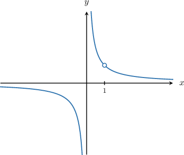
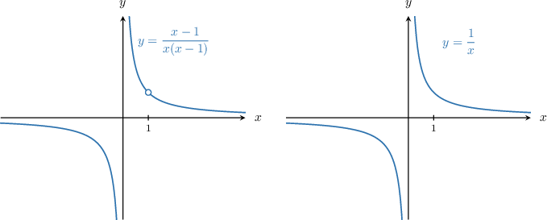
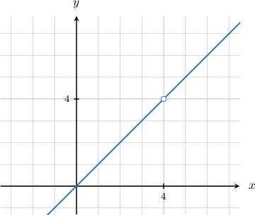

# Locating Holes in Rational Functions

Source: https://www.mathacademy.com/topics/1817?courseId=43
Topic ID: 1817

## Prerequisites

- [Vertical Asymptotes of Rational Functions](./807-vertical-asymptotes-of-rational-functions.md)

## Lesson

### Introduction

To find the vertical asymptotes of a rational function, we usually set the denominator equal to zero and solve for $x.$ Most of the time, the solutions to this equation give the equations of the asymptotes.

However, there are situations where some of the roots of the denominator do *not* correspond to vertical asymptotes.

To demonstrate, let's consider the rational function $f(x),$ given by

$$

f(x)= \dfrac{x-1}{x(x-1)}.

$$

Notice that $(x-1)$ is a factor of both the numerator and denominator. Of course, it's tempting to cancel this, but we shouldn't! You'll see why in a moment.

If we set the denominator equal to zero and solve for $x,$ we get two candidates for asymptotes, namely $x=0$ and $x=1.$ However, looking at the graph of $y=f(x)$ below, we see that the function has only one vertical asymptote, $x=0.$

From the plot, we see that $y = f(x)$ doesn't have an asymptote at $x=1,$ but an open circle instead. The open circle means that $f(x)$ is undefined at $x=1.$ We say that the function has a **hole** at $x=1.$ If we attempt to evaluate $f(1),$ we get

$$

f(1) = \dfrac{1-1}{1(1-1)} = \dfrac{0}{0},

$$

and $\dfrac00$ is not a valid expression!

This explains why we couldn't cancel out the common factor of $(x-1).$ The functions

$$

y = \dfrac{x-1}{x(x-1)}\quad\textrm{and}\quad y=\dfrac1x

$$

are not *exactly* the same! One has a hole, and the other does not.

To summarize, a rational function $f(x)$ has a **hole** at $x=a$ if $f(a)$ is undefined but $x=a$ is not a vertical asymptote of $f(x).$

In particular, we have a hole at $x=a$ if $(x-a)$ is a factor of both denominator and numerator of our rational function.

### Example: Finding the X-Coordinates of the Holes of a Factored Rational Function

#### Question

Find the $x$-coordinate of the hole in the function $f(x) = \dfrac{(x+6)(5x-2)}{(5x-2)(x+2)}.$

#### Explanation

To find the holes of a rational function, we first factor the numerator and denominator. Then, we identify the common factors in the numerator and denominator. Finally, we set these factors equal to zero and solve for $x.$

In this case, both the numerator and denominator of the function $f(x)$ are factored, and we notice that they both have $(5x-2)$ as a common factor.

Now, we set the common factor equal to zero and solve for $x.$ This gives

$$

5x-2 = 0\quad\Longrightarrow\quad x=\dfrac 2 5.

$$

Therefore, the function has a hole at $x =\dfrac 2 5.$

### Example: Finding the Coordinates of the Holes of a Factored Rational Function

#### Question

Find the coordinates of the hole in the function $f(x) = \dfrac{(x+5)(x+2)}{(x+2)(x+1)}.$

#### Explanation

To find the holes of a rational function, we first factor the numerator and denominator. Then, we identify the common factors in the numerator and denominator. Finally, we set these factors equal to zero and solve for $x.$

In this case, both the numerator and denominator of the function $f(x)$ are factored, and we notice that they both have $(x+2)$ as a common factor.

Now, we set the common factor equal to zero and solve for $x.$ This gives

$$

x + 2 = 0\quad\Longrightarrow\quad x=-2.

$$

Therefore, the function has a hole at $x = -2.$

To find the $y$-coordinate of the hole, we find the reduced rational function $F(x)$ and evaluate it at the $x$-coordinate of the hole.

Finding the reduced rational function $F(x),$ we get

$$

\begin{aligned}𝐹(𝑥) & =\frac{(𝑥+5)(𝑥+2)}{(𝑥+2)(𝑥+1)} \\ & =\frac{(𝑥+5)(𝑥+2)}{(𝑥+2)(𝑥+1)} \\ & =\frac{𝑥+5}{𝑥+1}.\end{aligned}

$$

Therefore, the $y$-coordinate of the hole is

$$

\begin{aligned}𝐹(−2) & =\frac{−2+5}{−2+1} \\ & =\frac{3}{−1} \\ & =−3.\end{aligned}

$$

Finally, the coordinates of the hole are $(-2,-3).$

### Example: Finding the Holes of a Rational Function by Factoring

#### Question

Find the $x$-coordinate of the hole in the function $f(x) = \dfrac{x^2-x-2}{x^2-1}.$

#### Explanation

To find the holes of a rational function, we first factor the numerator and denominator. Then, we identify the common factors in the numerator and denominator. Finally, we set these factors equal to zero and solve for $x.$

Factoring the numerator and denominator, we get

$$

\begin{aligned}𝑓(𝑥) & =\frac{𝑥^{2}−𝑥−2}{𝑥^{2}−1} \\ & =\frac{(𝑥+1)(𝑥−2)}{(𝑥−1)(𝑥+1)}.\end{aligned}

$$

We notice that the numerator and denominator both have $(x+1)$ as a common factor.

Now, we set the common factor equal to zero and solve for $x.$ This gives

$$

x + 1 = 0\quad\Longrightarrow\quad x= -1.

$$

Therefore, the function has a hole at $x = -1.$

### Example: Identifying a Possible Rational Function Given Its Graph

#### Question

Consider the graph of $y=f(x)$ shown above, where $f(x)$ is the rational function given by

$$

f(x) = \dfrac{x(x-4)}{g(x)}.

$$

Which of the following could be the function $g(x)?$

1. $x+4$

2. $x-4$

3. $x$

#### Explanation

First, notice that the function has a hole at $x=4.$

The straight line (without the hole) has a slope of $1$ and a $y$-intercept of $0.$ Therefore, its equation is

$$

y = x.

$$

To introduce a hole at $x=4,$ we need the function to have a common factor in the numerator and denominator that evaluates to zero when $x=4.$ Therefore, from the given options, we must have

$$

g(x) = x-4.

$$

The complete expression for $f(x)$ is

$$

f(x) = \dfrac{x(x-4)}{x-4}.

$$
