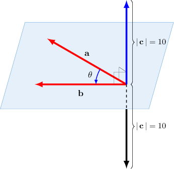
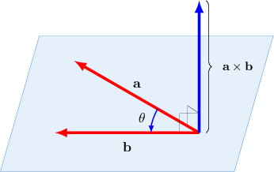

# The Cross Product of Two Vectors

Source: https://www.mathacademy.com/topics/246?courseId=43
Topic ID: 246

## Prerequisites

- [Calculating the Magnitude of Cartesian Vectors in 3D](./1277-calculating-the-magnitude-of-cartesian-vectors-in-3d.md)
- [Evaluating Trigonometric Expressions](../algebra-ii/3766-evaluating-trigonometric-expressions.md)

## Lesson

### Introduction

The **cross product** of two vectors $\mathbf{a}$ and $\mathbf{b}$ is defined as

$$

\mathbf{a}\times\mathbf{b} = | \, \mathbf{a} \, | \cdot | \, \mathbf{b} \, | \cdot \sin\theta \cdot \mathbf{n},

$$

where

- $\theta$ is the angle formed between the vectors when their tails are placed at the same point, and

- $\mathbf{n}$ is a unit vector that's perpendicular to both $\mathbf{a}$ and $\mathbf{b}.$

For example, suppose we have two vectors $\mathbf a$ and $\mathbf b$ such that

$$

|\,\mathbf{a}\,|=5,\qquad |\,\mathbf{b}\,|=4,\qquad \theta=30^\circ.

$$

To compute the cross product $\mathbf{c} = \mathbf{a}\times\mathbf{b},$ we first work out its magnitude:

$$

\begin{aligned}|\,𝐜\,| & =|\,𝐚×𝐛\,| \\ & =|\,𝐚\,|⋅|\,𝐛|⋅|sin⁡𝜃|⋅|𝐧| \\ & =5⋅4⋅sin⁡30^{∘}⋅1 \\ & =5⋅4⋅\frac{1}{2} \\ & =10\end{aligned}

$$

So, $\mathbf{c} = \mathbf a \times \mathbf b$ is a vector of magnitude $|\mathbf{c}| = 10$ that is perpendicular to the plane containing $\mathbf a$ and $\mathbf b.$

Notice that *two* possible vectors fit this criterion, as shown above. To decide which of these two vectors we should choose as $\mathbf a \times \mathbf b,$ we use the **right-hand rule**.

The right-hand rule says that if we extend the index finger on our right hand along the direction of the first vector $(\mathbf{a})$ and have our middle finger pointing in the direction of the second vector $(\mathbf{b}),$ then our thumb points in the direction of $\mathbf{a}\times\mathbf{b}.$

So, in this case, $\mathbf a \times \mathbf b$ is the blue vector.

The cross product is a *vector quantity* and is sometimes called the **vector product**. It can be thought of as a function that takes two vectors $\mathbf a$ and $\mathbf b$ as input and outputs a third vector $\mathbf c.$

### Example: Calculating the Cross Product of Two Vectors Whose Angle Is a Special Angle

#### Question

The vector $\mathbf{a}$ has magnitude $7,$ the vector $\mathbf{b}$ has magnitude $3,$ and the angle between the vectors is $120^\circ$ and $\mathbf{n}$ is the unit vector that points in the direction of $\mathbf{a} \times \mathbf{b}.$ Find $\mathbf{a} \times \mathbf{b}$ in terms of $\mathbf{n}.$

#### Explanation

We use the formula for the cross product and obtain

$$

\begin{aligned}𝐚×𝐛 & =|\,𝐚\,|⋅|\,𝐛\,|⋅sin⁡𝜃⋅𝐧 \\ & =7⋅3⋅sin⁡120^{∘}⋅𝐧 \\ & =7⋅3⋅\frac{\sqrt{√3}}{2}⋅𝐧 \\ & =\frac{21\sqrt{√3}}{2}𝐧.\end{aligned}

$$

### Example: Calculating the Cross Product of Two Vectors Whose Angle Is a Non-Special Angle

#### Question

The vector $\mathbf{a}$ has magnitude $12,$ the vector $\mathbf{b}$ has magnitude $9,$ the angle between the vectors is $105^\circ$ and $\mathbf{n}$ is the unit vector that points in the direction of $\mathbf{a} \times \mathbf{b}.$ Find $\mathbf{a} \times \mathbf{b}$ in terms of $\mathbf{n}.$ Give your answer to $2$ decimal places where appropriate.

#### Explanation

We use the formula for the cross product and obtain

$$

\begin{aligned}𝐚×𝐛 & =|\,𝐚\,|⋅|\,𝐛\,|⋅sin⁡𝜃⋅𝐧 \\ & =12⋅9⋅sin⁡105^{∘}⋅𝐧 \\ & ≈12⋅9⋅0.965926⋅𝐧 \\ & ≈104.32⋅𝐧.\end{aligned}

$$

### The Cross Product of Parallel Vectors

If two vectors $\mathbf{a}$ and $\mathbf{b}$ are parallel (or collinear), then the angle between them is $\theta = 0^\circ,$ and consequently their cross product is the zero vector:

$$

\begin{aligned}𝐚×𝐛 & =|\,𝐚\,|⋅|\,𝐛\,|⋅sin⁡0^{∘}⋅𝐧 \\ & =|\,𝐚\,|⋅|\,𝐛\,|⋅0⋅𝐧 \\ & =𝟎\end{aligned}

$$

The converse is also true. So, if $\mathbf a$ and $\mathbf b$ are nonzero vectors, then

$$

\mathbf{a} \parallel \mathbf{b} \quad\Leftrightarrow\quad \mathbf{a} \times \mathbf{b} = \mathbf{0}.

$$

Expressing this in words, the statement that two nonzero vectors $\mathbf{a}$ and $\mathbf{b}$ are parallel is *equivalent* to the statement that their cross product is zero.

**Note**: The symbol $\Leftrightarrow$ means "is equivalent to," which we sometimes write as "if and only if."

### Example: Calculating the Cross Product of Two Parallel Vectors

#### Question

The vector $\mathbf{a}$ has magnitude $4,$ the vector $\mathbf{b}$ has magnitude $6,$ and $\mathbf{a} \parallel \mathbf{b}.$ Find $\mathbf{a} \times \mathbf{b}.$

#### Explanation

Suppose $\mathbf a$ and $\mathbf b$ are nonzero vectors. Then, $\mathbf{a} \times \mathbf{b} = \mathbf{0}$ if and only if $\mathbf{a} \parallel \mathbf{b}.$

Therefore, $\mathbf{a} \times \mathbf{b} = \mathbf{0}.$
