# Scatter Plots

Source: https://www.mathacademy.com/topics/2585?courseId=43
Topic ID: 2585

## Prerequisites

- [The Cartesian Coordinate System](../grade-6/92-the-cartesian-coordinate-system.md)
- [Introduction to Statistics](../grade-6/2478-introduction-to-statistics.md)

## Lesson

### Introduction

Suppose a company manager compiles the tables below, showing the years of work experience and corresponding monthly salary, in thousands of dollars, among a particular group of employees.

To visualize this kind of data, we can use **scatter plots**. Let's draw a scatter plot representing the information in our table.

The first step is to set up the axes in the coordinate plane. We draw

- the *independent variable* (years of work experience) along the horizontal axis, and

- the *dependent variable* (salary) along the vertical axis.

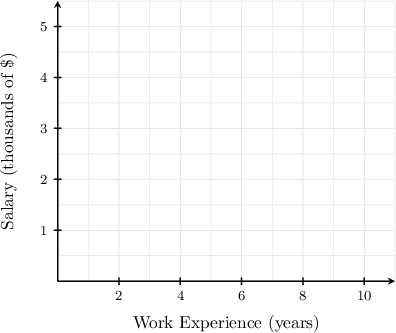

Then, we plot the points that correspond to the pairs from the data:

$$

(2,2.5), \quad (4,3), \quad (5,4), \quad (7,4.5), \quad (9,4.5)

$$

This gives us the following scatter plot.

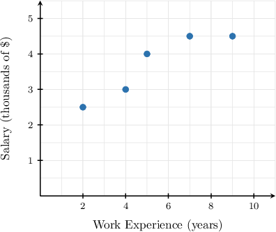

### Axis Discontinuities

When constructing a scatter plot, choosing an appropriate scale on one (or both) coordinate axes is often impossible unless we distort or enlarge our plot considerably.

To demonstrate the issue and how to deal with it, consider the data in the following table, showing the ages and corresponding weights of five players on a baseball team.

Now, notice that

- the data for the independent variable (age) starts at $10$ and increases in increments of one, while

- the data for the dependent variable (weight) starts at $30$ and increases in increments of ten.

In this case, the scales for the coordinate axes of our scatter plot could be as follows:

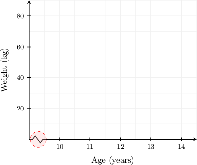

The "*lightning bolt symbol*" (highlighted) at the beginning of the $x$-axis indicates a jump or **axis discontinuity**. This symbol means we omit a whole interval on the $x$-axis unrelated to the given data to set a more convenient scale.

Finally, we complete the construction of our scatter plot by plotting the points representing the data, as usual.

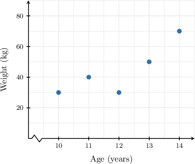

### Example: Correctly Identifying a Scatter Plot

#### Question

Johnny wants to find out if there is a relationship between a person's height and their weight. So he records the heights and corresponding weights of some of his classmates. The results are shown in the table below.

Construct a scatter plot that represents this data.

#### Explanation

We create a scatter diagram in the coordinate plane as follows:

- First, we draw the independent variable (height) along the horizontal axis.

- Then, we draw the dependent variable (weight) along the vertical axis.

- Finally, we plot the points that correspond to the pairs from the data.

This gives us the following scatter plot.

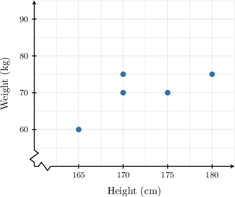

### Example: Reading a Scatter Plot

#### Question

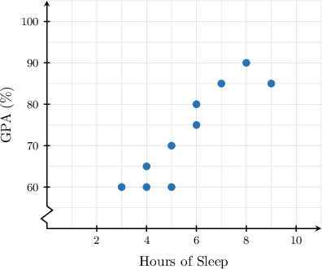

A group of $10$ students is surveyed. The scatter plot above shows the relationship between a student's number of hours of sleep per night and their overall grade point average (GPA). How many hours of sleep per night does the student with a GPA of $80\%$ get?

#### Explanation

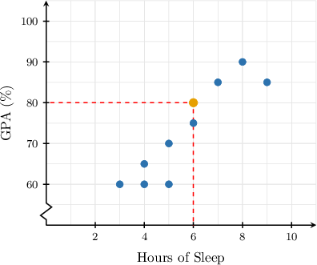

To determine the number of hours of sleep the student with a GPA of $80\%$ gets, we locate $80$ on the vertical axis and move in the horizontal direction until we find some points, as shown above.

The highlighted point has coordinates $(6,80).$ Therefore, the student with a GPA of $80\%$ sleeps for $6$ hours per night.

### Example: Interpreting Information From a Scatter Plot

#### Question

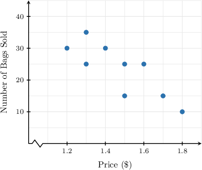

The scatter plot above shows the relationship between the number of bags of popcorn sold one day and the price per bag at nine locations.

Given that none of the points overlap, which of the following statements are true?

1. Only one location sold exactly $10$ bags of popcorn.

2. Two locations sold bags of popcorn for $1.40$ each.

3. No location sold more than $30$ bags of popcorn.

#### Explanation

Let's examine our scatter plot.

- Statement I is true. The scatter plot has only one dot whose vertical coordinate equals $10,$ namely, $(1.8,10).$ This means only one location sold exactly $10$ bags of popcorn.

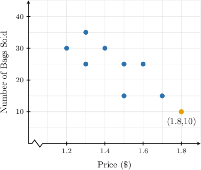

- Statement II is false. The scatter plot has only one dot whose horizontal coordinate equals $1.4,$ namely, $(1.4,30).$ This means that only one location sold popcorn for $1.40$ per bag.

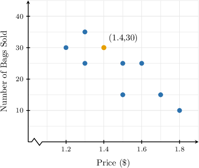

- Statement III is false. From the scatter plot, one location sold more than $30$ bags of popcorn, represented by the dot above the horizontal line.

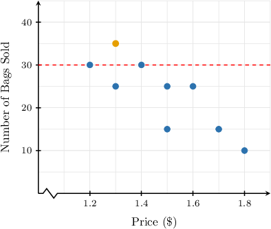

Therefore, the correct answer is "I only."
