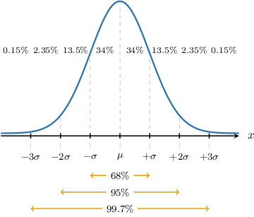
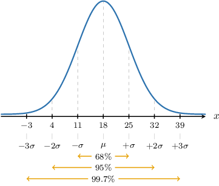
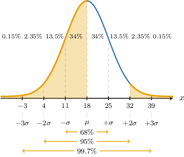
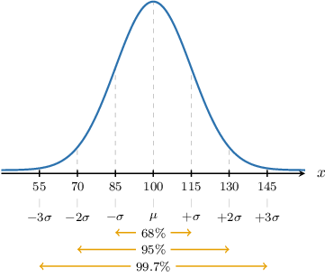
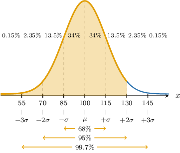
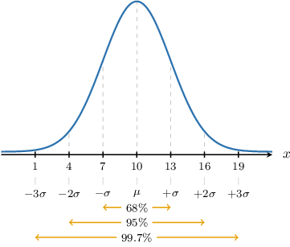

# The Empirical Rule for the Normal Distribution

Source: https://www.mathacademy.com/topics/3594?courseId=43
Topic ID: 3594

## Prerequisites

- [The Normal Distribution](./1843-the-normal-distribution.md)

## Lesson

### Introduction

Suppose that $X\sim N(\mu, \sigma)$ is a normally distributed random variable. As we've seen, probabilities associated with $X$ are often found using tables. However, there are cases where we can *estimate* probabilities associated with $X$ without tables.

In particular, we have the following facts, applicable to *all* normally distributed random variables:

- Approximately $68\%$ of the data falls within $1$ standard deviation of the mean. This means that the area under the bell curve from $\mu-\sigma$ to $\mu+\sigma$ represents approximately $68\%$ of the total area under the curve (which equals $1$). In other words,

- Approximately $95\%$ of the data falls within $2$ standard deviations of the mean. This means that the area under the bell curve from $\mu-2\sigma$ to $\mu+2\sigma$ represents approximately $95\%$ of the total area under the curve. In other words,

- Approximately $99.7\%$ of the data falls within $3$ standard deviations of the mean. This means that the area under the bell curve from $\mu-3\sigma$ to $\mu+3\sigma$ represents approximately $99.7\%$ of the total area under the curve. In other words,

- Finally, approximately $100\%$ of the data falls within $4$ (or more) standard deviations of the mean. This means that the area under the bell curve from $\mu-k\sigma$ to $\mu+k\sigma$ for $k \geq 4$ (almost) equals the total area under the curve. In other words, if $k \geq 4,$ then

### The Empirical Rule

Since the bell curve is symmetrical over the $y$-axis, all of the cases we just described can be summarized in one diagram.

Estimating the probabilities using this mnemonic diagram is called the **empirical rule**.

Notice that that empirical rule gives an approximate probability for each band of width $\sigma$ (one standard deviation) from the mean $\mu.$

### Example: Finding a Population Percentage Using the Empirical Rule

#### Question

Given a normal distribution with a mean of $18$ and a variance of $49,$ use the empirical rule to estimate the percentage of the data points that are less than $18$ or greater than $32.$

#### Explanation

Since $\mu=18$ and $\sigma=\sqrt{49} = 7,$ we have the normal distribution shown below.

According to the empirical rule, we have the following:

- Approximately $68\%$ of the data falls within $1$ standard deviation of the mean.

- Approximately $95\%$ of the data falls within $2$ standard deviations of the mean.

- Approximately $99.7\%$ of the data falls within $3$ standard deviations of the mean.

We can assume that $100\%$ of the data falls within $4$ (or more) standard deviations of the mean.

Now, notice that

- $x=18$ equals the mean:

- $x=32$ is $2$ standard deviations ** the mean:

The required percentage is represented by the area shown below.

From the diagram, the required percentage is

$$

50\% + 2.35\%+0.15\%= 52.5\%.

$$

### Example: Finding a Population Percentage in Context Using the Empirical Rule

#### Question

A particular organization only admits members with an IQ of at least $130.$ It's known that IQ is normally distributed with a mean of $100$ and a variance of $225.$ Use the empirical rule to estimate the percentage of people in the general population that would not be admitted to this organization.

#### Explanation

Since $\mu=100$ and $\sigma=\sqrt {225} = 15,$ we have the normal distribution shown below.

According to the empirical rule, we have the following:

- Approximately $68\%$ of the data falls within $1$ standard deviation of the mean.

- Approximately $95\%$ of the data falls within $2$ standard deviations of the mean.

- Approximately $99.7\%$ of the data falls within $3$ standard deviations of the mean.

We can assume that $100\%$ of the data falls within $4$ (or more) standard deviations of the mean.

Now, notice that $x=130$ is $2$ standard deviations ** the mean:

$$

130 = 100 + 2 \cdot 15 = \mu +2 \sigma

$$

We are interested only in those with an IQ of less than $130.$ The required percentage is represented by the area shown below.

From the diagram, the required percentage is

$$

100\%-(2.35\% + 0.15\%) = 97.5 \%

$$

### Estimators and Estimates

Suppose a population is normally distributed with known mean $\mu$ and *unknown* variance $\sigma^2.$ We can use empirical data to *estimate* the variance.

For example, let's assume our normal population has mean $\mu = 12$ and unknown variance. Suppose an independent random sample is drawn from the population, and it is found that approximately $68\%$ of the data in the sample have a value between $7$ and $17.$

According to the empirical rule, we have the following:

- Approximately $68\%$ of the data falls within $1$ standard deviation of the mean.

- Approximately $95\%$ of the data falls within $2$ standard deviations of the mean.

- Approximately $99.7\%$ of the data falls within $3$ standard deviations of the mean.

We can assume that $100\%$ of the data falls within $4$ (or more) standard deviations of the mean.

So, according to this rule, $68\%$ of the observations of a random normal variable $N(\mu, \sigma^2)$ fall in the interval $(\mu-\sigma, \mu+\sigma).$ This range represents $2$ standard deviations. Therefore, we can write:

$$

\begin{aligned}𝜇−\overset{𝜎}{ˆ} & =7 \\ 𝜇+\overset{𝜎}{ˆ} & =17\end{aligned}

$$

We have used $\widehat{\sigma}$ since the sample data will give an *estimate* of the population standard deviation $\sigma.$ Since the observations used to formulate these equations came from sample data, we cannot assume that $\widehat{\sigma} = \sigma.$ However, if the sample is large, $\widehat{\sigma}$ should give a reasonable approximation to $\sigma.$

We wish to solve for $\widehat{\sigma}.$ First, we subtract the first equation from the second, which gives

$$

2\widehat{\sigma} = 17-7 = 10.

$$

Therefore,

$$

\widehat{\sigma} = \dfrac{10}{2} = 5.

$$

Finally, the estimate of the population variance is given by

$$

\widehat{\sigma}^2 = 5^2 = 25.

$$

### Example: Finding an Estimate for the Variance

#### Question

Consider a normal population with mean $\mu = 10$ and unknown variance. An independent random sample is drawn from the population, and it is found that approximately $95\%$ of the data in the sample have a value between $4$ and $16.$ Using the empirical rule for the normal distribution, find an estimate of the population variance.

#### Explanation

According to the empirical rule, we have the following:

- Approximately $68\%$ of the data falls within $1$ standard deviation of the mean.

- Approximately $95\%$ of the data falls within $2$ standard deviations of the mean.

- Approximately $99.7\%$ of the data falls within $3$ standard deviations of the mean.

We can assume that $100\%$ of the data falls within $4$ (or more) standard deviations of the mean.

So, according to this rule, $95\%$ of the observations of a random normal variable $N(\mu, \sigma^2)$ fall in the interval $(\mu-2\sigma, \mu+2\sigma).$ This range represents 4 standard deviations. Therefore, we can write:

$$

\begin{aligned}𝜇−2\overset{𝜎}{ˆ} & =4 \\ 𝜇+2\overset{𝜎}{ˆ} & =16\end{aligned}

$$

Note that we have used $\widehat{\sigma}$ since this is an ** of the population standard deviation $\sigma.$

Solving for $\widehat{\sigma}$ we have:

$$

\widehat{\sigma} = \dfrac{16-4}{4} = 3

$$

Finally, the estimate of the population variance is given by

$$

\widehat{\sigma}^2 = 3^2 = 9.

$$
