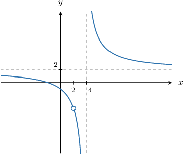
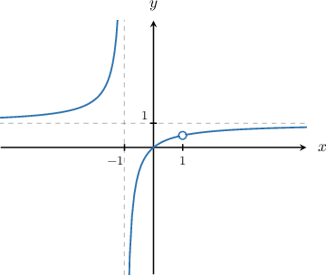
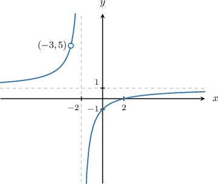
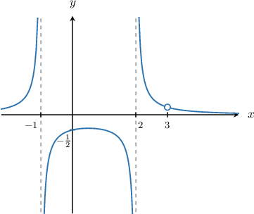
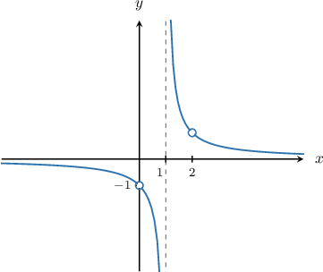

# Identifying a Rational Function From a Graph Containing Holes

Source: https://www.mathacademy.com/topics/3685?courseId=43
Topic ID: 3685

## Prerequisites

- [Identifying a Rational Function From a Graph](./738-identifying-a-rational-function-from-a-graph.md)
- [Locating Holes in Rational Functions](./1817-locating-holes-in-rational-functions.md)

## Lesson

### Introduction

A common type of problem is to match a given rational function $f(x)$ with its graph. Sometimes, the given graph contains holes.

For example, suppose we are given the following rational functions:

$$

\begin{aligned}𝑦=𝑓(𝑥) & =\frac{(𝑥−4)^{2}}{(𝑥−4)(𝑥−2)} \\ 𝑦=𝑔(𝑥) & =\frac{2(𝑥^{2}−4)}{(𝑥−4)(𝑥−2)} \\ 𝑦=ℎ(𝑥) & =\frac{2𝑥^{2}+4}{(𝑥−4)(𝑥−2)}\end{aligned}

$$

Which of them corresponds to the graph below?

From the graph, we note the following:

- The function has a vertical asymptote at $x = 4.$ Therefore, the function's denominator must be zero at $x = 4,$ but the numerator should not be zero at this point. This allows us to discard the following option:

- The function has an open circle at $x = 2.$ This means that $x = 2$ is a hole, and so the numerator and denominator are both zero at $x = 2.$ This allows us to discard the following option:

Therefore, among the given options, the only one that satisfies the above conditions is

$$

y=\dfrac{2(x^2-4)}{(x-4)(x-2)} \qquad {\color{green}\Large \checkmark}

$$

So, the function that corresponds to the given graph is $g(x).$

Sometimes, to determine which rational function corresponds to a particular graph, we also need to consider the horizontal asymptotes. Let's see an example.

### Example: Identifying a Rational Function With One Vertical Asymptote and One Hole

#### Question

Which of the following could be the equation of the graph shown above?

**

1. $y = \dfrac {x^2-1}{x+1}$

2. $y = \dfrac{x}{x-1}$

3. $y = \dfrac {x^2-1}{x^4-1}$

4. $y = \dfrac {x^2-x}{x^2-1}$

#### Explanation

From the graph of the function, we note the following:

- The function has a vertical asymptote at $x = -1.$ Therefore, the function's denominator must be zero at $x = -1,$ but the numerator should not be zero at this point. This allows us to discard the following option:

- The function has an open circle at $x = 1.$ This means that $x = 1$ is a hole, and so the numerator and denominator are both zero at $x = 1.$ This allows us to discard the following option: So, we're left with the following options:

- The function has a horizontal asymptote at $y = 1.$ This means that $y \to 1$ as $x \to \infty.$ Note that for large $|x|,$ we have So, we can discard this option.

Therefore, among the given options, the only one that satisfies the above conditions is

$$

y = \dfrac {x^2-x}{x^2-1}.

$$

### Intercepts of Rational Functions

We've already seen how we can use holes and asymptotes to determine which rational function could correspond to a graph. Sometimes, we also need to consider the $x$- and $y$-intercepts.

For example, consider the following graph of a rational function $y=f(x).$ What can we deduce from it?

- Firstly, the function has vertical asymptote $x=-2,$ horizontal asymptote $y=1,$ and hole $x=-3.$ We've already seen how to determine when a given function possesses these three properties.

- Note that the function has a root at $x=2.$ This means we must have $f(2) = 0.$

- Finally, the function has a $y$-intercept at the point $(0,-1).$ This means we must have $f(0) = -1.$

Let's now consider an example with two vertical asymptotes.

### Example: Identifying a Rational Function With Two Vertical Asymptotes and One Hole

#### Question

Which of the following could be the equation of the graph shown above?

**

1. $y = \dfrac{x-3}{(x+1)(x-2)(x-3)}$

2. $y = \dfrac{x-3}{(x+1)(x-3)}$

3. $y = \dfrac{x+1}{(x+1)(x-2)(x-3)}$

4. $y = \dfrac{1}{(x+1)(x-2)}$

5. $y = \dfrac{2(x-3)}{(x+1)(x-2)(x-3)}$

#### Explanation

From the graph of the function, we note the following:

- The function has two vertical asymptotes, $x = -1$ and $x=2.$ Therefore, the function's denominator must be zero at $x=-1$ and $x=2,$ but the numerator should not be zero at these points. This allows us to discard the following options:

- The function has an open circle at $x = 3.$ This means that $x=3$ is a hole, and so the numerator and denominator are both zero at $x = 3.$ This allows us to discard the following option: So, we're left with the following options:

- The $y$-intercept of the function is $-\dfrac12,$ so we must have $f(0)=-\dfrac12.$ This allows us to discard the following option:

Therefore, among the given options, the only one that satisfies the above conditions is

$$

y = \dfrac{x-3}{(x+1)(x-2)(x-3)}.

$$

### Example: Identifying a Rational Function With One Vertical Asymptote and Two Holes

#### Question

Which of the following could be the equation of the graph shown above?

**

1. $y = \dfrac{x^2-2x}{(x^2-x)(x-2)}$

2. $y = \dfrac{2(x^2-x)}{x^2-1}$

3. $y = \dfrac{x^2-2x}{x^2-x}$

4. $y = \dfrac{x^3-2x^2}{x(x-1)(x-2)}$

#### Explanation

From the graph of the function, we note the following:

- The function has only one vertical asymptote, $x = 1.$ Therefore, the function's denominator must be zero at $x=1,$ but the numerator should not be zero at this point. This allows us to discard the following option:

- The function has two open circles, at $x = 0$ and $x=2.$ This means that $x = 0$ and $x=2$ are holes, and so the numerator and denominator are both zero at $x = 0$ and $x=2.$ This allows us to discard the following option: So, we're left with the following options:

- The function has a horizontal asymptote at $y = 0.$ This means that $y \to 0$ as $|x| \to \infty.$ Note that for large $|x|,$ we have So, we can discard the following option:

Therefore, among the given options, the only one that satisfies the above conditions is

$$

y = \dfrac{x^2-2x}{(x^2-x)(x-2)}

$$
