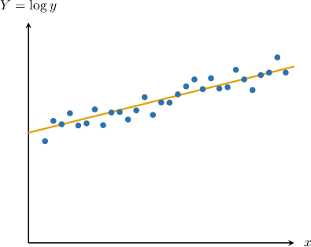
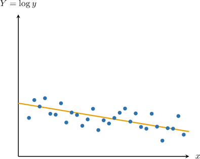
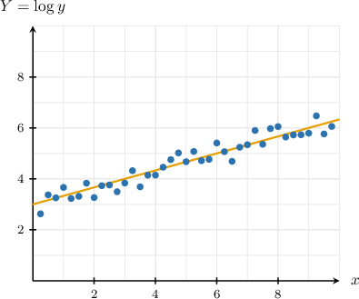
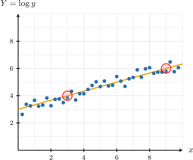
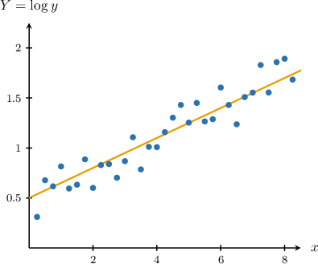

# Exponential Regression

Source: https://www.mathacademy.com/topics/3759?courseId=43
Topic ID: 3759

## Prerequisites

- [Semi-Log Scatter Plots](./1059-semi-log-scatter-plots.md)
- [Making Predictions Using Trend Lines](../algebra-i/3753-making-predictions-using-trend-lines.md)

## Lesson

### Introduction

Suppose there is an exponential relationship of the form $y \approx a \cdot b^x$ between the variables $x$ and $y,$ shown in the semi-log scatter plot below.

Suppose further that the semi-log scatter plot has the trend line

$$

Y = 4 + 0.3x,

$$

where $Y = \log y.$ Using only this information, it's possible to figure out the values of $a$ and $b$ in the exponential relationship $y \approx a \cdot b^x.$

The first step is to transform the exponential relationship into a linear form. We can do this by taking the logarithm of both sides of the equation:

$$

\begin{aligned}𝑦 & =𝑎⋅𝑏^{𝑥} \\ log⁡𝑦 & =log⁡(𝑎⋅𝑏^{𝑥}) \\ log⁡𝑦 & =log⁡𝑎+log⁡𝑏^{𝑥} \\ log⁡𝑦 & =log⁡𝑎+𝑥⋅log⁡𝑏 \\ 𝑌 & =𝐴+𝐵𝑥,\end{aligned}

$$

where

$$

Y=\log y,\qquad A=\log a,\qquad B=\log b.

$$

Now, comparing $Y = A + Bx$ with the equation $Y = 4 + 0.3x,$ we obtain

$$

A = 4, \qquad B = 0.3.

$$

Finally, all that's left is to substitute the values above in the equations relating $A$ to $a$ and $B$ to $b.$

- Substituting $A=4$ into the equation relating $A$ to $a,$ we get

- Substituting $B=0.3$ into the equation relating $B$ to $b,$ we get rounded to two decimal places.

Therefore, we conclude that the approximate relationship between $x$ and $y$ is given by

$$

y\approx 10\,000 \cdot 2^x.

$$

### Example: Calculating Exponential Parameters from Semi-Log Scatter Plots and Trend Line Equations

#### Question

There is an exponential relationship of the form $y \approx a \cdot b^x$ between the variables $x$ and $y.$ The corresponding semi-log scatter plot with the trend line $Y = 3 - 0.2x$ is shown above. Estimate the values of $a$ and $b.$ Round your answers to $2$ decimal places where appropriate.

#### Explanation

Applying $\log$ to both sides of $y = a \cdot b^x,$ we get

$$

\begin{aligned}𝑦 & =𝑎⋅𝑏^{𝑥} \\ log⁡𝑦 & =log⁡(𝑎⋅𝑏^{𝑥}) \\ log⁡𝑦 & =log⁡𝑎+log⁡𝑏^{𝑥} \\ log⁡𝑦 & =log⁡𝑎+𝑥⋅log⁡𝑏 \\ 𝑌 & =𝐴+𝐵𝑥,\end{aligned}

$$

where

$$

Y=\log y,\qquad A=\log a,\qquad B=\log b.

$$

Comparing $Y = A + Bx$ with the given equation $Y = 3 - 0.2x,$ we obtain

$$

A = 3, \qquad B = -0.2.

$$

As a result, we get

$$

\begin{aligned}𝐴 & =3 \\ log⁡𝑎 & =3 \\ 𝑎 & =10^{3} \\ 𝑎 & =1\,000.\end{aligned}

$$

Also,

$$

\begin{aligned}𝐵 & =−0.2 \\ log⁡𝑏 & =−0.2 \\ 𝑏 & =10^{−0.2} \\ & ≈0.63.\end{aligned}

$$

### Example: Calculating Parameters by Finding the Slope or Y-Intercept of a Semi-Log Scatter Plot

#### Question

There is an exponential relationship of the form $y \approx a \cdot b^x$ between variables $x$ and $y.$ The corresponding semi-log scatter plot with the associated trendline is shown above. Find the values of $a$ and $b.$ Round your answer to $2$ decimal places where appropriate.

**

#### Explanation

To get the corresponding semi-log plot, we apply $\log$ to both sides of $y = a \cdot b^x.$ This gives

$$

\begin{aligned}𝑦 & =𝑎⋅𝑏^{𝑥} \\ log⁡𝑦 & =log⁡(𝑎⋅𝑏^{𝑥}) \\ log⁡𝑦 & =log⁡𝑎+log⁡𝑏^{𝑥} \\ log⁡𝑦 & =log⁡𝑎+𝑥⋅log⁡𝑏 \\ 𝑌 & =𝐴+𝐵𝑥,\end{aligned}

$$

where

$$

Y=\log y , \qquad A=\log a, \qquad B=\log b.

$$

Let's now consider an approximate trend line $Y = A + Bx$ for our data:

We now proceed to calculate the constants $a$ and $b\mathbin{:}$

- Looking at the trendline, the $Y$-intercept is $Y \approx 3.$ Therefore,

- The trendline passes close to the points $(3,4)$ and $(9,6).$ Therefore, the line's slope is and we obtain rounded to $2$ decimal places.

### Example: Making Predictions using Semi-Log Scatter Plots

#### Question

The semi-log scatter plot above shows the monthly earnings $(y),$ in millions of dollars, of a company that manufactures computers and the number of years $(x)$ since $2010.$ The equation of the trend line is $Y = 0.5 + 0.15x.$

Approximately how many years must pass before the company's monthly earnings equal $15$ million?

#### Explanation

Applying $\log$ to both sides of $y = a \cdot b^x,$ we get

$$

\begin{aligned}𝑦 & =𝑎⋅𝑏^{𝑥} \\ log⁡𝑦 & =log⁡(𝑎⋅𝑏^{𝑥}) \\ log⁡𝑦 & =log⁡𝑎+log⁡𝑏^{𝑥} \\ log⁡𝑦 & =log⁡𝑎+𝑥⋅log⁡𝑏 \\ 𝑌 & =𝐴+𝐵𝑥,\end{aligned}

$$

where

$$

Y=\log y, \qquad A=\log a, \qquad B=\log b.

$$

When $y = 15$ (corresponding to monthly earnings of $15$ million), we have

$$

Y = \log {y} = \log (15) \approx 1.1761

$$

rounded to $4$ decimal places.

To find when the monthly earnings will equal $15$ million, we need to substitute $Y = 1.1761$ into the equation of the trend line and solve for $x{:}$

$$

\begin{aligned}1.1761 & =0.5+0.15𝑥 \\ 0.6761 & =0.15𝑥 \\ 𝑥 & ≈4.5\end{aligned}

$$

Therefore, the monthly earnings will equal $15$ million after approximately $4.5$ years.
