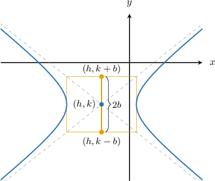
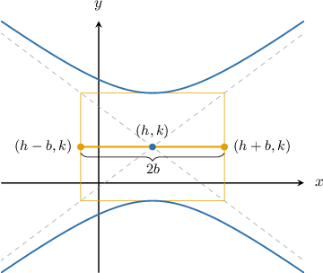
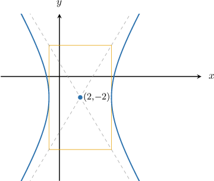
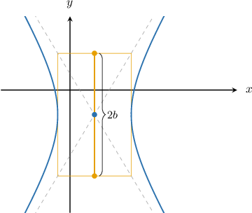

# Conjugate Axes of Hyperbolas

Source: https://www.mathacademy.com/topics/3768?courseId=43
Topic ID: 3768

## Prerequisites

- [Transverse Axes of Hyperbolas](./1032-transverse-axes-of-hyperbolas.md)

## Lesson

### Introduction

Consider the *horizontal* hyperbola

$$

\dfrac{(x-h)^2}{a^2} - \dfrac{(y-k)^2}{b^2} = 1,

$$

whose graph (along with its auxiliary rectangle) is shown below.

The line segment that joins the midpoints of the sides of the auxiliary rectangle that don't touch the hyperbola is called the **conjugate axis** (or the **minor axis**) of the hyperbola.

Note the following:

- the endpoints of the conjugate axis have the coordinates $(h, k \pm b)$

- the length of the conjugate axis equals $2b$

- the conjugate and transverse axes are perpendicular and intersect at the hyperbola's center.

Half the length of the conjugate axis, $b,$ is called the **semi-conjugate axis** (or the **semi-minor axis**) of the hyperbola.

### Conjugate Axes of Vertical Hyperbolas

Now consider the *vertical* hyperbola

$$

\dfrac{(y-k)^2}{a^2} - \dfrac{(x-h)^2}{b^2} = 1,

$$

whose graph is shown below.

In the case of a vertical hyperbola:

- the *center* of the hyperbola is at $(h,k)$

- the endpoints of the conjugate axis are coordinates $(h \pm b, k)$

- the length of the conjugate axis equals $2b$

### Example: Finding the Length of a Conjugate Axis from a Graph

#### Question

Given that the auxiliary rectangle is $6$ units long and $10$ units high, what are the endpoints of the conjugate axis of the hyperbola shown above?

#### Explanation

For the ** hyperbola

$$

\dfrac{(x-h)^2}{a^2} - \dfrac{(y-k)^2}{b^2} = 1

$$

the length of the conjugate axis is $2b,$ and its endpoints are $(h, k \pm b).$

From our diagram, we see that the center of the hyperbola is at

$$

(h,k) = (2,-2),

$$

and we are told that the conjugate axis is $2b=10.$ So, $b = \dfrac{10}{2}=5.$

Therefore, the endpoints of the conjugate axis are

$$

(h, k-b) = (2, -2-5) = (2,-7)

$$

and

$$

(h, k+b) = (2 , -2+5) = (2,3).

$$

### Example: Finding the Length of a Conjugate Axis from an Equation

#### Question

What are the endpoints of the conjugate axis of the hyperbola $\dfrac{(y - 2)^2}{72} - \dfrac{(x + 1)^2}{45} = 1?$

#### Explanation

For the ** hyperbola

$$

\dfrac{(y-k)^2}{a^2} - \dfrac{(x-h)^2}{b^2} = 1

$$

the length of the conjugate axis is $2b$ and its endpoints are $(h \pm b, k).$

In our case, we have

$$

(h,k) = (-1,2),

$$

and $b^2=45.$ So,

$$

b = \sqrt{45} = 3\sqrt{5}.

$$

Therefore, the endpoints of the conjugate axis are

$$

(h \pm b, k) = (-1 \pm 3\sqrt{5}, 2).

$$
