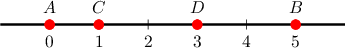
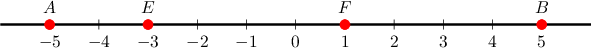
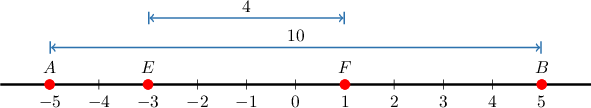
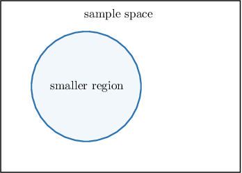
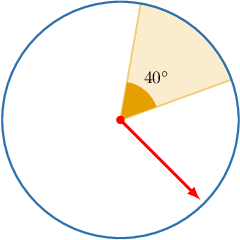
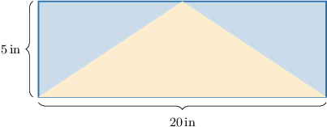
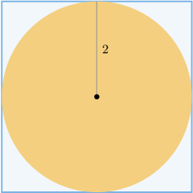

# Geometric Probability

Source: https://www.mathacademy.com/topics/710?courseId=43
Topic ID: 710

## Prerequisites

- [Fractions of Fractions](../grade-7/323-fractions-of-fractions.md)
- [The Complement of an Event](../geometry/1120-the-complement-of-an-event.md)
- [The Area Between Two Shapes](../grade-7/1435-the-area-between-two-shapes.md)
- [The Area of an Equilateral Triangle](../geometry/2886-the-area-of-an-equilateral-triangle.md)
- [Further Calculating Areas of Sectors](../geometry/3533-further-calculating-areas-of-sectors.md)

## Lesson

### Introduction

Consider the illustration below. Imagine that we choose a random point between $A$ and $B.$ What is the probability that this point lies between $C$ and $D?$

Here, the sample space is $\overline{AB},$ and the particular region of the sample space we're interested in is $\overline{CD}.$

To compute the desired probability, we need to divide the length of $CD$ by the length of the entire segment $AB.$ Intuitively, the longer the length of $\overline{CD}$ relative to $\overline{AB},$ the higher our probability.

From the diagram:

- The length of $\overline{AB}$ is

- The length of $\overline{CD}$ is

Therefore, the probability $P$ that a randomly chosen point between $A$ and $B$ lies between $C$ and $D$ is given by

$$

\begin{aligned} P&=\dfrac{{CD}}{{AB}}=\dfrac{2}{5}=0.4. \end{aligned}

$$

### Example: Computing the Probability That a Randomly Chosen Point Lies in a Particular Interval

#### Question

Find the probability that a randomly chosen point between $A$ and $B$ is also between $E$ and $F$ (see the illustration above).

#### Explanation

From the graph, the total length between $A$ and $B$ is

$$

{AB}=5-(-5)=10.

$$

The length between $E$ and $F$ is

$$

{EF}=1-(-3)=4.

$$

Therefore, the probability $P$ that a randomly chosen point between $A$ and $B$ is also between $E$ and $F$ is given by

$$

\begin{aligned} P&=\dfrac{{EF}}{{AB}}=\dfrac{4}{10}=0.4. \end{aligned}

$$

### Geometric Probability with Areas

Just like we can find probabilities by computing the ratio of the lengths of two segments, we can also compute probabilities by finding the ratio of two areas.

Suppose that the sample space is a two-dimensional region, and we want to compute the probability that a randomly chosen point lies within a smaller region.

In general, we can compute the desired probability $P$ as

$$

P = \dfrac{\textrm{area of the smaller region}}{\textrm{area of the sample space}}.

$$

### Example: Computing the Probability That a Spinner Will Stop in a Sector

#### Question

The diagram below shows a spinner that's attached to the center of a circle. The spinner is spun and stops at a random position. What is the probability that the pointer will stop in the shaded sector?

#### Explanation

The total area of the circle is

$$

\mathcal{A}_{\textrm{total}}=\pi r^2,

$$

where $r$ is the radius of a circle.

The area of the shaded sector is given by

$$

\mathcal{A}_{\textrm{sector}}=\dfrac{40^{\circ}}{360^{\circ}}\,\pi r^2=\dfrac{1}{9}\,\pi r^2.

$$

Therefore, the probability $P$ that the pointer will stop in the shaded sector is

$$

\begin{aligned}𝑃 & =\frac{A_{sector}}{A_{total}} \\ & =\frac{\frac{1}{9}𝜋𝑟^{2}}{9} \\ & =\frac{\frac{1}{9}\,𝜋𝑟^{2}}{9} \\ & =\frac{1}{9}.\end{aligned}

$$

### Example: Computing the Probability of a Randomly Selected Point Lying Inside a Given Region

#### Question

A rectangle with dimensions $5\,\textrm{in}\times 20\,\textrm{in}$ contains a triangle that has a base of length $20\,\textrm{in}$ and a height of $5\,\textrm{in},$ as shown below. A dart is aimed at the rectangle. Assuming that the dart lands on a random position inside the rectangle, what is the probability of the dart hitting the triangle?

#### Explanation

The area of the rectangle is

$$

\mathcal{A}_{\textrm{rectangle}} = 5 \cdot 20 = 100\,\textrm{in}^2.

$$

On the other hand, the area of the triangle is

$$

\mathcal{A}_{\textrm{triangle}} = \dfrac{1}{2} \cdot 20 \cdot 5 = 50\,\textrm{in}^2.

$$

Therefore, the probability of hitting the triangle is

$$

\begin{aligned}𝑃 & =\frac{A_{triangle}}{A_{rectangle}} \\ & =\frac{50}{100} \\ & =\frac{1}{2}.\end{aligned}

$$

### Example: Computing the Probability of a Randomly Selected Point Lying Outside a Given Region

#### Question

A circle of radius $2$ is contained in a square with sides of length $4$ units. A dart is aimed at the square. Assuming that the dart lands on a random position inside the square, what is the probability of the dart missing the circle? Round your answer to three decimal places.

#### Explanation

The area of the square is

$$

\mathcal{A}_{\textrm{square}} = 4^2 = 16.

$$

The area of the circle is

$$

\mathcal{A}_{\textrm{circle}} = \pi \cdot 2^2 = 4\pi.

$$

Therefore, the probability of hitting the circle is

$$

\begin{aligned}\frac{A_{circle}}{A_{square}}=\frac{4𝜋}{16}=\frac{𝜋}{4}.\end{aligned}

$$

Finally, hitting the circle is the complement of missing the circle. As a result, the probability $P$ of dart missing the circle is

$$

\begin{aligned}𝑃 & =1−\frac{A_{circle}}{A_{square}} \\ & =1−\frac{𝜋}{4} \\ & =\frac{4−𝜋}{4} \\ & ≈0.215\end{aligned}

$$

rounded to three decimal places.
