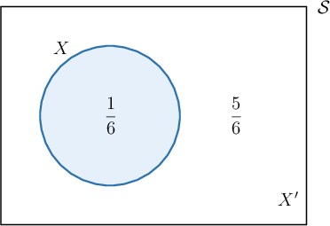
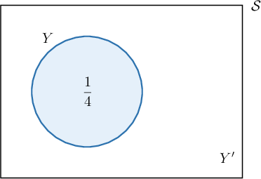
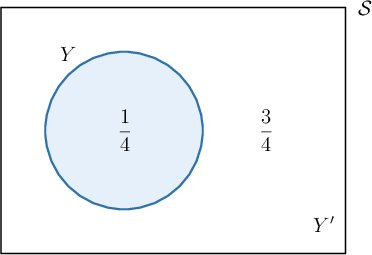
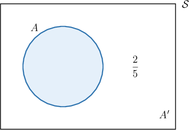
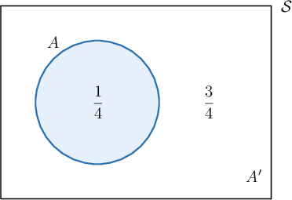

# Venn Diagrams in Probability

Source: https://www.mathacademy.com/topics/793?courseId=43
Topic ID: 793

## Prerequisites

- [The Complement of an Event](../geometry/1120-the-complement-of-an-event.md)

## Lesson

### Introduction

Suppose we roll a fair die. Then, the sample space $\mathcal S$ of this experiment is

$$

\mathcal{S} = \{1,2,3,4,5,6\}.

$$

Now, let's consider the event

$$

X = \{6\}.

$$

This means that $X$ is the event "the die lands on $6.$" We know that $P(X) = \dfrac{1}{6},$ because there are $6$ equally likely outcomes and only $1$ of those outcomes is a $6.$

We can represent the entire sample space $\mathcal S,$ the event $X,$ and its probability using a **Venn diagram**.

Note the following important points:

- The area inside the rectangle represents the sample space $\mathcal S.$

- The area inside the circle (shaded blue) represents the event $X.$

- The number inside the blue circle represents the probability of $X.$

- The area inside the rectangle but outside the circle represents the event $X',$ the complement of $X.$ In our case, the complement is which consists of every event other than throwing a $6.$

For any event $X,$ we have

$$

P(X) +P\left(X'\right) = 1.

$$

Note that the above formula can be rearranged into either of the following equivalent forms:

$$

\begin{aligned}𝑃(𝑋) & =1−𝑃(𝑋^{′}) \\ 𝑃(𝑋^{′}) & =1−𝑃(𝑋)\end{aligned}

$$

In our case, we can calculate $P\left(X'\right)$ as

$$

\begin{aligned}𝑃(𝑋^{′}) & =1−𝑃(𝑋) \\ & =1−\frac{1}{6} \\ & =\frac{5}{6}.\end{aligned}

$$

Finally, since the sample space $\mathcal S$ contains every possible event, we sometimes write $P(\mathcal S) = 1$

### Example: Determining Whether a Venn Diagram is Correct

#### Question

Is the Venn diagram below correct?

#### Explanation

For any event $X,$ we have

$$

P(X) +P(X') = 1.

$$

The Venn diagram tells us that $P(X) = \dfrac{3}{4}$ and $P(X') = \dfrac{1}{2}.$

However, these probabilities don't satisfy the rule:

$$

\begin{aligned}𝑃(𝑋)+𝑃(𝑋^{′}) & =\frac{3}{4}+\frac{1}{2} \\ & =\frac{3}{4}+\frac{2}{4} \\ & =\frac{5}{4}≠1\,×\end{aligned}

$$

Therefore, the above Venn diagram is not correct.

### Example: Calculating the Probability of the Complement Given the Probability of the Event

#### Question

Given the sample space $\mathcal S$ with Venn diagram shown below, calculate $P(Y').$

#### Explanation

The Venn diagram tells us that $P(Y) = \dfrac{1}{4}.$ So, we have

$$

\begin{aligned}𝑃(𝑌^{′}) & =1−𝑃(𝑌) \\ & =1−\frac{1}{4} \\ & =\frac{3}{4}.\end{aligned}

$$

The complete Venn diagram is as follows:

### Example: Calculating the Probability of an Event Given the Probability of the Complement

#### Question

Given the sample space $\mathcal S$ with Venn diagram shown below, calculate $P(A).$

#### Explanation

The Venn diagram tells us that $P(A')= \dfrac{2}{5}.$ So, we have

$$

\begin{aligned}𝑃(𝐴) & =1−𝑃(𝐴^{′}) \\ & =1−\frac{2}{5} \\ & =\frac{3}{5}.\end{aligned}

$$

The complete Venn diagram is as follows:

### Example: Constructing a Venn Diagram for a Given Sample Space

#### Question

Suppose we have two fair coins and we toss both of them. The sample space $\mathcal S$ is

$$

\mathcal S=\{HH,HT,TH,TT\}.

$$

Let $A=\{HH\}$ be the event that we get two heads. What Venn diagram represents this event?

#### Explanation

We know that $P(A) = \dfrac{1}{4}$ because there are $4$ possible outcomes and only one of them is $A.$

So, we can calculate $P(A')$ as

$$

\begin{aligned}𝑃(𝐴^{′}) & =1−𝑃(𝐴) \\ & =1−\frac{1}{4} \\ & =\frac{4}{4}−\frac{1}{4} \\ & =\frac{3}{4}.\end{aligned}

$$

Therefore, the correct Venn diagram representation is as follows:

