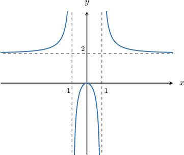

# Horizontal Asymptotes of Rational Functions

Source: https://www.mathacademy.com/topics/808?courseId=43
Topic ID: 808

## Prerequisites

- [The Quotient Rule for Exponents With Algebraic Expressions](../algebra-i/374-the-quotient-rule-for-exponents-with-algebraic-expressions.md)
- [Graph Transformations of Reciprocal Functions](../algebra-ii/3735-graph-transformations-of-reciprocal-functions.md)

## Lesson

### Introduction

A **horizontal asymptote** is a horizontal line that a graph of a function approaches as $x$ tends to (positive or negative) infinity.

For example, let's consider the rational function

$$

f(x) = \frac{2x^2}{x^2-1}.

$$

The graph of $y=f(x)$ is shown below.

We can see that $y=f(x)$ has the horizontal asymptote $y=2.$ The function gets closer and closer to this line but never touches it.

But how can we calculate the horizontal asymptote of a function without using a graph?

To find the horizontal asymptote of a rational function, we follow these three steps.

1. Identify the **dominant term** in the denominator. The dominant term is the leading term of the polynomial in the denominator, though we usually ignore the coefficient.

2. Divide every term in the numerator and denominator of $f(x)$ by the dominant term.

3. Evaluate the remaining expression as $x\to\infty.$

In our case, the dominant term is $x^2.$ So, we divide every term in the numerator and denominator by $x^2,$ as follows:

$$

\begin{aligned}𝑓(𝑥) & =\frac{2𝑥^{2}}{𝑥^{2}−1} \\ & =\frac{\frac{2𝑥^{2}}{𝑥^{2}}}{𝑥^{2}} \\ & =\frac{2}{1−\frac{1}{𝑥^{2}}}.\end{aligned}

$$

When $x$ is very large, the $\dfrac{1}{x^2}$term becomes very small. Therefore, as $x\to\infty,$ we have

$$

\begin{aligned}𝑓(𝑥) & =\frac{2}{1−\frac{1}{𝑥^{2}}} \\ & →\frac{2}{1−0} \\ & =2.\end{aligned}

$$

Therefore, the horizontal asymptote is $y=2.$

### Example: Finding a Horizontal Asymptote When the Degrees of the Numerator and Denominator are Equal

#### Question

Determine the horizontal asymptote of the function $f(x) = \dfrac{4x^3-x}{3x^3+24}.$

#### Explanation

To find the horizontal asymptote of a rational function, we divide every term in the numerator and denominator by the dominant term in the denominator, and then we let $x\to\infty.$

Ignoring the coefficient, the dominant term in the denominator is $x^3.$ So, we divide every term in the numerator and denominator by $x^3,$ as follows:

$$

\begin{aligned}𝑓(𝑥) & =\frac{4𝑥^{3}−𝑥}{3𝑥^{3}+24} \\ & =\frac{(\frac{4𝑥^{3}}{𝑥^{3}}−\frac{𝑥}{𝑥^{3}})}{𝑥^{3}} \\ & =\frac{(4−\frac{1}{𝑥^{2}})}{𝑥^{2}}\end{aligned}

$$

Now, when $x$ is very large, the terms $\dfrac{1}{x^2}$ and $\dfrac{24}{x^3}$ become very small. Therefore, as $x\to\infty,$ we have

$$

\begin{aligned}𝑓(𝑥) & =\frac{(4−\frac{1}{𝑥^{2}})}{𝑥^{2}} \\ & →\frac{4−0}{3+0} \\ & =\frac{4}{3}.\end{aligned}

$$

So, the horizontal asymptote is $y = \dfrac{4}{3}.$

### Example: Finding a Horizontal Asymptote When the Degree of the Denominator is Greater

#### Question

Determine the horizontal asymptote of the function $f(x) = \dfrac{3x^2+ 2x}{6x^4-1}$.

#### Explanation

To find the horizontal asymptote of a rational function, we divide every term in the numerator and denominator by the dominant term in the denominator, and then we let $x\to\infty.$

Ignoring the coefficient, the dominant term in the denominator is $x^4.$ So, we divide every term in the numerator and denominator by $x^4,$ as follows:

$$

\begin{aligned}𝑓(𝑥) & =\frac{3𝑥^{2}+2𝑥}{6𝑥^{4}−1} \\ & =\frac{(\frac{3𝑥^{2}}{𝑥^{4}}+\frac{2𝑥}{𝑥^{4}})}{𝑥^{4}} \\ & =\frac{(\frac{3}{𝑥^{2}}+\frac{2}{𝑥^{3}})}{𝑥^{2}}\end{aligned}

$$

Now, when $x$ is very large, the terms $\dfrac{3}{x^2}, \dfrac{2}{x^3},$ and $\dfrac{1}{x^4}$ become very small. Therefore, as $x\to\infty,$ we have

$$

\begin{aligned}𝑓(𝑥) & =\frac{(\frac{3}{𝑥^{2}}+\frac{2}{𝑥^{3}})}{𝑥^{2}} \\ & →\frac{0+0}{6−0} \\ & =0.\end{aligned}

$$

So, the horizontal asymptote is $y = 0.$

### Example: Finding a Horizontal Asymptote When the Degree of the Numerator is Greater

#### Question

Determine the horizontal asymptote of $f(x) = \dfrac{2x^3}{x^2-1}.$

#### Explanation

To find the horizontal asymptote of a rational function, we divide every term in the numerator and denominator by the dominant term in the denominator, and then we let $x\to\infty.$

Ignoring the coefficient, the dominant term in the denominator is $x^2.$ So, we divide every term in the numerator and denominator by $x^2,$ as follows:

$$

\begin{aligned}𝑓(𝑥) & =\frac{2𝑥^{3}}{𝑥^{2}−1} \\ & =\frac{(\frac{2𝑥^{3}}{𝑥^{2}})}{𝑥^{2}} \\ & =\frac{2𝑥}{(1−\frac{1}{𝑥^{2}})}\end{aligned}

$$

Now, when $x$ is very large, the term $\dfrac{1}{x^2}$ becomes very small. Therefore, as $x\to\infty,$ we have

$$

\begin{aligned}𝑓(𝑥) & =\frac{2𝑥}{(1−\frac{1}{𝑥^{2}})} \\ & ≈\frac{2𝑥}{1−0} \\ & =2𝑥.\end{aligned}

$$

This is not a constant, which means that $y = f(x)$ does not have a horizontal asymptote.
