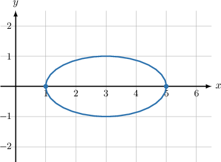
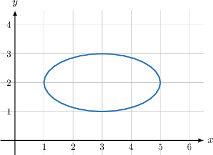
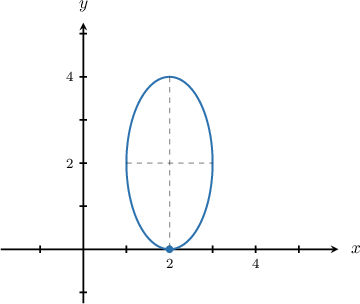
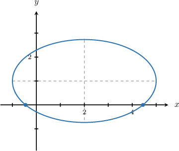
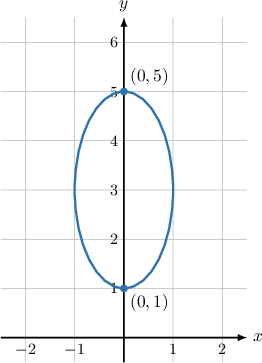
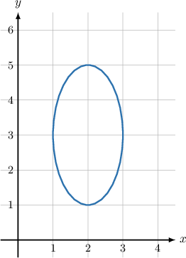
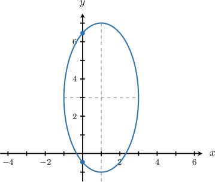
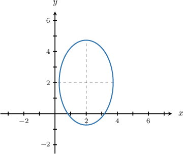

# Finding Intercepts of Ellipses

Source: https://www.mathacademy.com/topics/850?courseId=43
Topic ID: 850

## Prerequisites

- [Properties of Lines Given in Slope-Intercept Form](../algebra-i/398-properties-of-lines-given-in-slope-intercept-form.md)
- [Equations of Ellipses Centered at a General Point](./849-equations-of-ellipses-centered-at-a-general-point.md)
- [Perfect Square Quadratic Equations with One or No Solutions](../algebra-i/1425-perfect-square-quadratic-equations-with-one-or-no-solutions.md)
- [Solving Quadratic Equations With Leading Coefficients by Completing the Square](../algebra-i/3849-solving-quadratic-equations-with-leading-coefficients-by-completing-the-square.md)

## Lesson

### Introduction

When an ellipse intercepts the $x$-axis, we must have $y = 0.$ So, to find the $x$-intercepts of an ellipse, we substitute $y = 0$ into the equation of the ellipse and solve the resulting equation for $x.$

For example, let's find the $x$-intercepts of the ellipse given by the equation

$$

\dfrac{(x-3)^2}{4} + y^2 = 1.

$$

Substituting $y=0$ into the equation and solving the resulting equation for $x,$ we get

$$

\begin{aligned}\frac{(𝑥−3)^{2}}{4}+0^{2} & =1 \\ \frac{(𝑥−3)^{2}}{4} & =1 \\ (𝑥−3)^{2} & =4 \\ 𝑥−3 & =±2 \\ 𝑥 & =3±2 \\ 𝑥 & =1,5.\end{aligned}

$$

Therefore, the ellipse intercepts the $x$-axis at the points $(1,0)$ and $(5,0).$ We can verify this by plotting the graph:

### Ellipses with No x-Intercepts

Some ellipses have no $x$-intercepts. For example, consider the ellipse given by the equation

$$

\dfrac{(x-3)^2}{4} + (y-2)^2 = 1.

$$

As we can see in the graph below, this ellipse does not intercept the $x$-axis.

Algebraically, we can tell that an ellipse has no $x$-intercepts if there are no solutions when we substitute $y=0$ into the equation.

For example, substituting $y=0$ into the equation of the ellipse given above, we find no solutions:

$$

\begin{aligned}\frac{(𝑥−3)^{2}}{4}+(𝑦−2)^{2} & =1 \\ \frac{(𝑥−3)^{2}}{4}+(0−2)^{2} & =1 \\ \frac{(𝑥−3)^{2}}{4}+4 & =1 \\ \frac{(𝑥−3)^{2}}{4} & =−3 \\ (𝑥−3)^{2} & =−12\end{aligned}

$$

Since $(x-3)^2 \geq 0$, there is no $x$ such that $(x-3)^2 = -12.$ Therefore, the ellipse has no $x$-intercepts, meaning that it does not intercept the $x$-axis at any point.

### Example: Calculating the x-Intercepts of an Ellipse

#### Question

Calculate the point where the ellipse $(x-2)^2 + \dfrac{(y-2)^2}{4} = 1$ intercepts the $x$-axis.

#### Explanation

To calculate the $x$-intercept, we need to substitute $y = 0$ into the equation of the ellipse and solve the resulting equation for $x.$ Doing this, we get

$$

\begin{aligned}(𝑥−2)^{2}+\frac{(𝑦−2)^{2}}{4} & =1 \\ (𝑥−2)^{2}+\frac{(0−2)^{2}}{4} & =1 \\ (𝑥−2)^{2}+1 & =1 \\ (𝑥−2)^{2} & =0 \\ 𝑥−2 & =0 \\ 𝑥 & =2.\end{aligned}

$$

Therefore, the ellipse intercepts the $x$-axis at the point $(2,0).$

### Example: Calculating the x-Intercepts of an Ellipse By Completing the Square

#### Question

Calculate the points where the ellipse $x^2 + 3y^2 - 4x - 6y = 2$ (shown above) intercepts the $x$-axis.

#### Explanation

To calculate the $x$-intercepts, we need to substitute $y = 0$ into the equation of the ellipse and solve the resulting equation for $x.$ We do this and solve the resulting equation by completing the square:

$$

\begin{aligned}𝑥^{2}+3𝑦^{2}−4𝑥−6𝑦 & =2 \\ 𝑥^{2}+3⋅0^{2}−4𝑥−6⋅0 & =2 \\ 𝑥^{2}−4𝑥 & =2 \\ (𝑥^{2}−4𝑥+4)−4 & =2 \\ (𝑥−2)^{2}−4 & =2 \\ (𝑥−2)^{2} & =6 \\ 𝑥−2 & =±\sqrt{√6} \\ 𝑥 & =2±\sqrt{√6}\end{aligned}

$$

Therefore, the ellipse intercepts the $x$-axis at $(2-\sqrt{6},0)$ and $(2+\sqrt{6},0).$

### Finding the y-Intercepts of an Ellipse

When an ellipse intercepts the -axis, we must have So, to find the -intercepts of an ellipse, we substitute into the equation of the ellipse and solve the resulting equation for

For example, let's find the -intercepts of the ellipse given by the equation

Substituting in the equation of the ellipse and solving the resulting equation for we get

Therefore, the ellipse intercepts the -axis at the points and We can verify this by plotting the graph:

### Ellipses with No y-Intercepts

Again, some ellipses have no $y$-intercepts. For example, consider the ellipse given by the equation

$$

(x-2)^2 + \dfrac{(y-3)^2}{4} = 1.

$$

As we can see in the graph below, this ellipse does not intercept the $y$-axis.

Algebraically, we can tell that an ellipse has no $y$-intercepts if there are no solutions when we substitute $x=0$ into the equation.

For example, substituting $x=0$ into the equation of the ellipse given above, we find no solutions:

$$

\begin{aligned}(𝑥−2)^{2}+\frac{(𝑦−3)^{2}}{4} & =1 \\ (0−2)^{2}+\frac{(𝑦−3)^{2}}{4} & =1 \\ 4+\frac{(𝑦−3)^{2}}{4} & =1 \\ \frac{(𝑦−3)^{2}}{4} & =−3 \\ (𝑦−3)^{2} & =−12.\end{aligned}

$$

Since $(y-3)^2 \geq 0$, there is no $y$ such that $(y-3)^2 = -12.$ Therefore, the ellipse has no $y$-intercepts, meaning that it does not intercept the $y$-axis at any point.

### Example: Calculating the y-Intercepts of an Ellipse

#### Question

Calculate the point where the ellipse $\dfrac{(x-1)^2}{4}+\dfrac{(y-3)^2}{16}=1$ intercepts the $y$-axis.

#### Explanation

To calculate the $y$-intercept, we need to substitute $x = 0$ in the equation of the ellipse and solve the resulting equation for $y.$ Doing this, we get

$$

\begin{aligned}\frac{(𝑥−1)^{2}}{4}+\frac{(𝑦−3)^{2}}{16} & =1 \\ \frac{(0−1)^{2}}{4}+\frac{(𝑦−3)^{2}}{16} & =1 \\ \frac{1}{4}+\frac{(𝑦−3)^{2}}{16} & =1 \\ \frac{(𝑦−3)^{2}}{16} & =\frac{3}{4} \\ (𝑦−3)^{2} & =12 \\ 𝑦−3 & =±\sqrt{√12} \\ 𝑦−3 & =2\sqrt{√3} \\ 𝑦 & =3±2\sqrt{√3}.\end{aligned}

$$

Therefore, the ellipse intercepts the $y$-axis at the points $(0,3 -2\sqrt{3})$ and $(0,3 +2\sqrt{3}).$

### Example: Calculating the y-Intercepts of an Ellipse By Completing the Square

#### Question

Calculate the points where the ellipse $5x^2 + 2y^2 - 20x - 8y + 13 = 0$ intercepts the $y$-axis.

#### Explanation

To calculate the $y$-intercepts, we need to substitute $x = 0$ in the equation of the ellipse and try to solve the resulting equation for $y.$ We do this and solve the resulting equation by completing the square:

$$

\begin{aligned}5𝑥^{2}+2𝑦^{2}−20𝑥−8𝑦+13 & =0 \\ 5⋅0^{2}+2𝑦^{2}−20⋅0−8𝑦+13 & =0 \\ 2𝑦^{2}−8𝑦+13 & =0 \\ 2(𝑦^{2}−4𝑦)+13 & =0 \\ 2[𝑦^{2}−4𝑦+4−4]+13 & =0 \\ 2[(𝑦−2)^{2}−4]+13 & =0 \\ 2(𝑦−2)^{2}+5 & =0 \\ (𝑦−2)^{2} & =−\frac{5}{2}\end{aligned}

$$

Since $(y-2)^2 \geq 0$, there is no $y$ such that $(y-2)^2 = -\dfrac{5}{2}.$ Therefore, the ellipse has no $y$-intercepts, meaning that it does not intercept the $y$-axis at any point.

