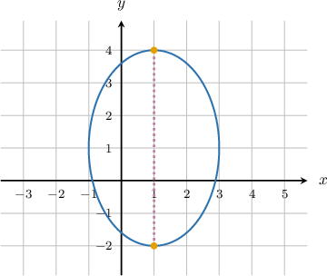
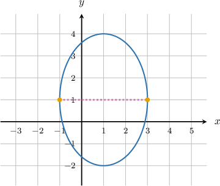
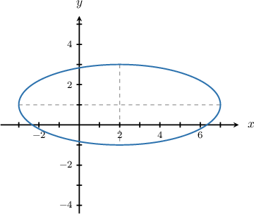
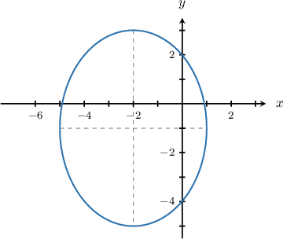
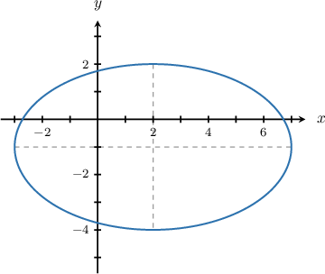

# Introduction to Ellipses

Source: https://www.mathacademy.com/topics/853?courseId=43
Topic ID: 853

## Prerequisites

- [Distances Between Points in the Coordinate Plane](../grade-6/573-distances-between-points-in-the-coordinate-plane.md)
- [Circles](../geometry/1404-circles.md)

## Lesson

### Introduction

An **ellipse** is a circle that has been stretched. For example, let's look at the ellipse given below:

The longest diameter of an ellipse is called the **major axis**.

So, for the ellipse above, the major axis is the line segment bounded by the points $(1,-2)$ and $(1,4),$ and its length is $4-(-2)=6.$

Half of the major axis is called a **semi-major axis**. For our ellipse above, the length of the semi-major axis is $\dfrac{6}{2} = 3.$

On the other hand, the **minor axis** is the shortest diameter of an ellipse. Let's have another look at the same ellipse:

Here, we see the minor axis of the ellipse. It is the line segment bounded by the points $(-1,1)$ and $(3,1),$ and its length is $3-(-1)=4.$

Half of the minor axis is called a **semi-minor axis**. For our ellipse, the semi-minor axis has a length of $\dfrac{4}{2} = 2.$

For this particular ellipse:

- Since the major axis is parallel to the $y$-axis, the major axis is said to be "along the $y$-direction".

- Since the minor axis is parallel to the $x$-axis, the minor axis is said to be "along the $x$-direction".

Note that for other ellipses, it may be opposite: the major axis may be along the $x$-direction, and the minor axis may be along the $y$-direction.

### Example: Determining the Lengths of the Major and Minor Axes of an Ellipse

#### Question

What are the lengths of the major and minor axes of the ellipse given below?

#### Explanation

The major axis is the longest diameter of the ellipse, which is the line segment bounded by the points $(-3,1)$ and $(7,1).$ So, the length of the major axis is $7 - (-3) = 10.$

The minor axis is the shortest diameter of the ellipse, which is the line segment bounded by the points $(2,-1)$ and $(2,3).$ So, the length of the minor axis is $3 - (-1) = 4.$

### Example: Determining the Lengths of the Semi-Major Axis of an Ellipse

#### Question

What are the lengths of the major and semi-major axes of the ellipse given below?

#### Explanation

The major axis is the longest diameter of the ellipse, which is the line segment bounded by the points $(-2,-5)$ and $(-2,3).$ So, the length of the major axis is $3-(-5)=8.$

The length of the semi-major axis is half the length of the major axis. So, the length of the semi-major axis $\dfrac{8}{2} = 4.$

### Example: Determining the Lengths of the Semi-Minor Axis of an Ellipse

#### Question

What are the lengths of the minor and semi-minor axes of the ellipse given below?

#### Explanation

The major axis is the longest diameter of the ellipse, which is the line segment bounded by the points $(-3, -1)$ and $(7, -1).$ So, the length of the major axis is $7-(-3)=10.$

The length of the semi-minor axis is half the length of the minor axis.

- The minor axis is the shortest diameter of the ellipse, which is the line segment bounded by the points $(2,2)$ and $(2,-4).$ So, the length of the minor axis is $2-(-4)=6.$

- The length of the semi-minor axis, then, is $\dfrac{6}{2}=3.$
