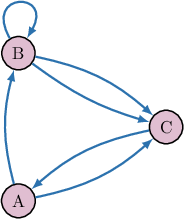
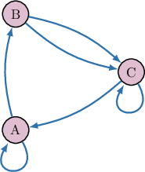

# Introduction to Matrices

Source: https://www.mathacademy.com/topics/861?courseId=43
Topic ID: 861

## Prerequisites

- [Surds](../grade-8/2204-surds.md)

## Lesson

### Introduction

In mathematics, rectangular arrays containing numbers are called **matrices**.

As an example, consider the matrix $A$ below:

$$

\begin{aligned}2 & 1 & 3 \\ 4 & −1 & 2 \\ 1 & −4 & 6\end{aligned}

$$

This particular matrix has $3$ rows and $3$ columns. The numbers in the matrix are called **entries** or **elements.**

The number of rows and columns in a matrix does not need to be the same. For example, consider another matrix that has $3$ rows and $4$ columns:

$$

\begin{aligned}−1 & 13 & 4 & 2 \\ 0 & −1 & 3 & 0 \\ 3 & 1 & 2 & −5\end{aligned}

$$

The **dimensions** of the matrix are the number of rows and the number of columns. For example, the matrix $M$ shown above has $3$ rows and $4$ columns. So, we write the dimensions of $M$ as $3 \times 4$ (read as "three by four").

### Square Matrices

A **square matrix** is a matrix where the number of rows is equal to the number of columns.

For example, the matrix

$$

[\begin{aligned}3 & −1 \\ 2 & 5\end{aligned}]

$$

is a square matrix because it has $2$ rows and $2$ columns. Its dimensions are $2 \times 2.$

In general, the dimensions of a square matrix are $n \times n.$

### Example: Determining the Dimensions of a Matrix

#### Question

What are the dimensions of the matrix ${A},$ where

$$

\begin{aligned}4 & 5 & 1 \\ −2 & 0 & 6 \\ 3 & 2 & −5 \\ 5 & 1 & 7\end{aligned}

$$

#### Explanation

The matrix ${A}$ has $4$ rows and $3$ columns. Therefore, its dimensions are $4\times 3.$

### Matrices With One Row or Column

Some matrices have only one column, for instance

$$

[\begin{aligned}−1 \\ 13\end{aligned}]

$$

Here, $A$ is a $2\times 1$ matrix, $B$ is a $4\times 1$ matrix, and $C$ is a $3\times 1$ matrix. These types of matrices are often called **column vectors**.

Other matrices have only one row, for instance

$$

[\begin{aligned}−1 & 0\end{aligned}]

$$

Here, $D$ is a $1\times 2$ matrix, $E$ is a $1\times 3$ matrix, and $F$ is a $1\times 4$ matrix. These types of matrices are often called **row vectors**.

**Note:** Every number can be thought of as a $1\times 1$ matrix. For instance, we can consider the number $5$ as the matrix

$$

[\begin{aligned}\,5\,\end{aligned}]

$$

### Example: Determining the Dimensions of a Matrix with One Row or Column

#### Question

What are the dimensions of the matrix ${D},$ where

$$

[\begin{aligned}5 & 1 & 0 & 5\end{aligned}]

$$

#### Explanation

The matrix ${D}$ has $1$ row and $4$ columns. So, its dimensions are $1\times 4.$

### Example: Identifying a Matrix by Its Description

#### Question

Which of the following is a $3 \times 2$ matrix?

$$

[\begin{aligned}1 & 0 & −5 \\ 0 & 1.1 & \sqrt{√2}\end{aligned}]

$$

#### Explanation

- The matrix $A$ has $2$ rows and $3$ columns. So, its dimensions are $2 \times 3.$ $\quad{\color{red}\times}$

- The matrix $B$ has $3$ rows and $2$ columns. So, its dimensions are $3 \times 2.$ $\quad{\color{green}\checkmark}$

- The matrix $C$ has $1$ rows and $3$ columns. So, its dimensions are $1 \times 3.$ $\quad{\color{red}\times}$

Therefore, only $B$ is a $3 \times 2$ matrix.

### Using Matrices for Modeling

Matrices arise naturally in *many* real-world problems. Weather forecasting, image processing and computer graphics, video games, and online customization algorithms are just a few of the many applications of matrices.

Let's consider an example where we can use a matrix to model bus routes in a city.

The diagram below shows the bus routes between three stations (Station A, Station B, and Station C) in a particular city, where $A, B,$ and $C$ represent the stations and the arrows represent the directed routes between them.

Note that the circles $A,B,$ and $C$ in our diagram are called **nodes**.

We wish to represent this same diagram using a matrix. Let's start by putting this information into a table like the one below:

Let's now fill in the rows of our table. We begin by considering all of the bus routes from Station A to the other stations:

- There are $\color{blue}0$ bus routes from $A$ to itself.

- There is $\color{blue}1$ bus route from $A$ to $B.$

- There is $\color{blue}1$ bus route from $A$ to $C.$

Filling in the first row of the table, we get the following:

Filling in the remaining rows in the same way, we get:

Finally, keeping only the essential information, we obtain the following matrix:

$$

\begin{aligned}0 & 1 & 1 \\ 0 & 1 & 2 \\ 1 & 0 & 0\end{aligned}

$$

### Example: Matrices for Route Planning

#### Question

The diagram above shows train routes between three train stations, where the nodes represent stations and arrows represent the directed routes between them. The (incomplete) route matrix below represents the number of routes between the three stations. Find the value of $a+b+c.$

#### Explanation

Let's examine our diagram.

- There is $1$ arrow starting at Station A and ending at Station A. So, there is only one route from $A$ to $A,$ and so $a=1.$

- No arrows are starting at Station B and ending at Station B. So, there are no routes from $B$ to $B,$ and so $b=0.$

- There is $1$ arrow starting at Station C and ending at Station A. So, there is only one route from $C$ to $A,$ and so $c=1.$

As a result, our route matrix is the following:

Therefore,

$$

a+b+c = 1+0+1 = 2.

$$
