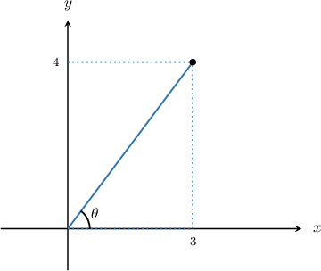
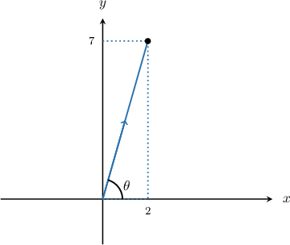
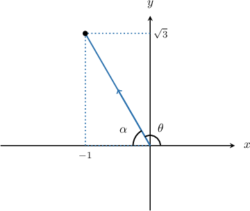
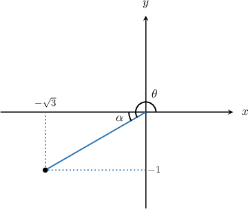
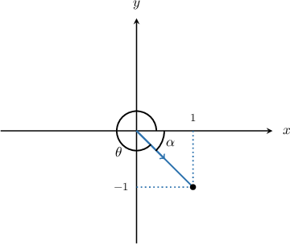

# The Argument of a Complex Number

Source: https://www.mathacademy.com/topics/893?courseId=43
Topic ID: 893

## Prerequisites

- [The Complex Plane](./157-the-complex-plane.md)
- [Calculating Reference Angles](../algebra-ii/1456-calculating-reference-angles.md)

## Lesson

### Introduction

Consider the complex number $z=3+4\textrm{i},$ as depicted on the Argand diagram below:

There is a natural angle $\theta$ that $z$ makes with the positive real axis. This angle is called the **argument** of $z.$ We often denote the argument as $\arg(z),$ or just $\theta.$ The numeric value of $\arg(z)$ is given in radians, and we restrict the values to

$$

0\leq \arg(z) \lt 2\pi.

$$

In the triangle above, we have

$$

\begin{aligned}tan⁡𝜃 & =\frac{4}{3} \\ 𝜃 & =arctan⁡(\frac{4}{3}) \\ & ≈0.93,\end{aligned}

$$

rounded to two decimal places. Therefore $\arg (z) \approx 0.93$ to two decimal places.

**Caution:** When you evaluate $\arctan \left(\dfrac{4}{3} \right)$ on your calculator, be sure that you're in radians mode, and be sure to put parentheses around the $\dfrac{4}{3}.$

### Example: Finding the Argument of a Complex Number in the First Quadrant

#### Question

Find, in radians to two decimal places, the argument of $z=2+7\textrm{i}.$

#### Explanation

Let's plot $z$ in the complex plane.

The complex number $z$ lies in the first quadrant of the complex plane. Therefore $0< \arg(z)< \dfrac{\pi}{2}.$ Further,

$$

\begin{aligned}arg⁡(𝑧) & =arctan⁡(\frac{7}{2})≈1.29\end{aligned}

$$

to two decimal places.

### Example: Finding the Argument of a Complex Number in the Second Quadrant

#### Question

Find, in radians, the argument of $z=-1+\textrm{i}\sqrt{3}.$

#### Explanation

Let's plot $z$ in the complex plane.

The complex number $z$ lies in the second quadrant of the complex plane. Therefore $\dfrac{\pi}{2}< \arg(z)< \pi.$ If $\alpha$ is the angle that $z$ makes with the negative real axis, then

$$

\begin{aligned}tan⁡𝛼 & =\frac{\sqrt{√3}}{1} \\ 𝛼 & =arctan⁡(\sqrt{√3}) \\ & =\frac{𝜋}{3}\end{aligned}

$$

Therefore,

$$

\theta=\arg(z) = \pi - \dfrac\pi 3 = \dfrac{2\pi}{3}.

$$

### Example: Finding the Argument of a Complex Number in the Third Quadrant

#### Question

Find, in radians to two decimal places, the argument of $z=-\sqrt{3}-\textrm{i}.$

#### Explanation

Let's plot $z$ in the complex plane.

The complex number $z$ lies in the third quadrant of the complex plane. Therefore $\pi< \arg(z)< \dfrac{3\pi}{2}.$ If $\alpha$ is the angle that $z$ makes with the negative real axis, then

$$

\begin{aligned}𝛼 & =arctan⁡(\frac{1}{\sqrt{√3}})=\frac{𝜋}{6}.\end{aligned}

$$

Therefore,

$$

\theta=\arg(z) = \pi +\dfrac\pi 6 = \dfrac{7\pi}{6}.

$$

### Example: Finding the Argument of a Complex Number in the Fourth Quadrant

#### Question

Find, in radians, the argument of $z=1-\textrm{i}.$

#### Explanation

Let's plot $z$ in the complex plane.

The complex number $z$ lies in the fourth quadrant of the complex plane. Therefore $\dfrac{3\pi}{2}< \arg(z)< 2\pi.$

If $\alpha$ is the angle that $z$ makes with the positive real axis, then

$$

\alpha = \arctan\left(1\right) = \dfrac\pi 4.

$$

Therefore,

$$

\theta=\arg(z) = 2\pi - \dfrac\pi 4 =\dfrac{7\pi}{4}.

$$
