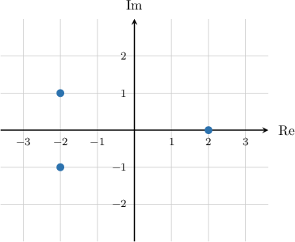

# The Fundamental Theorem of Algebra with Cubic Equations

Source: https://www.mathacademy.com/topics/896?courseId=43
Topic ID: 896

## Prerequisites

- [The Complex Plane](./157-the-complex-plane.md)
- [The Fundamental Theorem of Algebra for Quadratic Equations](./724-the-fundamental-theorem-of-algebra-for-quadratic-equations.md)

## Lesson

### Introduction

The **fundamental theorem of algebra** tells us that any cubic polynomial with real coefficients has precisely three roots.

Furthermore, any such polynomial can be factored as

$$

ax^3+bx^2+cx + d = a(x-x_1)(x-x_2)(x-x_3),

$$

where $x_1, x_2,$ and $x_3$ are the roots of the polynomial.

When counting the roots of a cubic polynomial, we need to bear in mind the following points:

- If a root has multiplicity $2,$ we count it twice.

- If a root has multiplicity $3,$ we count it three times.

- We also include any imaginary or complex roots.

Also, remember that in the case of imaginary or complex roots, the roots always come in complex conjugate pairs.

Let's consider some examples.

- Let $f(x) = x^3-2x^2 -5x +6.$ This polynomial has three distinct real roots, $x = -2, x=1$ and $x = 3.$ Therefore, it can be factored as follows:

$$

\begin{aligned}𝑓(𝑥) & =(𝑥−(−2))(𝑥−1)(𝑥−3) \\ & =(𝑥+2)(𝑥−1)(𝑥−3)\end{aligned}

$$

- Let $g(x) = 4x^3-16x^2 +13x -3.$ This polynomial has one double root $x = \dfrac12$ and one single root $x = 3.$ Therefore, it can be factored as follows:

$$

\begin{aligned}𝑔(𝑥) & =4(𝑥−\frac{1}{2})(𝑥−\frac{1}{2})(𝑥−3) \\ & =4(𝑥−\frac{1}{2})^{2}(𝑥−3)\end{aligned}

$$

- Let $h(x) = x^3-3x^2+3x-1.$ This polynomial has one triple root, $x = 1.$ Therefore, it can be factored as follows:

$$

\begin{aligned}ℎ(𝑥) & =(𝑥−1)(𝑥−1)(𝑥−1) \\ & =(𝑥−1)^{3}\end{aligned}

$$

- Let $k(x) = x^3-x^2+4x-4.$ This polynomial has two complex conjugate roots, $x = \pm 2\textrm i,$ and one single real root $x=1.$ Therefore, it can be factored as follows:

$$

\begin{aligned}𝑘(𝑥) & =(𝑥−2i)(𝑥−(−2i))(𝑥−1) \\ & =(𝑥−2i)(𝑥+2i)(𝑥−1)\end{aligned}

$$

### Example: Finding a Cubic Polynomial Given Three Real Roots and a Leading Coefficient

#### Question

The cubic polynomial $P(x)$ has roots $x_1=x_2=2,x_3=1,$ and the coefficient of the cubic term is $3.$ Find $P(x).$

#### Explanation

Since our cubic polynomial has roots ${\color{black}x_1=x_2=2}$ and ${\color{black}x_3=1},$ and the coefficient of the cubic term is ${\color{black}a=3},$ we can write the polynomial as follows:

$$

\begin{aligned}𝑎(𝑥−𝑥_{1})(𝑥−𝑥_{2})(𝑥−𝑥_{3}) & =3(𝑥−2)(𝑥−2)(𝑥−1)\end{aligned}

$$

Expanding the parentheses, we obtain

$$

\begin{aligned}3(𝑥−2)(𝑥−2)(𝑥−1) & =3(𝑥^{2}−4𝑥+4)(𝑥−1) \\ & =3(𝑥^{3}−𝑥^{2}−4𝑥^{2}+4𝑥+4𝑥−4) \\ & =3(𝑥^{3}−5𝑥^{2}+8𝑥−4) \\ & =3𝑥^{3}−15𝑥^{2}+24𝑥−12.\end{aligned}

$$

Therefore, $P(x) = 3x^3 -15x^2+24x-12.$

### Example: Finding a Cubic Polynomial Given One Real Root, Two Complex Roots, and a Leading Coefficient

#### Question

The Argand diagram above shows the roots of the cubic polynomial $f(x).$ Find $f(x)$ given that the coefficient of the cubic term is $1.$

#### Explanation

From the diagram, we see that $f(x)$ has roots ${\color{black}x_1= 2}$ and ${\color{black}x_{2,3}=-2\pm \textrm{i}}.$ Additionally, we're given that the coefficient of the cubic term is ${\color{black}a=1}.$

Therefore, we can write the polynomial as follows:

$$

\begin{aligned}𝑓(𝑥) & =𝑎(𝑥−𝑥_{1})(𝑥−𝑥_{2})(𝑥−𝑥_{3}) \\ & =(𝑥−2)(𝑥−(−2+i))(𝑥−(−2−i))\end{aligned}

$$

Expanding the parentheses, we obtain

$$

\begin{aligned}(𝑥−2)(𝑥−(−2+i))(𝑥−(−2−i)) & = \\ (𝑥−2)(𝑥^{2}−𝑥(−2−i)−𝑥(−2+i)+(−2+i)(−2−i)) & = \\ (𝑥−2)(𝑥^{2}+4𝑥+5) & = \\ 𝑥^{3}+4𝑥^{2}+5𝑥−2𝑥^{2}−8𝑥−10 & = \\ 𝑥^{3}+2𝑥^{2}−3𝑥−10 & .\end{aligned}

$$

Therefore, $f(x) = x^3+2x^2-3x-10.$

### General Statement of the Fundamental Theorem of Algebra

In this lesson, we have considered the fundamental theorem of algebra applied to cubic polynomials. However, we remind ourselves that we can apply the fundamental theorem of algebra to *any* polynomial with real coefficients.

Suppose that $p(x)$ is a polynomial of degree $n$ with real coefficients, given by

$$

p(x) = a_nx^n+\ldots+a_1x+a_0, \qquad a_n\neq 0.

$$

The fundamental theorem of algebra tells us that $p(x)$ will always have precisely $n$ roots.

Furthermore, $p(x)$ can be factored as follows:

$$

p(x) = a_n(x-x_1)(x-x_2)(x-x_3)\cdots (x-x_{n})

$$

where $x_1, x_2, x_3,\ldots,x_n$ are the roots of the polynomial.

As with the quadratic and cubic cases, we need to bear the following important points in mind when counting the roots of a polynomial:

- If a root has multiplicity $m,$ we count that root $m$ times.

- We also include any imaginary or complex roots.

As with the quadratic and cubic cases, imaginary and complex roots *always* come in complex conjugate pairs.
