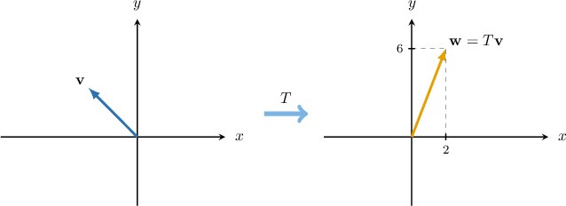
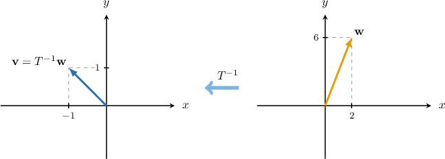

# Inverting Linear Transformations

Source: https://www.mathacademy.com/topics/988?courseId=43
Topic ID: 988

## Prerequisites

- [Inverses of 2x2 Matrices](./864-inverses-of-2x2-matrices.md)
- [Linear Transformations of Objects in the Plane](./866-linear-transformations-of-objects-in-the-plane.md)

## Lesson

### Introduction

Consider the linear transformation $\mathbf{T}$ whose matrix $T$ is given by

$$

[\begin{aligned}2 & 4 \\ 4 & 10\end{aligned}]

$$

Suppose we know that some vector $\mathbf{v}$ in the plane is mapped to the vector $\mathbf w$ under the action of $\mathbf T,$ where the vector $\mathbf w$ is given by

$$

[\begin{aligned}2 \\ 6\end{aligned}]

$$

The mapping $\mathbf T(\mathbf v) = \mathbf w$ is shown schematically in the diagram below.

How can we find the original vector $\mathbf v?$

To find the vector $\mathbf v,$ we compute the inverse of the matrix $T$ and then use it to reverse the action of $\mathbf T.$ Let's see how this works.

From the given information, we have

$$

[\begin{aligned}2 \\ 6\end{aligned}]

$$

If we pre-multiply the above equation by $T^{-1},$ we get

$$

\begin{aligned}𝑇^{−1}⋅𝑇⋅𝐯 & =𝑇^{−1}⋅[\begin{aligned}2 \\ 6\end{aligned}] \\ 𝐼_{2}⋅𝐯 & =𝑇^{−1}⋅[\begin{aligned}2 \\ 6\end{aligned}] \\ 𝐯 & =𝑇^{−1}⋅[\begin{aligned}2 \\ 6\end{aligned}].\end{aligned}

$$

This equation tells that to find the vector $\mathbf v,$ we need to pre-multiply the vector $\mathbf w$ by the inverse of $T.$

So, we now calculate the inverse of $T\mathbin{:}$

$$

\begin{aligned}𝑇^{−1} & =\frac{1}{20−16}[\begin{aligned}10 & −4 \\ −4 & 2\end{aligned}] \\ & =\frac{1}{4}[\begin{aligned}10 & −4 \\ −4 & 2\end{aligned}].\end{aligned}

$$

Therefore, we can calculate the original vector $\mathbf v$ as follows:

$$

\begin{aligned}𝐯 & =𝑇^{−1}⋅[\begin{aligned}2 \\ 6\end{aligned}] \\ & =\frac{1}{4}[\begin{aligned}10 & −4 \\ −4 & 2\end{aligned}][\begin{aligned}2 \\ 6\end{aligned}] \\ & =\frac{1}{4}[\begin{aligned}−4 \\ 4\end{aligned}] \\ & =[\begin{aligned}−1 \\ 1\end{aligned}]\end{aligned}

$$

We can easily check that this is the correct answer by computing $T\cdot \mathbf v\mathbin{:}$

$$

\begin{aligned}𝑇⋅𝐯 & =[\begin{aligned}2 & 4 \\ 4 & 10\end{aligned}][\begin{aligned}−1 \\ 1\end{aligned}] \\ & =[\begin{aligned}2 \\ 6\end{aligned}]\,✓\end{aligned}

$$

We summarize the process we just completed in the following diagram.

In general, if $T$ is a $2\times 2$ matrix that represents a linear transformation, then $T^{-1}$ is the inverse linear transformation and, if it exists, it reverses the action of $T.$ So for any vector $\mathbf{v}$ on the plane, we have

$$

T^{-1}\cdot T\cdot \mathbf{v} = I_2 \cdot \mathbf{v} = \mathbf{v}.

$$

### Example: Calculating a Vector Given Its Image Under a Linear Transformation

#### Question

The vector $\mathbf{v}$ in the plane is mapped to the vector $[\begin{aligned}1 \\ 4\end{aligned}]$ under the action of the linear transformation $\mathbf{T}$ whose matrix $T$ is given by

$$

[\begin{aligned}5 & −2 \\ 10 & −3\end{aligned}]

$$

What is the original vector $\mathbf{v}?$

#### Explanation

From the given information, we have

$$

[\begin{aligned}1 \\ 4\end{aligned}]

$$

We need to reverse the action of the matrix $T.$ So, we multiply the above equation by $T^{-1},$ and we get

$$

\begin{aligned}𝑇^{−1}⋅𝑇⋅𝐯 & =𝑇^{−1}⋅[\begin{aligned}1 \\ 4\end{aligned}] \\ 𝐯 & =𝑇^{−1}⋅[\begin{aligned}1 \\ 4\end{aligned}].\end{aligned}

$$

Now, we need to calculate the inverse of $T$, which is

$$

\begin{aligned}𝑇^{−1} & =\frac{1}{−15−(−20)}[\begin{aligned}−3 & 2 \\ −10 & 5\end{aligned}] \\ & =\frac{1}{5}[\begin{aligned}−3 & 2 \\ −10 & 5\end{aligned}].\end{aligned}

$$

Therefore, the original vector is

$$

\begin{aligned}𝐯 & =𝑇^{−1}⋅[\begin{aligned}1 \\ 4\end{aligned}] \\ & =\frac{1}{5}[\begin{aligned}−3 & 2 \\ −10 & 5\end{aligned}][\begin{aligned}1 \\ 4\end{aligned}] \\ & =\frac{1}{5}[\begin{aligned}5 \\ 10\end{aligned}] \\ & =[\begin{aligned}1 \\ 2\end{aligned}].\end{aligned}

$$

### Example: Calculating the Vertices of a Polygon Given Its Image Under a Linear Transformation

#### Question

Consider the linear transformation $\mathbf T$ with matrix representation $T,$ given by

$$

[\begin{aligned}4 & −1 \\ 3 & 1\end{aligned}]

$$

The triangle $S$ is mapped to the triangle $S'$ under the action of $\mathbf T.$ The triangle $S'$ has vertices $(4,3),(4,10),$ and $(-4,-3).$ Which of the following are vertices of $S?$

1. $(1,0)$

2. $(4,-3)$

3. $(-1,0)$

#### Explanation

First, we create a matrix $Y$ containing all of the vertices of $S'\mathbin{:}$

$$

[\begin{aligned}4 & 4 & −4 \\ 3 & 10 & −3\end{aligned}]

$$

Now, if $X$ denotes the matrix that contains the corresponding vertices of $S$, we have

$$

\begin{aligned}𝑇⋅𝑋 & =𝑌 \\ 𝑇⋅𝑋 & =[\begin{aligned}4 & 4 & −4 \\ 3 & 10 & −3\end{aligned}].\end{aligned}

$$

We need to reverse the action of the matrix $T.$ So, we multiply the above equation by $T^{-1},$ and we get

$$

\begin{aligned}𝑇^{−1}⋅𝑇⋅𝑋 & =𝑇^{−1}⋅[\begin{aligned}4 & 4 & −4 \\ 3 & 10 & −3\end{aligned}] \\ 𝑋 & =𝑇^{−1}⋅[\begin{aligned}4 & 4 & −4 \\ 3 & 10 & −3\end{aligned}].\end{aligned}

$$

The inverse of $T$ is

$$

\begin{aligned}𝑇^{−1} & =\frac{1}{4−(−3)}[\begin{aligned}1 & 1 \\ −3 & 4\end{aligned}] \\ & =\frac{1}{7}[\begin{aligned}1 & 1 \\ −3 & 4\end{aligned}].\end{aligned}

$$

Therefore, we obtain

$$

\begin{aligned}𝑋 & =𝑇^{−1}⋅[\begin{aligned}4 & 4 & −4 \\ 3 & 10 & −3\end{aligned}] \\ & =\frac{1}{7}[\begin{aligned}1 & 1 \\ −3 & 4\end{aligned}][\begin{aligned}4 & 4 & −4 \\ 3 & 10 & −3\end{aligned}] \\ & =\frac{1}{7}[\begin{aligned}7 & 14 & −7 \\ 0 & 28 & 0\end{aligned}] \\ & =[\begin{aligned}1 & 2 & −1 \\ 0 & 4 & 0\end{aligned}].\end{aligned}

$$

As a result, the coordinates of the vertices of the original triangle are $(1,0),(2,4),(-1,0).$

Therefore, the correct answer is "I and III only."
