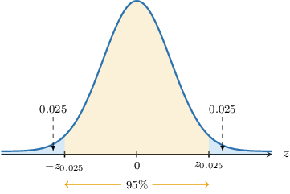
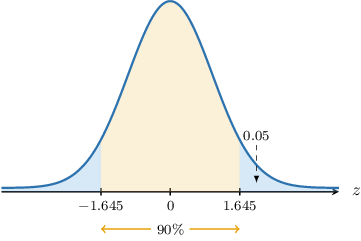
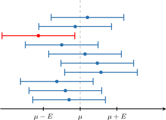
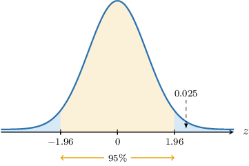
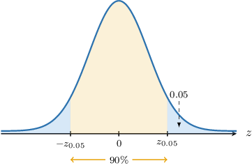

# Confidence Intervals for One Mean: Known Population Variance

Source: https://www.mathacademy.com/topics/260?courseId=73
Topic ID: 260

## Prerequisites

- [The Central Limit Theorem](./359-the-central-limit-theorem.md)

## Lesson

### Introduction

Suppose we conduct a random sample of size $n=10$ from a normal population with the unknown population mean $\mu$ and *known* population variance $\sigma^2=9.$ After processing our results, we compute the mean of this sample using the usual methods and get the following result:

$$

\overline{x}=12

$$

This is an unbiased estimate of the population mean $\mu.$ However, it is unsatisfactory because we have no information regarding its reliability.

For this reason, it's often more helpful to give a range of possible values for $\mu.$ In other words, instead of reporting a single estimate $\overline{x},$ we might instead report a so-called **confidence interval,** which is an interval of the form

$$

(\overline{x}-E, \: \overline{x}+E)

$$

where

- $\overline{x}$ is our estimate of the population mean, and

- $E$ is some **margin of error**.

In addition, we need to give some indication regarding the reliability of our confidence interval. With this in mind, we will construct a $\boldsymbol{95\%}$ **confidence interval** for the population mean $\mu$. The precise meaning of this will become clear shortly.

### Constructing Confidence Intervals

In our example, the population is normally distributed. Therefore, the sample mean $\overline{X}$ is also normally distributed, where

$$

\overline{X}\sim N\left(\mu,\dfrac{\sigma^2}{n}\right).

$$

By transforming $\overline{X}$ to a standard normal random variable, we have

$$

Z = \dfrac{\overline{X} - \mu}{\sigma/\sqrt n}\sim N(0,1).

$$

We wish to find a $z$-interval that we're $95\%$ confident that the random variable $Z$ lies within. This interval is indicated in the diagram below:

To help with the notation, we define a new parameter $\alpha.$ Since we're computing a $95\%$ confidence interval, we have

$$

\alpha=1-0.95=0.05\quad\Longrightarrow\quad \dfrac{\alpha}{2}=0.025.

$$

Notice that $\dfrac{\alpha}{2}$ is precisely the area bounded by each "tail" that we're excluding from our confidence interval. Let's label the critical values at the endpoints of our interval as $\pm z_{\alpha/2}\mathbin{:}$

According to our diagram,

$$

P(Z > z_{0.025}) = P(Z < -z_{0.025}) = 0.025.

$$

Using a percentage points table for the standard normal distribution, we find that $z_{0.025} \approx 1.96.$ Therefore,

$$

P(Z > 1.96) = P(Z < -1.96) = 0.025.

$$

In other words,

$$

\begin{aligned}𝑃(−1.96<𝑍<1.96)=0.95.\end{aligned}

$$

Therefore, there is a $95\%$ probability that our random variable $Z$ will lie in the interval $(-1.96, 1.96).$

Now, here's the trick. We solve the inequality inside the parentheses of the last probability statement for the population mean $\mu\mathbin{:}$

$$

\begin{aligned}−1.96< & \,𝑍<1.96 \\ −1.96< & \,\frac{\overset{𝑥}{}−𝜇}{𝜎/\sqrt{√𝑛}}<1.96 \\ −1.96⋅\frac{𝜎}{\sqrt{√𝑛}}< & \,\overset{𝑥}{}−𝜇<1.96⋅\frac{𝜎}{\sqrt{√𝑛}} \\ −\overset{𝑥}{}−1.96⋅\frac{𝜎}{\sqrt{√𝑛}}< & \,−𝜇\,<−\overset{𝑥}{}+1.96⋅\frac{𝜎}{\sqrt{√𝑛}} \\ \overset{𝑥}{}+1.96⋅\frac{𝜎}{\sqrt{√𝑛}}> & \,𝜇>\overset{𝑥}{}−1.96⋅\frac{𝜎}{\sqrt{√𝑛}} \\ \overset{𝑥}{}−1.96⋅\frac{𝜎}{\sqrt{√𝑛}}< & \,𝜇<\overset{𝑥}{}+1.96⋅\frac{𝜎}{\sqrt{√𝑛}}\end{aligned}

$$

Therefore, a $95\%$ confidence interval for the population mean $\mu$ is given by

$$

\left(\overline{x} - 1.96\cdot\dfrac{\sigma}{\sqrt{n}},\: \overline{x} + 1.96\cdot\dfrac{\sigma}{\sqrt{n}}\right)

$$

Finally, substituting our values

$$

n=10, \qquad \overline{x}=12, \qquad \sigma=3,

$$

we obtain that our $95\%$ confidence interval for $\mu$ is

$$

\big( 12- 1.859, \: 12 + 1.859 \big).

$$

Now that we've seen how to construct a particular confidence interval, let's discuss the more general procedure.

### Summarizing Confidence Intervals for Normal Populations With Known Population Variance

Suppose we have a random sample of size $n$ from a normal population with the unknown population mean $\mu$ and *known* population variance $\sigma^2.$ Then, for a given value $\alpha$ between $0$ and $1,$ a $[100(1-\alpha)]\%$ confidence interval for the population mean $\mu$ is given by

$$

\left(\overline{x} - z_{\alpha/2} \cdot \dfrac{\sigma}{\sqrt{n}}, \: \overline{x} + z_{\alpha/2} \cdot \dfrac{\sigma}{\sqrt{n}}\right)

$$

where $P(Z > z_{\alpha/2}) = \dfrac{\alpha}{2},$ and $Z \sim N(0,1).$

The endpoints of our confidence interval are called **confidence limits** and are given by

$$

\overline{x} \pm z_{\alpha/2} \cdot \dfrac{\sigma}{\sqrt{n}}.

$$

Each part of the formula above has a name:

- $\overline{x}$ is an estimate of the population mean

- $\dfrac{\sigma}{\sqrt{n}}$ is the standard error of the mean

- $z_{\alpha/2}$ is the corresponding $z$-score

- $E = z_{\alpha/2} \cdot \dfrac{\sigma}{\sqrt{n}}$ is the margin of error

$$

𝑧

$$

So, our confidence interval can be written as follows:

$$

\begin{aligned}(\overset{𝑥}{}−[margin of error], & \,\overset{𝑥}{}+[margin of error]) \\ (\overset{𝑥}{}−[z-score]⋅[standard error], & \,\overset{𝑥}{}+[z-score]⋅[standard error]) \\ (\overset{𝑥}{}−𝑧_{𝛼/2}⋅\frac{𝜎}{\sqrt{√𝑛}}, & \,\overset{𝑥}{}+𝑧_{𝛼/2}⋅\frac{𝜎}{\sqrt{√𝑛}})\end{aligned}

$$

Since computing a confidence interval amounts to finding the corresponding confidence limits, we will use the two terms interchangeably.

### Example: Finding Confidence Intervals From Normal Populations

#### Question

Consider a sample of size $n=9$ from a normal population with standard deviation $\sigma=2.$ Given that the mean of the sample is $\overline{x}=-5,$ find a $90\%$ confidence interval for the population mean $\mu$ of the distribution.

**

#### Explanation

We are told that the population is normally distributed. Therefore, the distribution of sample mean is also normal, and we have that

$$

\dfrac{\overline{X} - \mu}{\sigma/\sqrt n} \sim N(0,1),

$$

where

- $\overline{X}$ is the sample mean,

- $\mu$ is the population mean,

- $\sigma^2$ is the population variance, and

- $n$ is the sample size.

Given a value $\alpha$ between $0$ and $1,$ the corresponding $[100(1-\alpha)]\%$ confidence interval for the population mean $\mu$ of the original distribution is given by

$$

\overline{x} \pm z_{\alpha/2} \cdot \dfrac{\sigma}{\sqrt{n}},

$$

where $P(Z > z_{\alpha/2}) = \dfrac{\alpha}{2}$ and $Z \sim N(0,1).$

We are interested in finding a $90\%$ confidence interval. So, we have

$$

\alpha=1-0.9=0.1 \qquad\Longrightarrow\qquad \dfrac{\alpha}{2}=0.05.

$$

We are given that $P(Z > 1.645) = 0.05.$ As a result,

$$

z_{\alpha/2} = z_{0.05} = 1.645.

$$

Therefore, a $90\%$ confidence interval for the population mean $\mu$ is the following:

$$

\begin{aligned}−5±1.645⋅\frac{2}{\sqrt{√9}} \\ −5±1.097\end{aligned}

$$

### Interpreting Confidence Intervals

It's important to be able to interpret confidence intervals correctly.

Imagine we conduct several independent random samples from a population. The mean of the sample will be different for each sample. Some values of $\overline{x}$ might lie close to the population mean $\mu,$ and some could lie further away.

Suppose we construct a $90\%$ confidence interval for each sample and plot them on the same diagram. We might get a picture similar to the one below.

In the diagram above, we see that nine out of ten of our confidence intervals contain $\mu,$ while one of them (the red one) does *not* contain the population mean $\mu.$

The idea is that if we construct many $90\%$ confidence intervals, one for each sample, then approximately $90\%$ of these confidence intervals will contain the population mean $\mu.$

### Large Samples

Up to now, we've assumed that the underlying population is normally distributed. However, if we have a *sufficiently large* sample, then according to the central limit theorem, we can use the approximation

$$

\dfrac{\overline{X} - \mu}{\sigma/\sqrt n} \approx N(0,1).

$$

So, even though we might not know the underlying distribution, we can still use our formula for the confidence interval of the population mean $\mu{:}$

$$

\overline{x} \pm z_{\alpha/2} \cdot \dfrac{\sigma}{\sqrt{n}}

$$

### Example: Finding Confidence Intervals From Large Samples

#### Question

Consider a sample of size $n=196$ from a population with standard deviation $\sigma=7.$ Given that the mean of the sample is $\overline{x}=24,$ find a $95\%$ confidence interval for the population mean $\mu$ of the distribution.

**

#### Explanation

We do not know the distribution of the population. However, the sample size $n = 196 \geq 30$ is **. Therefore, according to the central limit theorem, we may use the following approximation:

$$

\dfrac{\overline{X} - \mu}{\sigma/\sqrt n} \sim N(0,1),

$$

where

- $\overline{X}$ is the sample mean,

- $\mu$ is the population mean,

- $\sigma^2$ is the population variance, and

- $n$ is the sample size.

Given a value $\alpha$ between $0$ and $1,$ the corresponding $[100(1-\alpha)]\%$ confidence interval for the population mean $\mu$ of the original distribution is given by

$$

\overline{x} \pm z_{\alpha/2} \cdot \dfrac{\sigma}{\sqrt{n}},

$$

where $P(Z > z_{\alpha/2}) = \dfrac{\alpha}{2}$ and $Z \sim N(0,1).$

We are interested in finding a $95\%$ confidence interval. So, we have

$$

\alpha=1-0.95=0.05 \qquad\Longrightarrow\qquad \dfrac{\alpha}{2}=0.025.

$$

We are given that $P(Z > 1.96) = 0.025.$ As a result,

$$

z_{\alpha/2} = z_{0.025} = 1.96.

$$

Therefore, the $95\%$ confidence interval for the population mean $\mu$ is the following:

$$

\begin{aligned}24±1.96⋅\frac{7}{\sqrt{√196}} \\ 24±0.98\end{aligned}

$$

### Example: Finding Confidence Intervals: Applications

#### Question

The daily percentage return of a particular stock has a population standard deviation of $\sigma = 5\%.$ A sample of $90$ randomly selected trading days was examined, and it was found that the mean daily return of the stock over these days was $7.5\%.$ Find a $90\%$ confidence interval for the mean daily percentage return $\mu$ of the entire population of trading days.

**

#### Explanation

We do not know the distribution of the population. However, the sample size $n = 90\geq 30$ is **. Therefore, according to the central limit theorem, we may use the following approximation:

$$

\dfrac{\overline{X} - \mu}{\sigma/\sqrt n} \sim N(0,1),

$$

where

- $\overline{X}$ is the sample mean,

- $\mu$ is the population mean,

- $\sigma^2$ is the population variance, and

- $n$ is the sample size.

Given a value $\alpha$ between $0$ and $1,$ the corresponding $[100(1-\alpha)]\%$ confidence interval for the population mean $\mu$ of the original distribution is given by

$$

\overline{x} \pm z_{\alpha/2} \cdot \dfrac{\sigma}{\sqrt{n}},

$$

where $P(Z > z_{\alpha/2}) = \dfrac{\alpha}{2}$ and $Z \sim N(0,1).$

In our case,

$$

\overline{x}=7.5, \qquad n = 90, \qquad \sigma = 5.

$$

We are interested in finding a $90\%$ confidence interval. So, we have

$$

\alpha=1-0.9=0.1 \qquad\Longrightarrow\qquad \dfrac{\alpha}{2}=0.05.

$$

We also need to find the $z$-score value $z_{0.05}$ such that $P(Z > z_{0.05}) = 0.05,$ where $Z \sim N(0,1).$

From the percentage points table of the normal distribution, we obtain that $z_{0.05}=1.645{:}$

Therefore, the $90\%$ confidence interval for the population mean $\mu$ is the following:

$$

\begin{aligned}7.5±1.645⋅\frac{5}{\sqrt{√90}} \\ 7.5±0.867\end{aligned}

$$
