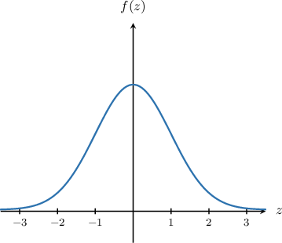
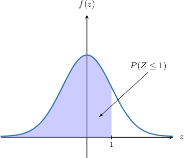
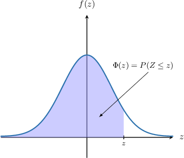
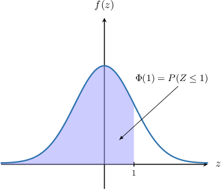
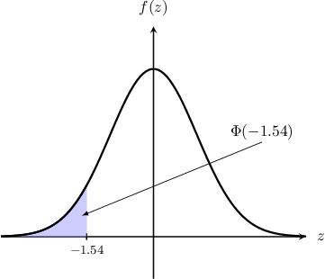
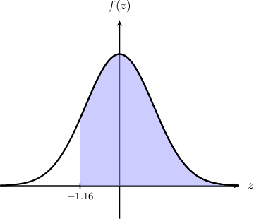
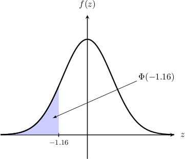
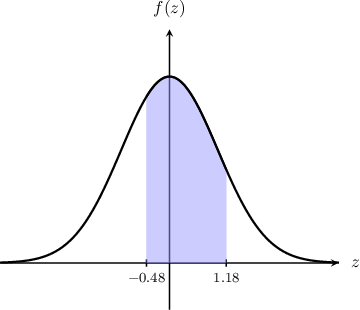

# The Standard Normal Distribution

Source: https://www.mathacademy.com/topics/265?courseId=73
Topic ID: 265

## Prerequisites

- [Variance and Standard Deviation](../integrated-math-ii-honors/1632-variance-and-standard-deviation.md)
- [Cumulative Distribution Functions for Discrete Random Variables](../discrete-mathematics/2024-cumulative-distribution-functions-for-discrete-random-variables.md)

## Lesson

### Introduction

The most important distribution in all probability and statistics is the **standard normal distribution.** This distribution describes the **standard normal random variable**, usually denoted as $Z.$

Note the following:

- $Z$ is a **continuous random variable**. Unlike discrete random variables, normally distributed random variables can take any value in the interval $(-\infty, \infty).$

- Continuous random variables are described using a continuous curve called the **probability density function** (or pdf). In the case of $Z,$ its pdf is denoted $f(z).$

- $f(z)$ has the shape of a so-called **bell curve.** The graph of this function is shown below.

The graph has the following important properties:

- The graph is symmetric about the vertical axis.

- The total area under the curve adds up to $1.$

To state that a random variable $Z$ follows a standard normal distribution, we write

$$

Z \sim N(0,1).

$$

In this notation, $0$ and $1$ refer to the mean $\mu$ and variance $\sigma^2$ of $Z,$ respectively. We'll learn more about this later.

### Calculating Probabilities Using Areas

An important concept regarding the standard normal distribution is that we calculate probabilities using *the area under the graph* of $f(z).$

For example, suppose that the (continuous) random variable $Z$ follows a standard normal distribution:

$$

Z\sim N(0,1)

$$

How do we calculate $P(Z\leq 1)?$

By definition, this probability is given by the area under the graph of $f(z)$ over the interval $z\in (-\infty, 1],$ as shown below.

It can be shown that this area equals $0.8413$ to four decimal places. Therefore,

$$

P(Z \leq 1) = 0.8413.

$$

Note the following important points:

- Since $Z$ is continuous, there is no difference between $P(Z\leq 1)$ and $P(Z < 1).$ Therefore, It doesn't matter whether $z\in(-\infty, 1]$ or $z\in (-\infty, 1),$ the area under the graph is the same.

- The probability that $Z$ equals a specific value is zero! For example, This is because the area under the graph of $f(z)$ at the specific value $z=1$ equals zero.

The last property makes intuitive sense. Since $Z$ can be *any* value in the interval $(-\infty,\infty),$ the probability of reaching any particular value is vanishingly small.

### The Standard Normal Cumulative Distribution Function

The **cumulative distribution function for the standard normal distribution** is defined by

$$

\Phi(z) = P(Z \leq z),

$$

where $P(Z \leq z)$ denotes the probability that $Z\sim N(0,1)$ is less than some fixed value $z.$

For example, using the result we saw earlier,

$$

P(Z \leq 1) = \Phi(1) = 0.8413

$$

as shown below.

The symbol $\Phi$ is called "Phi" and rhymes with "fly."

When we need to find values of $\Phi(z),$ we often use a lookup table, like the one shown below:

For example, to determine the value of $\Phi({\color{red}0.12})$ from the table, we proceed as follows:

- Select the row that corresponds to ${\color{red}0.1}$ and the column that corresponds to $0.0{\color{red}2}.$

- Take the value that lies at the intersection:

Therefore,

$$

P(Z \leq 0.12) = \Phi(0.12)=0.5478.

$$

**Note:** Since the function $f(z)$ is symmetric about the vertical axis and the total area under the curve must equal $1,$ we must have $\Phi(0) = 0.5.$ This value is shown in the table.

### Example: Computing a Probability on an Unbounded Interval

#### Question

The data below is taken from the table of values of the cumulative distribution function $\Phi(z)$ for the standard normal distribution. Given that $Z \sim N(0,1),$ compute $P(Z < -1.54).$

#### Explanation

If $Z\sim N(0,1),$ then by the definition of the cumulative distribution function $\Phi(z),$

$$

P(Z \leq z) = \Phi(z).

$$

Also, since $Z$ is continuous,

$$

P(Z < -1.54) = P(Z \leq -1.54) = \Phi(-1.54).

$$

The required probability is represented by the area shown below.

Now, we determine the value of $\Phi(-1.54)$ from the table:

- We first select the row that corresponds to $-1.5$ and the column that corresponds to $0.04.$

- Then, we take the value that lies at the intersection:

Therefore, according to the table, we have

$$

P(Z \leq -1.54) = \Phi(-1.54) = 0.0618

$$

### Example: Computing a Probability on an Unbounded Interval Using the Complement

#### Question

The data below is taken from the table of values of the cumulative distribution function $\Phi(z)$ for the standard normal distribution. Given that $Z \sim N(0,1),$ compute $P(Z \geq -1.16).$

#### Explanation

We're given that $Z\sim N(0,1),$ and we wish to compute $P(Z \geq -1.16).$ The required probability is represented by the area shown below.

By the definition of the cumulative distribution function $\Phi(z),$

$$

P(Z \leq z) = \Phi(z).

$$

Since the total area under the graph equals $1,$ we can express the required probability in terms of $\Phi(z)$ as follows:

$$

\begin{aligned}𝑃(𝑍≥−1.16) & =1−𝑃(𝑍<−1.16) \\ & =1−Φ(−1.16)\end{aligned}

$$

From the table, we know that

$$

\Phi(-1.16) = 0.1230.

$$

Therefore, we have

$$

\begin{aligned}𝑃(𝑍≥−1.16) & =1−Φ(−1.16) \\ & =1−0.1230 \\ & =0.8770.\end{aligned}

$$

### Example: Computing a Probability on a Bounded Interval

#### Question

The data below is taken from the table of values of the cumulative distribution function $\Phi(z)$ for the standard normal distribution. Given that $Z \sim N(0,1),$ compute $P(-0.48 < Z < 1.18).$

#### Explanation

We're given that $Z\sim N(0,1),$ and we wish to compute $P(-0.48 < Z < 1.18).$ The required probability is represented by the area shown below.

By the definition of the cumulative distribution function $\Phi(z),$

$$

P(Z \leq z) = \Phi(z).

$$

So, we express the required probability in terms of $\Phi(z)$:

$$

\begin{aligned}𝑃(−0.48<𝑍<1.18) & =𝑃(𝑍<1.18)−𝑃(𝑍≤−0.48) \\ & =𝑃(𝑍≤1.18)−𝑃(𝑍≤−0.48) \\ & =Φ(1.18)−Φ(−0.48)\end{aligned}

$$

From the tables, we have the following:

$$

\begin{aligned}Φ(−0.48) & =0.3156 \\ Φ(1.18) & =0.8810\end{aligned}

$$

Therefore, we have

$$

\begin{aligned}𝑃(−0.48<𝑍<1.18) & =Φ(1.18)−Φ(−0.48) \\ & =0.8810−0.3156 \\ & =0.5654.\end{aligned}

$$
