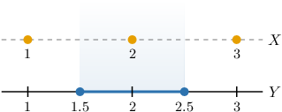
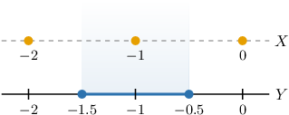
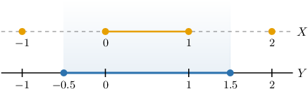
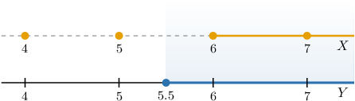

# Approximating Discrete Random Variables as Continuous

Source: https://www.mathacademy.com/topics/2994?courseId=73
Topic ID: 2994

## Prerequisites

- [Special Sets](../linear-algebra/47-special-sets.md)
- [Continuous Random Variables Over Infinite Domains](./4100-continuous-random-variables-over-infinite-domains.md)

## Lesson

### Introduction

We often want to approximate a discrete random variable $X$ by a continuous random variable $Y.$ To do this, we need to consider how to treat the values of $Y$ that lie between the discrete values of $X.$

First, recall that if $X = 2$ *to the nearest integer*, then

$$

1.5\leq X \lt 2.5.

$$

Now consider the following scenario:

- $X\in\big\{\ldots, 0,1,2, 3\ldots\big\}$ is a *discrete* random variable with *integer* support

- $Y\in(-\infty, \infty)$ is a *continuous* random variable that we will use to approximate $X$

To approximate the probability

$$

P(X = 2)

$$

using the random variable $Y,$ we need to calculate

$$

P( 1.5 \leq Y \lt 2.5).

$$

Also, since $Y$ is continuous, this probability is equal to

$$

P( 1.5 \leq Y \leq 2.5).

$$

We can think of the required values of $Y$ as lying within the interval contained within a circle of radius $0.5$ centered at $Y=2.$

Adjusting the values of a discrete random variable so that it can be approximated using a continuous random variable is called a **continuity correction.**

### Example: Approximating a Probability Involving a Discrete Random Variable at a Single Point

#### Question

The discrete random variable $X\in \mathbb Z$ can be approximated by the continuous random variable $Y.$ By applying an appropriate continuity correction, $P(X = -1)$ can be approximated as $P(a\leq Y \leq b).$ Find the values of $a$ and $b.$

#### Explanation

We construct an interval around $X=-1$ with a radius of $0.5{:}$

This gives

$$

\begin{aligned}𝑃(𝑋=−1) & ≈𝑃(−1−0.5≤𝑌≤−1+0.5) \\ & =𝑃(−1.5≤𝑌≤−0.5).\end{aligned}

$$

Therefore, $a=-1.5$ and $b=-0.5.$

### Example: Approximating a Probability Involving a Discrete Random Variable Over an Interval

#### Question

The discrete random variable $X\in \mathbb Z$ can be approximated by the continuous random variable $Y.$ By applying an appropriate continuity correction, $P(-1 \lt X \lt 2)$ can be approximated as $P(a\leq Y \leq b).$ Find the values of $a$ and $b.$

#### Explanation

To apply the appropriate continuity correction, we first rewrite the strict inequalities using non-strict inequalities, as follows:

$$

\begin{aligned}𝑃(−1<𝑋<2) & =𝑃(0≤𝑋≤1)\end{aligned}

$$

Then, we extend the endpoints of the interval $0 \leq X \leq 1$ by $0.5.$ This gives

$$

\begin{aligned}𝑃(0≤𝑋≤1) & ≈𝑃(0−0.5≤𝑌≤1+0.5) \\ & =𝑃(−0.5≤𝑌≤1.5).\end{aligned}

$$

Therefore, $a=-0.5$ and $b=1.5.$

### Example: Approximating a Probability Involving a Discrete Random Variable Over an Unbounded Interval

#### Question

The discrete random variable $X\in \mathbb Z$ can be approximated by the continuous random variable $Y.$ By applying an appropriate continuity correction, $P(X > 5)$ can be approximated as $P(Y\geq a).$ Find the value of $a.$

#### Explanation

To apply the appropriate continuity correction, we first rewrite the strict inequalities using non-strict inequalities, as follows:

$$

P(X > 5) =P(X \geq 6)

$$

Then, we extend the endpoints of the interval $X \geq 6$ by $0.5.$ This gives

$$

\begin{aligned}𝑃(𝑋≥6) & ≈𝑃(𝑌≥6−0.5) \\ & =𝑃(𝑌≥5.5).\end{aligned}

$$

Therefore, $a=5.5.$

