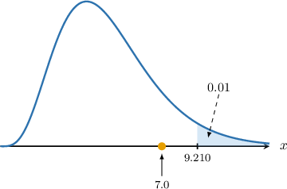

# Testing Normal Models Using Chi-Square Goodness-of-Fit

Source: https://www.mathacademy.com/topics/3018?courseId=73
Topic ID: 3018

## Prerequisites

- [Estimating Means and Variances For Grouped Data](../integrated-math-ii-honors/126-estimating-means-and-variances-for-grouped-data.md)
- [Introduction to Chi-Square Goodness-of-Fit](./3014-introduction-to-chi-square-goodness-of-fit.md)

## Lesson

### Introduction

In this lesson, we'll learn how to conduct chi-square goodness-of-fit tests to determine whether some sample data fit a normal distribution.

First, let's remind ourselves of some basic facts.

- Given a continuous random variable $Y\sim N(\mu, \sigma^2),$ the probability that $Y$ lies between the real numbers $a$ and $b$ is given by where $\Phi(z)$ is the cumulative distribution function of the standard normal distribution.

- We use intervals to calculate expected frequencies when working with continuous data. For a sample of size $N,$ the expected frequency for a given interval $(a,b)$ is calculated as

$$

E_{(a,b)} = N\cdot P\left(a < Y < b \right).

$$

Let's get some practice calculating expected frequencies using the normal distribution.

### Example: Calculating Expected Frequencies

#### Question

Suppose $Y$ is a continuous random variable. We wish to conduct a hypothesis test with the following null and alternative hypotheses:

- $H_0\mathbin{:}\:$ $Y\sim N(22,(\sqrt{66})^2)$

- $H_1\mathbin{:}\:$ $Y\not\sim N(22,(\sqrt{66})^2)$

A random sample is carried out, and the sample data is shown below. The third column gives $P\left(a < Y < b\right)$ under the null hypothesis, where $a$ and $b$ are the boundaries for each class of observations.

Complete the table by calculating the expected frequency $E_i$ for each class of observations. Round each answer to ****

#### Explanation

The number of observations is

$$

N= 6+13+47+53+22= 141.

$$

We compute the expected frequencies for each class of observations by multiplying the total number of observations by the probability that $Y$ lies in that class.

$$

\begin{aligned}𝐸_{1} & =141⋅0.0390≈5.5 \\ 𝐸_{2} & =141⋅0.1877≈26.5 \\ 𝐸_{3} & =141⋅0.3671≈51.8 \\ 𝐸_{4} & =141⋅0.2936≈41.4 \\ 𝐸_{5} & =141⋅0.0958≈13.5\end{aligned}

$$

Therefore, our completed table is as follows:

### The Chi-Square Test

Let's remind ourselves of the key facts regarding chi-square goodness-of-fit tests.

Suppose we have a set of observed frequencies $O_i$ and corresponding expected frequencies $E_i,$ as defined by a theoretical model under the null hypothesis. Then, the random variable

$$

X = \sum_{i} \frac{(O_i - E_i)^2}{E_i}

$$

approximately follows a chi-square distribution with $\nu$ degrees of freedom, where

- $O_i$ is the observed frequency for category $i,$

- $E_i$ is the expected frequency for category $i,$ as predicted under the null hypothesis,

- The number of degrees of freedom $\nu$ is given by

$$

\nu = \textrm{number of categories} - \textrm{number of constraints}.

$$

This approximation holds when all expected frequencies $E_i$ are sufficiently large (typically $E_i \geq 5$ for each category), and the observations are independent.

In this lesson, we'll consider the cases where $E_i\geq 5$ for all $E_i$'s. Cases where this isn't true will be dealt with in separate topics.

Note the following:

- If $\mu$ and $\sigma$ are *given*, there is only one constraint: the total number of observations is fixed. In this case, we have

- If $\mu$ or $\sigma$ is *not* given, then they must be estimated. Estimating a population parameter places an extra constraint on our data. In such cases, we have the following: If *only one* parameter must be estimated, then we have two constraints in total, and If *both* parameters must be estimated, then we have three constraints in total, and

We'll consider cases with multiple constraints toward the end of the lesson.

### Example: Calculating a Test Statistic

#### Question

Suppose $Y$ is a continuous random variable. We wish to conduct a chi-square goodness-of-fit test at the $2.5\%$ significance level with the following null and alternative hypotheses:

- $H_0\mathbin{:}\:$ $Y\sim N(16,(\sqrt{20})^2)$

- $H_1\mathbin{:}\:$ $Y\not\sim N(16,(\sqrt{20})^2)$

A random sample is carried out, and the sample data is shown below. The rightmost column gives $P\left(a < Y < b\right)$ under the null hypothesis, where $a$ and $b$ are the boundaries for each class of observations.

Calculate the value of the test statistic for this hypothesis test, rounded to one decimal place.

#### Explanation

Suppose we have a set of observed frequencies $O_i$ and corresponding expected frequencies $E_i,$ as defined by a theoretical model under the null hypothesis. Then, the random variable

$$

X = \sum_{i} \frac{(O_i - E_i)^2}{E_i}

$$

approximately follows a chi-square distribution with $\nu$ degrees of freedom, where

- $O_i$ is the observed frequency for category $i,$ and

- $E_i$ is the expected frequency for category $i,$ as predicted under the null hypothesis.

This approximation holds when all expected frequencies $E_i$ are sufficiently large (typically $E_i \geq 5$ for each category), and the observations are independent.

The number of observations is

$$

N= 9+45+78+18 = 150.

$$

Next, we compute the expected frequencies for each class of observations.

Notice that all the expected frequencies are greater than or equal to $5.$ We have rounded to four decimal places, where appropriate.

Finally, we calculate the test statistic by summing the values in the last row:

$$

\begin{aligned}\underset{𝑖}{∑}\frac{(𝑂_{𝑖}−𝐸_{𝑖})^{2}}{𝐸_{𝑖}} & =1.1945+4.4338+4.4177+1.9880 \\ & ≈12.0\end{aligned}

$$

Therefore, the test statistic is approximately $\boxed{\color{blue}12.0}.$

### Example: Carrying Out a Chi-Square Test

#### Question

Suppose $Y$ is a continuous random variable. We wish to conduct a chi-square goodness-of-fit test at the $5\%$ significance level with the following null and alternative hypotheses:

- $H_0\mathbin{:}\:$ $Y\sim N(10,(\sqrt{30})^2)$

- $H_1\mathbin{:}\:$ $Y\not\sim N(10,(\sqrt{30})^2)$

A random sample is carried out, and the sample data is shown below. The rightmost column gives $P\left(a < Y < b\right)$ under the null hypothesis, where $a$ and $b$ are the boundaries for each class of observations.

The table below gives the values of $w$ that satisfy $P(W\geq w) = p,$ where $W\sim \chi^2(\nu).$

Conduct this hypothesis test, and state your conclusion.

#### Explanation

Suppose we have a set of observed frequencies $O_i$ and corresponding expected frequencies $E_i,$ as defined by a theoretical model under the null hypothesis. Then, the random variable

$$

X = \sum_{i} \frac{(O_i - E_i)^2}{E_i}

$$

approximately follows a chi-square distribution with $\nu$ degrees of freedom, where

- $O_i$ is the observed frequency for category $i,$ and

- $E_i$ is the expected frequency for category $i,$ as predicted under the null hypothesis.

This approximation holds when all expected frequencies $E_i$ are sufficiently large (typically $E_i \geq 5$ for each category), and the observations are independent.

The number of observations is

$$

N= 12 + 15 + 19 + 14= 60.

$$

Next, we compute the expected frequencies for each class of observations.

Notice that all the expected frequencies are greater than or equal to $5.$ We have rounded to four decimal places, where appropriate.

First, we compute our test statistic:

$$

\begin{aligned}\underset{𝑖}{∑}\frac{(𝑂_{𝑖}−𝐸_{𝑖})^{2}}{𝐸_{𝑖}} & =1.1619+0.9024+0.0013+3.0697 \\ & ≈5.1\end{aligned}

$$

Therefore, the test statistic is approximately $\boxed{\color{blue}5.1}.$

There is only one constraint on our data: the total number of observations must equal $N.$ Therefore, the number of degrees of freedom $\nu$ is calculated as follows:

$$

\begin{aligned}𝜈 & =number of categories−number of constraints \\ & =4−1 \\ & =3\end{aligned}

$$

So, there are $\nu = \boxed{\color{blue}3}$ degrees of freedom.

From the given chi-square table, the critical value for $\nu=3$ at a $5\%$ significance level is $\chi^2_{\textrm{critical}}=7.815,$ and the critical region is

$$

X\geq 7.815

$$

as shown below.

### Estimating the Mean and Variance

Let's remind ourselves how to estimate $\mu$ and $\sigma$ from sample data.

Suppose $Y$ is a continuous random variable. A random sample is carried out, and the sample data is shown below.

Suppose we wish to test the following null and alternative hypotheses:

- $H_0\mathbin{:}\:$ $Y\sim N(\mu,\sigma^2)$

- $H_1\mathbin{:}\:$ $Y\not\sim N(\mu,\sigma^2)$

We're not given the mean $\mu$ nor the variance $\sigma^2,$ so we have to estimate them from the sample data.

- For the mean, we have the following estimate:

- For the variance, we have where $\widehat{\mu}$ is our estimate for the mean $\mu,$ $\widehat{\sigma}^2$ is our estimate for the variance $\sigma^2,$ $N$ is the total number of observations, $y_i^{\textrm{mid}}$ is the midpoint of an observational class $(a_i, b_i).$

Let's compute estimates for the mean and variance in this case:

The total number of observations is

$$

N= 8+12+11+9= 40.

$$

Next, we find the midpoint of each observational class.

Our estimate $\widehat{\mu}$ for the mean $\mu$ is

$$

\begin{aligned}\overset{𝜇}{ˆ} & =\frac{1}{𝑁}∑𝑂_{𝑖}⋅𝑦_{mid𝑖}^{} \\ & =\frac{1}{40}(8⋅2+12⋅4+11⋅6+9⋅8) \\ & =5.05.\end{aligned}

$$

Finally, our estimate $\widehat{\sigma}^2$ for the variance $\sigma^2$ is

$$

\begin{aligned}\overset{𝜎}{ˆ}^{2} & =\frac{1}{𝑁−1}∑𝑂_{𝑖}⋅(𝑦_{mid𝑖}^{}−\overset{𝜇}{ˆ})^{2} \\ & =\frac{1}{40−1}(8⋅(2−5.05)^{2}+12⋅(4−5.05)^{2} \\ & =\,\,+11⋅(6−5.05)^{2}+9⋅(8−5.05)^{2}) \\ & =4.51025… \\ & ≈4.5.\end{aligned}

$$

When conducting a chi-square test, we lose a degree of freedom for every estimated parameter:

- If *only one* parameter must be estimated, then we have two constraints in total, and

- If *both* parameters must be estimated, then we have three constraints in total, and

Let's see an example.

### Example: Carrying Out a Chi-Square Test (Parameter Estimation Needed)

#### Question

Suppose $Y$ is a continuous random variable. We wish to conduct a chi-square goodness-of-fit test at the $1\%$ significance level with the following null and alternative hypotheses:

- $H_0\mathbin{:}\:$ $Y\sim N(\mu,\sigma^2)$

- $H_1\mathbin{:}\:$ $Y\not\sim N(\mu,\sigma^2)$

where the mean $\mu$ and variance $\sigma^2$ are unknown.

A random sample is carried out, and the sample data is shown below.

Some summary statistics for this data set are given below. Each expected frequency $E_i$ is calculated assuming the null hypothesis is true using the estimates $\widehat{\mu} \approx 11.6$ and $\widehat{\sigma}^2\approx 25.4$.

Carry out this hypothesis test and state your conclusion.

#### Explanation

Suppose we have a set of observed frequencies $O_i$ and corresponding expected frequencies $E_i,$ as defined by a theoretical model under the null hypothesis. Then, the random variable

$$

X = \sum_{i} \frac{(O_i - E_i)^2}{E_i}

$$

approximately follows a chi-square distribution with $\nu$ degrees of freedom, where

- $O_i$ is the observed frequency for category $i,$ and

- $E_i$ is the expected frequency for category $i,$ as predicted under the null hypothesis.

This approximation holds when all expected frequencies $E_i$ are sufficiently large (typically $E_i \geq 5$ for each category), and the observations are independent.

First, note that the number of observations is

$$

N= 11 + 12 + 25 + 19 + 13 = 80.

$$

We first need to find estimates for the mean $\mu$ and variance $\sigma^2.$ We start by finding the midpoint of each observational class.

We can find an estimate $\widehat{\mu}$ for the mean $\mu$ as follows:

$$

\begin{aligned}\overset{𝜇}{ˆ} & =\frac{1}{𝑁}∑𝑂_{𝑖}⋅𝑦_{mid𝑖}^{} \\ & =\frac{1}{80}(11⋅3+12⋅7+25⋅11+19⋅15+13⋅19) \\ & =11.55 \\ & ≈11.6\end{aligned}

$$

We can find an estimate $\widehat{\sigma}^2$ for the variance $\sigma^2$ as follows:

$$

\begin{aligned}\overset{𝜎}{ˆ}^{2} & =\frac{1}{𝑁−1}∑𝑂_{𝑖}⋅(𝑦_{mid𝑖}^{}−\overset{𝜇}{ˆ})^{2} \\ & =\frac{1}{80−1}(11⋅(3−11.55)^{2}+12⋅(7−11.55)^{2} \\ & +25⋅(11−11.55)^{2}+19⋅(15−11.55)^{2}+13⋅(19−11.55)^{2}) \\ & =25.4151… \\ & ≈25.4\end{aligned}

$$

Our data has three constraints: the total number of observations must equal $N,$ and our estimates for the mean and variance are $11.6$ and $25.4.$ Therefore, the number of degrees of freedom $\nu$ is calculated as follows:

$$

\begin{aligned}𝜈 & =number of categories−number of constraints \\ & =5−3 \\ & =2\end{aligned}

$$

So, there are $\nu = \boxed{\color{blue}2}$ degrees of freedom.

We compute the chi-square test statistic as follows:

$$

\begin{aligned}\underset{𝑖}{∑}\frac{(𝑂_{𝑖}−𝐸_{𝑖})^{2}}{𝐸_{𝑖}} & =3.5080+1.3544+0.0088+0.0291+2.0615 \\ & ≈7.0\end{aligned}

$$

So, the test statistic is approximately $\boxed{\color{blue}7.0}.$

Notice that the test statistic does not lie inside the critical region, as shown below.

Therefore, there is $\boxed{\color{blue}\textrm{insufficient}}$ evidence to reject the null hypothesis.
