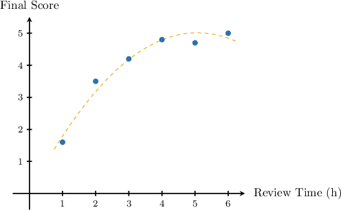

# Spearman's Rank Correlation Coefficient

Source: https://www.mathacademy.com/topics/3020?courseId=73
Topic ID: 3020

## Prerequisites

- [The Linear Correlation Coefficient](./1056-the-linear-correlation-coefficient.md)

## Lesson

### Introduction

In this lesson, we'll learn how to compute the **Spearman's rank correlation coefficient.**

Suppose two testers independently rated the taste of $5$ kinds of cheese during a degustation. Each tester ranked the cheeses by assigning a unique integer between $1$ and $5$ to each kind, with $1$ being the best and $5$ being the worst. The table below shows their rankings, where the cheeses are labeled $A$-$E.$

The Spearman's rank correlation coefficient $r_s$ is the linear correlation coefficient - also known as Pearson's correlation coefficient - applied to two sets of ranks, as in the example above.

In the case of integer ranks, the formula for the correlation can be slightly simplified.

Given two sets of ranks $x_1, x_2, \ldots, x_n$ and $y_1, y_2, \ldots, y_n,$ where the numbers in each set are uniquely expressed as integers between $1$ and $n,$ the **Spearman's rank correlation coefficient** can be calculated as follows:

$$

r_s = 1 - \dfrac{6}{n(n^2-1)}\sum_{i=1}^n d_i^2

$$

where $d_i = x_i - y_i$ is the difference between the ranks of $x_i$ and $y_i.$

Back to our example. First, we calculate the differences between the ranks and their squares.

Notice that $\displaystyle\sum_i d_i = 0$ as expected.

So, we have

$$

\sum_{i=1}^{5} d_i^2 = 4, \qquad n=5.

$$

Therefore, the Spearman's rank correlation coefficient is

$$

r_s = 1 - \dfrac{6(4)}{5(5^2-1)} = \dfrac{4}{5} = 0.8.

$$

**Note:** If we compute the Pearson's correlation coefficient for the above example using the usual formula

$$

\rho(x,y) = \dfrac{\textrm{Cov}(x,y)}{\sigma_x \cdot \sigma_y},

$$

we get the same value of $\rho=0.8.$

### Example: Calculating Spearman’s Rank Correlation Coefficient

#### Question

Calculate Spearman's correlation coefficient $r_s$ for the two sets of ranks given below.

#### Explanation

The Spearman's rank correlation coefficient $r_s$ is Pearson's correlation coefficient applied to two sets of ranks.

Given two sets of ranks $x_1, x_2, \ldots, x_n$ and $y_1, y_2, \ldots, y_n,$ where the numbers in each set are uniquely expressed as integers between $1$ and $n,$ the Spearman's rank correlation coefficient can be calculated as follows:

$$

r_s = 1 - \dfrac{6}{n(n^2-1)}\sum_{i=1}^n d_i^2

$$

where $d_i = x_i - y_i$ is the difference between the ranks of $x_i$ and $y_i.$

First, we calculate the differences between the ranks, and their squares.

Notice that $\displaystyle\sum_i d_i = 0$ as expected.

So, we have

$$

\sum_{i=1}^{4} d_i^2 = 14, \qquad n=4.

$$

Therefore, the Spearman's rank correlation coefficient is

$$

r_s = 1 - \dfrac{6(14)}{4(4^2-1)} = -0.4.

$$

### Interpreting the Correlation Coefficient

Similar to Pearson's correlation coefficient, Spearman's rank correlation coefficient $r_s$ has the following properties:

- If $r_s = 1,$ rankings are in exact agreement.

- If $r_s = -1,$ rankings are in exact reverse order.

- If $r_s = 0,$ there is no correlation between the rankings.

Furthermore, similar thresholds can be applied to distinguish between different degrees of relationships:

### Example: Calculating Spearman’s Rank Coefficient in Contextual Situations: Ranked Data

#### Question

A film critic ranks five movies based on the screenplay and actors' performance. The table below shows the rankings, where the movies are labeled $A$-$E.$

Calculate Spearman's correlation coefficient $r_s$ and interpret the result.

#### Explanation

The Spearman's rank correlation coefficient $r_s$ is Pearson's correlation coefficient applied to two sets of ranks.

Given two sets of ranks $x_1, x_2, \ldots, x_n$ and $y_1, y_2, \ldots, y_n,$ where the numbers in each set are uniquely expressed as integers between $1$ and $n,$ the Spearman's rank correlation coefficient can be calculated as follows:

$$

r_s = 1 - \dfrac{6}{n(n^2-1)}\sum_{i=1}^n d_i^2

$$

where $d_i = x_i - y_i$ is the difference between the ranks of $x_i$ and $y_i.$

First, we calculate the differences between the ranks and their squares.

Therefore, the Spearman's rank correlation coefficient is

$$

r_s = 1 - \dfrac{6(32)}{5(5^2-1)} = -0.6.

$$

Since $-0.7 < r_s \leq -0.3,$ we conclude that there is a **** between the rankings.

### Spearman's Rank Correlation Coefficient For Non-Ranked Data

The time spent on review per day (in hours) a week before a math exam and the final scores on the exam for six students are shown in the table below. The students are labeled A-F.

Let's plot the data:

From the diagram, there is a positive correlation. Indeed, computing Pearson's correlation coefficient, we obtain $\rho \approx 0.886.$ However, the points better fit a (quadratic) curve rather than a straight line. Pearson's coefficient shows a strong linear correlation but not exact agreement.

Let's now find the corresponding Spearman's rank correlation coefficient.

Recall that given two sets of ranks $x_1, x_2, \ldots, x_n$ and $y_1, y_2, \ldots, y_n,$ where the numbers in each set are uniquely expressed as integers between $1$ and $n,$ the Spearman's rank correlation coefficient can be calculated as follows:

$$

r = 1 - \dfrac{6}{n(n^2-1)}\sum_{i=1}^n d_i^2

$$

where $d_i = x_i - y_i$ is the difference between the ranks of $x_i$ and $y_i.$

First, we need to rank the students' times and scores. So, we'll label the shortest time as $1$ and the longest time as $6.$ Note that we can rank the times the opposite way, and the final answer will be the same.

Next, we calculate the differences between the ranks (the two final rows in the table), and their squares.

Notice that $\displaystyle\sum_i d_i = 0$ as expected, and

$$

\sum_i d_i^2 = 0^2+0^2+0^2+0^2+1^2+1^2 = 2.

$$

Therefore, the Spearman's rank correlation coefficient is

$$

r_s = 1 - \dfrac{6(2)}{6(6^2-1)} \approx 0.943

$$

So, we have an even stronger positive correlation between the rankings than we got using Pearson's coefficient. What does it mean?

The Spearman correlation measures the relationship between two variables based on their ranks, and it equals the Pearson correlation of those ranks. While Pearson's correlation determines *linear* relationships, Spearman's correlation focuses on *monotonic* (i.e., increasing or decreasing) relationships, whether linear or not.

- A perfect Pearson's correlation ($1$ or $−1$) occurs when one variable is a perfect *linear* function of the other.

- On the other hand, a perfect Spearman's correlation ($1$ or $−1$) occurs when one variable is a perfect *monotonic* function of the other.

In our example above, the dependence was not quite linear (rather quadratic). On the other hand, the dependence was almost monotonic (to get a perfect one, we would need to swap the ranks of only two data points, $4.7$ and $4.8$).

### Example: Calculating Spearman’s Rank Coefficient in Contextual Situations: Non-Ranked Data

#### Question

The air pollution level in micrograms per cubic meter and average lung capacity of citizens in liters for five cities are shown in the table below. The cities are labeled A-E.

Calculate **** correlation coefficient for this data.

#### Explanation

The Spearman's rank correlation coefficient $r_s$ is Pearson's correlation coefficient applied to two sets of ranks.

Given two sets of ranks $x_1, x_2, \ldots, x_n$ and $y_1, y_2, \ldots, y_n,$ where the numbers in each set are uniquely expressed as integers between $1$ and $n,$ the Spearman's rank correlation coefficient can be calculated as follows:

$$

r = 1 - \dfrac{6}{n(n^2-1)}\sum_{i=1}^n d_i^2

$$

where $d_i = x_i - y_i$ is the difference between the ranks of $x_i$ and $y_i.$

First, we need to rank the cities' pollution levels and average lung capacities. So, we'll label the highest value in each category as $1$ and the lowest value in each category as $5$ (Note that we can rank the values in each category the opposite way, and the final answer will be the same).

Next, we calculate the differences between the ranks, and their squares.

Notice that $\displaystyle\sum_i d_i = 0$ as expected, and

$$

\sum_i d_i^2 = 9+9+0+9+9 = 36.

$$

Therefore, the Spearman's rank correlation coefficient is

$$

r_s = 1 - \dfrac{6(36)}{5(5^2-1)} = \boxed{\color{blue}-0.8}.

$$
