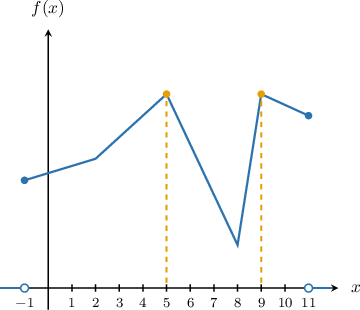
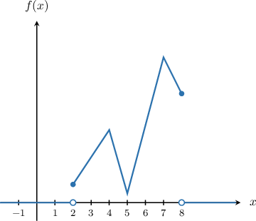
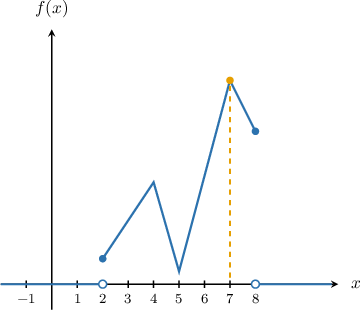
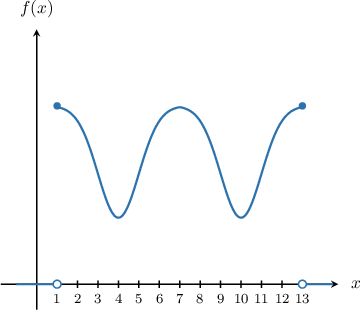
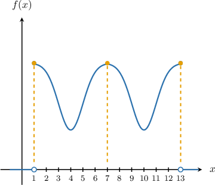

# Finding the Mode of a Continuous Random Variable

Source: https://www.mathacademy.com/topics/3025?courseId=73
Topic ID: 3025

## Prerequisites

- [The Candidates Test](../ap-calculus-ab/364-the-candidates-test.md)
- [Continuous Random Variables Over Infinite Domains](./4100-continuous-random-variables-over-infinite-domains.md)

## Lesson

### Introduction

The **modes of a random variable $X$** with probability density function $f(x)$ are the values of $x$ at the global maxima of $f(x).$

For example, the modes of the random variable $X$ with the probability density function shown below are ${\color{blue}5}$ and ${\color{blue}9}$ (the values of $x$ that correspond to the global maxima):

### Example: Finding the Mode of a Continuous Random Variable Using a Graph: One Mode

#### Question

Let $X$ be a random variable with the probability density function $f(x)$ shown below. What is the mode of $X?$

#### Explanation

The mode of a random variable $X$ with probability density function $f(x)$ is the value of $x$ at the global maxima of $f(x).$

From the graph, we can tell that $f(x)$ has a single global maximum at $x=7.$

Therefore, the mode of $X$ is $7.$

### Example: Finding the Mode of a Continuous Random Variable Using a Graph: Multiple Modes

#### Question

Let $X$ be a random variable with the probability density function shown below. What are the modes of $X?$

#### Explanation

The modes of a random variable $X$ with probability density function $f(x)$ are the values of $x$ at the global maxima of $f(x).$

From the graph, we can tell that the global maxima of $f(x)$ are at $x=1,7,13.$

Therefore, the modes of $X$ are $1,7,$ and $13.$

### Finding the Mode of a Continuous Random Variable Algebraically

Now, suppose we are given the random variable $X$ with the probability density function shown below.

$$

\begin{aligned}2𝑥, & 0≤𝑥≤1 \\ 0, & otherwise\end{aligned}

$$

How can we find the mode of $X$ algebraically?

To find the global maximum of $f(x),$ we find the critical points of $f(x)$ and then apply the candidates test.

First, we find the critical points.

- The piece of $f(x)$ defined on $0 \leq x \leq 1$ is $f(x) =2x.$ Taking the derivative, we get So, there are no solutions of $f'(x) = 0.$

- The derivative doesn't exist at the endpoints $x = 0,1.$ So, these are critical points.

Now, we evaluate $f(x)$ at the critical points $x=0,1{:}$

$$

\begin{aligned}𝑓(0) & =2(0)=0 \\ 𝑓(1) & =2(1)=2\end{aligned}

$$

Finally, we compare all of the values above. The largest value is

$$

f({\color{blue}1}) =2.

$$

Therefore, the mode of $X$ is ${\color{blue}1}.$

### Example: Finding the Mode of a Continuous Random Variable Algebraically: One Mode

#### Question

Let $X$ be a random variable with the probability density function shown below. What is the mode of $X?$

$$

\begin{aligned}\frac{sin⁡𝑥}{2}, & 0≤𝑥≤𝜋 \\ 0, & otherwise\end{aligned}

$$

#### Explanation

The mode of a random variable $X$ with probability density function $f(x)$ is the value of $x$ at the global maximum of $f(x).$

To find the global maximum of $f(x),$ we find the critical points of $f(x)$ and then apply the candidates test.

First, we find the critical points.

- The piece of $f(x)$ defined on $0 \leq x\leq \pi$ is $f(x) = \dfrac{\sin x}{2}.$ Taking the derivative, we get and solving $f'(x) = 0,$ we get where $k$ is any integer. Among these critical points, only $x= \dfrac{\pi}{2}$ lies within the interval $\left[0, \pi \right].$

- The derivative doesn't exist at the endpoints $x = 0, \pi.$ So, these are critical points as well.

Now, we evaluate $f(x)$ at the critical points $x=0,\dfrac{\pi}{2}, \pi{:}$

$$

\begin{aligned}𝑓(0) & =\frac{1}{2}sin⁡0=0 \\ 𝑓(\frac{𝜋}{2}) & =\frac{1}{2}sin⁡(\frac{𝜋}{2})=\frac{1}{2} \\ 𝑓(𝜋) & =\frac{1}{2}sin⁡𝜋=0\end{aligned}

$$

Finally, we compare all of the values above. The largest value is

$$

f\left(\dfrac{\pi}{2}\right) = \dfrac{1}{2}.

$$

Therefore, the mode of $X$ is $\dfrac{\pi}{2}.$

### Example: Finding the Mode of a Continuous Random Variable Algebraically: Multiple Modes

#### Question

Let $X$ be a random variable with the probability density function shown below. What are the modes of $X?$

$$

\begin{aligned}\frac{3}{2}(𝑥−1)^{2}, & 0≤𝑥≤2 \\ 0, & otherwise\end{aligned}

$$

#### Explanation

The modes of a random variable $X$ with probability density function $f(x)$ are the values of $x$ at the global maxima of $f(x).$

To find the global maxima of $f(x),$ we find the critical points of $f(x)$ and then apply the candidates test.

First, we find the critical points.

- The piece of $f(x)$ defined on $0 \leq x \leq 2$ is $f(x) = \dfrac{3}{2}(x-1)^2.$ Taking the derivative, we get and solving $f'(x) = 0,$ we get This critical point is within the interval $[0,2],$ so we keep it.

- The derivative doesn't exist at the endpoints $x = 0, 2.$ So, these are critical points as well.

Now, we evaluate $f(x)$ at the critical points $x=0,1, 2{:}$

$$

\begin{aligned}𝑓(0) & =\frac{3}{2}(0−1)^{2}=\frac{3}{2} \\ 𝑓(1) & =\frac{3}{2}(1−1)^{2}=0 \\ 𝑓(2) & =\frac{3}{2}(2−1)^{2}=\frac{3}{2}\end{aligned}

$$

Finally, we compare all of the values above. The largest values are

$$

f(0 ) = f( 2) = \dfrac{3}{2}.

$$

Therefore, the modes of $X$ are $0$ and $2.$
