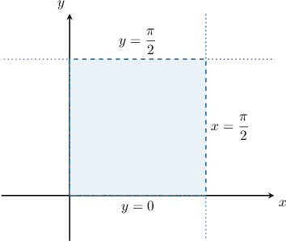
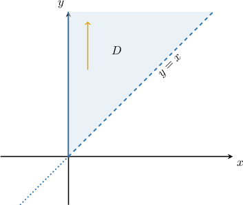
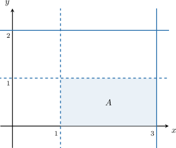

# Joint Distributions for Continuous Random Variables

Source: https://www.mathacademy.com/topics/3052?courseId=73
Topic ID: 3052

## Prerequisites

- [Double Integrals Over Type II Regions](../multivariable-calculus/2152-double-integrals-over-type-ii-regions.md)
- [Joint Distributions for Discrete Random Variables](./3001-joint-distributions-for-discrete-random-variables.md)
- [Continuous Random Variables Over Infinite Domains](./4100-continuous-random-variables-over-infinite-domains.md)

## Lesson

### Introduction

We've already seen how to work with bivariate distributions for *discrete* random variables. This lesson will examine the case where the random variables are *continuous.*

A function $f(x,y)$ is a **joint probability density function** (or **joint PDF**) for the two continuous random variables $X$ and $Y$ if the following three conditions are satisfied:

- $f(x,y) \geq 0$ for all $(x,y) \in \mathbb{R}^2$

- $\displaystyle \iint_{\mathbb R^2} f(x,y) \,\textrm{d}x\textrm{d}y = 1$

- $P\left((X,Y)\in A\right) = \displaystyle \iint_{A} f(x,y) \,\textrm{d}x\textrm{d}y,$ where $A$ is a subset of $\mathbb R^2.$

There is some nice intuition to these conditions.

- The first condition states that $f$ must be nonnegative everywhere.

- The second condition states that the sum (integral) of $f$ over possible values of $X$ and $Y$ must add up to $1.$

- The third condition states that we compute the probability of an event $A$ by summing (integrating) $f$ over all regions associated with $A.$

It's worth taking a minute to compare these conditions with those we've seen previously. Firstly, they are the continuous analog of those for the joint PMF of two discrete random variables. Secondly, they are the two-dimensional analog of those for the PDF $f(x)$ of a (single) continuous random variable $X.$

It's also worth noting that these conditions can be generalized to multivariate distributions $(X_1, X_2, \ldots, X_n)$ of $n$ continuous random variables.

Let's now take a look at a concrete example.

### Verifying That a Function Is a Valid Joint PDF

Let's show that the following function is a valid joint PDF:

$$

\begin{aligned}\frac{3}{2}(𝑥^{2}+𝑦^{2}),\, & 0≤𝑥≤1,\,0≤𝑦≤1 \\ 0, & otherwise\end{aligned}

$$

We only need to check the first two conditions to show that this is a valid joint PDF for *some* pair of random variables. So let's do that:

- Clearly $f(x,y) \geq 0$ for all $(x,y) \in \mathbb{R}^2,$ so the first condition is satisfied. $\quad{\color{green}{\checkmark}}$

- To check the second condition, let's first define a region $D$ where $f(x)$ is nonzero: A sketch of this region is shown below. Let's now integrate $f(x,y)$ over $\mathbb R^2.$ By doing this, we get Therefore, the second condition is satisfied too.

Hence, $f(x,y)$ is a valid joint probability density function.

We'll learn how to compute probabilities using the joint PDF later in this lesson.

### Example: Joint PDFs for Continuous Random Variables: Rectangular Domains

#### Question

The random variables $X$ and $Y$ have the joint probability density function

$$

\begin{aligned}𝑐sin⁡(𝑥+𝑦),\, & 0<𝑥<\frac{𝜋}{2},0<𝑦<\frac{𝜋}{2} \\ 0, & otherwise\end{aligned}

$$

where $c$ is a positive real number. Find the value of $c.$

#### Explanation

To verify that $f(x,y)$ is a valid joint probability density function, we must check the following conditions:

- $f(x,y) \geq 0$ for all $(x,y)\in \mathbb R^2$

- $\displaystyle \iint_{\mathbb R^2} f(x,y) \;\textrm{d}x\textrm{d}y= 1$

First, let's sketch the region $D = \left\{(x,y) \::\: 0\lt x\lt \dfrac{\pi}{2},0\lt y \lt \dfrac{\pi}{2} \right\}.$

Now, let's check our conditions:

- Since $c > 0,$ we clearly have $f(x,y) \geq 0$ for all $(x,y)\in \mathbb R^2.$ So the first condition is satisfied.

- For the second condition to be satisfied, we must have We evaluate the inner integral by integrating with respect to $y$, treating $x$ as a constant: Then, we integrate with respect to $x$:

Hence,

$$

2c=1 \qquad \Longrightarrow \qquad c=\dfrac{1}{2}.

$$

### Example: Joint PDFs for Continuous Random Variables: Non-Rectangular Domains

#### Question

The random variables $X$ and $Y$ have the joint probability density function

$$

\begin{aligned}\frac{𝑐}{(1+𝑥+𝑦)^{3}},\, & 0≤𝑥<𝑦 \\ 0, & otherwise\end{aligned}

$$

where $c$ is a positive real number. Find the value of $c.$

#### Explanation

To verify that $f(x,y)$ is a valid joint probability density function, we must check the following conditions:

- $f(x,y) \geq 0$ for all $(x,y)\in \mathbb R^2$

- $\displaystyle \iint_{\mathbb R^2} f(x,y) \;\textrm{d}x\,\textrm{d}y= 1$

First, let's sketch the region $D = \{(x,y) \::\: 0 \leq x \lt y \}.$

Now, let's check our conditions:

- Since $c > 0,$ we clearly have $f(x,y) \geq 0$ for all $(x,y)\in \mathbb R^2.$ So the first condition is satisfied.

- For the second condition to be satisfied, we must have We evaluate the inner integral by integrating with respect to $y$, treating $x$ as a constant:

$$

\begin{aligned}∫_{∞0}^{}[∫_{∞𝑥}^{}\frac{𝑐}{(1+𝑥+𝑦)^{3}}\,d𝑦]d𝑥 & =𝑐∫_{∞0}^{}[∫_{∞𝑥}^{}(1+𝑥+𝑦)^{−3}\,d𝑦]d𝑥 \\ & =𝑐∫_{∞0}^{}[−\frac{1}{2}(1+𝑥+𝑦)^{−2}]_{𝑦=∞𝑦=𝑥}^{}\,d𝑥 \\ & =−\frac{𝑐}{2}∫_{∞0}^{}[(1+𝑥+𝑦)^{−2}]_{𝑦=∞𝑦=𝑥}^{}\,d𝑥 \\ & =−\frac{𝑐}{2}∫_{∞0}^{}0−(1+2𝑥)^{−2}\,d𝑥 \\ & =−\frac{𝑐}{2}∫_{∞0}^{}−(1+2𝑥)^{−2}\,d𝑥 \\ & =\frac{𝑐}{2}∫_{∞0}^{}(1+2𝑥)^{−2}\,d𝑥\end{aligned}

$$

Then, we integrate with respect to $x{:}$

$$

\begin{aligned}\frac{𝑐}{2}∫_{∞0}^{}(1+2𝑥)^{−2}\,d𝑥 & =\frac{𝑐}{2}[−\frac{1}{2}(1+2𝑥)^{−1}]_{∞0}^{} \\ & =−\frac{𝑐}{4}[\frac{1}{1+2𝑥}]_{∞0}^{} \\ & =−\frac{𝑐}{4}[0−1] \\ & =\frac{𝑐}{4}\end{aligned}

$$

Hence,

$$

\dfrac{c}{4}=1 \qquad \Longrightarrow \qquad c=4.

$$

### Finding Probabilities Using Joint PDFs

Suppose that $f(x,y)$ is a joint probability density function for two continuous random variables $X$ and $Y.$ As previously discussed, for any subset $A$ of $\mathbb{R}^2,$ we have

$$

P\big( (X,Y) \in A \big) = \iint_A f(x, y) \;\textrm{d}x\textrm{d}y.

$$

In particular, if $A$ is the event defined as

$$

A = \big\{ (X,Y) \:|\: a \leq X \leq b, \, c \leq Y \leq d \big\},

$$

then the corresponding probability can be computed as

$$

P(a \leq X \leq b, c \leq Y \leq d) = \int^{d}_{c} \int^{b}_{a} f(x,y) \;\textrm{d}x \: \textrm{d}y = \int^{b}_{a} \int^{d}_{c} f(x,y) \;\textrm{d}y \: \textrm{d}x.

$$

Finally, analogously to the case of a single continuous random variable, the probability that $(X,Y)$ takes on any particular value $(x,y)$ is zero, i.e.,

$$

P(X = x, Y=y) = 0.

$$

Let's see an example of how to compute a probability in practice.

### Example: Computing a Probability Using a Joint PDF

#### Question

The random variables $X$ and $Y$ have the joint probability density function

$$

\begin{aligned}\frac{1}{6},\, & 0≤𝑥≤3,\,0≤𝑦≤2, \\ 0, & otherwise.\end{aligned}

$$

Find $P(X > 1, Y < 1).$

#### Explanation

If $f(x,y)$ is a joint probability density function for the random variables $X$ and $Y$ and $A\subset \mathbb R^2,$ then

$$

P\left((X,Y)\in A\right) = \iint_A f(x,y)\,\textrm d x\textrm d y.

$$

Notice that $f(x,y)$ is nonnegative in the region $D = [0,3]\times [0,2],$ and the event $A = \left\{X > 1, Y < 1\right\}$ corresponds to a subset of $D,$ shown as the shaded region below:

Therefore,

$$

\begin{aligned}𝑃(𝑋>1,𝑌<1) & =∬_{𝐴}𝑓(𝑥,𝑦)\,d𝑥d𝑦 \\ & =\frac{1}{6}∬_{𝐴}\,d𝑥d𝑦 \\ & =\frac{1}{6}Area(𝐴) \\ & =\frac{1}{6}⋅(3−1)⋅(1−0) \\ & =\frac{1}{6}⋅2⋅1 \\ & =\frac{1}{3}.\end{aligned}

$$
