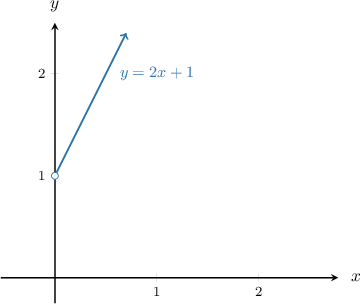
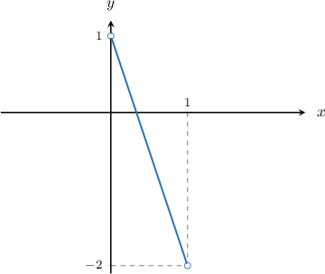
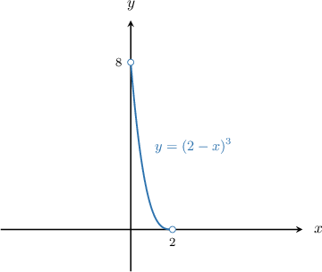

# The Distribution Function Method

Source: https://www.mathacademy.com/topics/3055?courseId=73
Topic ID: 3055

## Prerequisites

- [Solving Elementary Quadratic Inequalities](../integrated-math-iii-honors/1495-solving-elementary-quadratic-inequalities.md)
- [Cumulative Distribution Functions for Continuous Random Variables](./2163-cumulative-distribution-functions-for-continuous-random-variables.md)
- [Solving Radical Inequalities](../integrated-math-iii-honors/2856-solving-radical-inequalities.md)
- [Solving Inequalities Involving Exponential Functions](../integrated-math-iii-honors/2857-solving-inequalities-involving-exponential-functions.md)
- [Solving Inequalities Involving Logarithmic Functions](../integrated-math-iii-honors/2858-solving-inequalities-involving-logarithmic-functions.md)

## Lesson

### Introduction

Let $X$ be a continuous random variable whose probability density function is known. Suppose we want to define a new random variable $Y$ as

$$

Y = u(X),

$$

where $u = u(X)$ is a function of $X.$ How do we find the probability density function of $Y?$

To find the PDF of $Y,$ we can use the **distribution function method**. The distribution function method consists of two steps:

- First, we find an expression for $F_Y$ in terms of $F_X,$ where $F_Y$ and $F_X$ are the cumulative distribution functions of $Y$ and $X,$ respectively.

- Then, we differentiate $F_Y$ to get the probability density function $f_Y$ of $Y.$

In this lesson, we'll assume that the function $u$ is strictly monotonic (i.e., strictly increasing or decreasing). The case where $u$ is not monotonic will be dealt with in a future lesson.

Let's see an example of the distribution function method in action.

### A Worked Example

Suppose the continuous random variable $X$ is defined as

$$

\begin{aligned}𝑒^{−𝑥},\, & 𝑥>0 \\ 0,\, & otherwise.\end{aligned}

$$

Let $Y= 1+2X.$ Let's use the distribution function method to find the probability density function of $Y.$

First, note that $Y = 1+2X$ is a strictly increasing function of $X.$ Moreover, for $x > 0,$ we have $y > 1.$

Let's consider $y > 1.$ We write down the definition of the cumulative distribution of $Y,$ and then use our transformation to isolate $X$ in the parentheses. This will allow us to write $F_Y$ in terms of $F_X\mathbin{:}$

$$

\begin{aligned}𝐹_{𝑌}(𝑦) & =𝑃(𝑌≤𝑦) \\ & =𝑃(2𝑋+1≤𝑦) \\ & =𝑃(2𝑋≤𝑦−1) \\ & =𝑃(𝑋≤\frac{𝑦−1}{2}) \\ & =𝐹_{𝑋}(\frac{𝑦−1}{2})\end{aligned}

$$

Now, to compute the PDF $f_Y(y)$ for $y > 1,$ we differentiate $F_Y$ with respect to $y$ using the chain rule. This gives

$$

\begin{aligned}𝑓_{𝑌}(𝑦) & =𝐹_{′𝑌}^{}(𝑦) \\ & =\frac{d}{d𝑦}(𝐹_{𝑋}(\frac{𝑦−1}{2})) \\ & =\frac{d}{d𝑦}(\frac{𝑦−1}{2})⋅𝐹_{′𝑋}^{}(\frac{𝑦−1}{2}) \\ & =\frac{1}{2}⋅𝐹_{′𝑋}^{}(\frac{𝑦−1}{2}) \\ & =\frac{1}{2}⋅𝑓_{𝑋}(\frac{𝑦−1}{2}).\end{aligned}

$$

Applying the definition of $f_X,$ we finally arrive at

$$

\begin{aligned}𝑓_{𝑌}(𝑦) & =\frac{1}{2}⋅𝑓_{𝑋}(\frac{𝑦−1}{2}) \\ & =\frac{1}{2}⋅𝑒^{−(𝑦−1)/2} \\ & =\frac{1}{2}𝑒^{(1−𝑦)/2}.\end{aligned}

$$

Therefore, the full expression for the PDF of $Y$ is

$$

\begin{aligned}𝑓_{𝑌}(𝑦) & =\begin{aligned}\frac{1}{2}𝑒^{(1−𝑦)/2}, & \,𝑦>1 \\ 0, & \,otherwise.\end{aligned}\end{aligned}

$$

It's easy (and often worthwhile) to check that this is a valid probability density function.

### Example: Computing the PDF of a Random Variable Under an Affine Transformation

#### Question

Let $X$ be a continuous random variable with the following probability density function:

$$

\begin{aligned}2𝑥,\, & 0<𝑥<1 \\ 0, & otherwise\end{aligned}

$$

If $Y =1-3X,$ then what is the probability density function of $Y?$

#### Explanation

To compute the probability density function of a random variable $Y,$ where $Y = u(X)$ is a continuous, strictly monotonic function of a continuous random variable $X,$ we follow two steps:

- First, we find an expression for $F_Y$ terms of $F_X,$ where $F_Y$ and $F_X$ are the cumulative distribution functions of $Y$ and $X,$ respectively.

- Then, we differentiate $F_Y$ to get the probability density function $f_Y.$

Before we start, note that $Y = 1-3X$ is a strictly decreasing function of $X.$ Moreover, for $0 < x < 1,$ we have $-2 \lt y \lt 1.$

Now, using the definition of the cumulative distribution of $Y,$ for $-2 \lt y \lt 1,$ we have

$$

\begin{aligned}𝐹_{𝑌}(𝑦) & =𝑃(𝑌≤𝑦) \\ & =𝑃(1−3𝑋≤𝑦) \\ & =𝑃(−3𝑋≤𝑦−1) \\ & =𝑃(𝑋≥\frac{1−𝑦}{3}) \\ & =1−𝐹_{𝑋}(\frac{1−𝑦}{3})\end{aligned}

$$

To compute the PDF $f_Y(y)$ for $-2 \lt y \lt 1,$ we differentiate $F_Y$ with respect to $y$ using the chain rule. This gives

$$

\begin{aligned}𝑓_{𝑌}(𝑦) & =𝐹_{′𝑌}^{}(𝑦) \\ & =0−(−\frac{1}{3})⋅𝐹_{′𝑋}^{}(\frac{1−𝑦}{3}) \\ & =\frac{1}{3}⋅𝑓_{𝑋}(\frac{1−𝑦}{3}).\end{aligned}

$$

Applying the definition of $f_X,$ we finally arrive at

$$

\begin{aligned}𝑓_{𝑌}(𝑦) & =\frac{1}{3}⋅𝑓_{𝑋}(\frac{1−𝑦}{3}) \\ & =\frac{1}{3}⋅2⋅(\frac{1−𝑦}{3}) \\ & =\frac{2}{9}(1−𝑦).\end{aligned}

$$

Therefore, the full expression for the PDF of $Y$ is

$$

\begin{aligned}\frac{2}{9}(1−𝑦),\, & −2<𝑦<1 \\ 0,\, & otherwise\end{aligned}

$$

### Example: Computing the PDF of a Random Variable Under a Nonlinear Transformation

#### Question

Let $X$ be a continuous random variable with the following probability density function:

$$

\begin{aligned}\frac{3}{8}(2−𝑥)^{2},\, & 0<𝑥<2 \\ 0, & otherwise\end{aligned}

$$

If $Y = (2-X)^3,$ then what is the probability density function of $Y?$

#### Explanation

To compute the probability density function of a random variable $Y,$ where $Y = u(X)$ is a continuous, strictly monotonic function of a continuous random variable $X,$ we follow two steps:

- First, we find an expression for $F_Y$ terms of $F_X,$ where $F_Y$ and $F_X$ are the cumulative distribution functions of $Y$ and $X,$ respectively.

- Then, we differentiate $F_Y$ to get the probability density function $f_Y.$

Before we start, note that $Y = (2-X)^3$ is a strictly decreasing function of $X.$ Moreover, for $0 \lt x \lt 2,$ we have $0 \lt y \lt 8.$

Now, using the definition of the cumulative distribution of $Y,$ for $0 \lt y \lt 8,$ we have

$$

\begin{aligned}𝐹_{𝑌}(𝑦) & =𝑃(𝑌≤𝑦) \\ & =𝑃((2−𝑋)^{3}≤𝑦) \\ & =𝑃(2−𝑋≤𝑦^{1/3}) \\ & =𝑃(−𝑋≤𝑦^{1/3}−2) \\ & =𝑃(𝑋≥2−𝑦^{1/3}) \\ & =1−𝐹_{𝑋}(2−𝑦^{1/3}).\end{aligned}

$$

To compute the PDF $f_Y(y)$ for $0 \lt y \lt 8,$ we differentiate $F_Y$ with respect to $y$ using the chain rule. This gives

$$

\begin{aligned}𝑓_{𝑌}(𝑦) & =𝐹_{′𝑌}^{}(𝑦) \\ & =0−(−\frac{1}{3𝑦^{2/3}})⋅𝐹_{′𝑋}^{}(2−𝑦^{1/3}) \\ & =\frac{1}{3𝑦^{2/3}}⋅𝑓_{𝑋}(2−𝑦^{1/3}).\end{aligned}

$$

Applying the definition of $f_X,$ we finally arrive at

$$

\begin{aligned}𝑓_{𝑌}(𝑦) & =\frac{1}{3𝑦^{2/3}}⋅𝑓_{𝑋}(2−𝑦^{1/3}) \\ & =\frac{1}{3𝑦^{2/3}}⋅\frac{3}{8}(2−(2−𝑦^{1/3}))^{2} \\ & =\frac{1}{3𝑦^{2/3}}⋅\frac{3}{8}(2−2+𝑦^{1/3})^{2} \\ & =\frac{1}{3𝑦^{2/3}}⋅\frac{3}{8}(𝑦^{1/3})^{2} \\ & =\frac{1}{8}.\end{aligned}

$$

Therefore, the full expression for the PDF of $Y$ is

$$

\begin{aligned}\frac{1}{8},\, & 0<𝑦<8 \\ 0,\, & otherwise.\end{aligned}

$$
