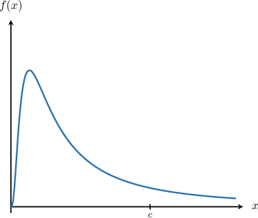
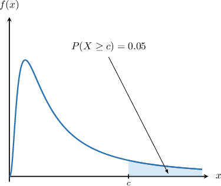
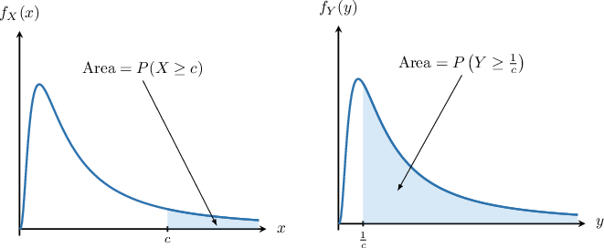

# The F-Distribution

Source: https://www.mathacademy.com/topics/3060?courseId=73
Topic ID: 3060

## Prerequisites

- [The Chi-Square Distribution](./3023-the-chi-square-distribution.md)

## Lesson

### Introduction

Suppose that $W_1$ and $W_2$ are independent chi-square random variables with $\nu_1$ and $\nu_2$ degrees of freedom, respectively.

$$

W_1\sim \chi^2(\nu_1), \qquad W_2\sim \chi^2(\nu_2)

$$

It can be shown that the random variable $X,$ defined as

$$

X = \dfrac{W_1/\nu_1}{W_2/\nu_2}

$$

follows a two-parameter probability distribution called an $\boldsymbol F$**-distribution.** We denote this as follows:

$$

X\sim F(\nu_1, \nu_2)

$$

The probability density function $f(x)$ of a typical $F$-distribution curve is shown below.

Since an $F$-distribution is a ratio of chi-square random variables with support $x > 0,$ the support of $f(x)$ is also $x > 0.$

The $F$-distribution is sometimes called **Fisher's $\boldsymbol F$-distribution** after the British statistician Sir Ronald Fisher.

### F-Distribution Tables

The $F$-distribution often occurs when conducting certain types of statistical tests. You'll learn about these tests in future lessons. For now, let's get some practice at computing probabilities associated with random variables following an $F$-distribution.

Suppose we define the following random variable:

$$

X \sim F(6, 12)

$$

Let's find the value $c > 0$ such that $P(X \geq c) = 0.05.$ This probability equals the area indicated in the diagram below.

To determine this probability, we must use a percentage points table for the $F$-distribution.

The table below gives the values of $w$ that satisfy $P(W\geq w) = p,$ where $W\sim F(\nu_1, \nu_2).$

When reading an $F$-distribution table, note that the first parameter $\nu_1$ is given in the first row ($5,6,7$ in the table shown), and the second parameter $\nu_2$ is in the first column ($11,12,13$ in the table).

Since $X \sim F(6, 12),$ we focus on the column of the table corresponding to $\nu_1=6$ and the row corresponding to $\nu_2=12.$

From the highlighted cell, we see that

$$

P(X \geq \boxed{\color{blue}2.996}) = 0.05.

$$

Therefore, our answer is $c=2.996.$

Note that the values given by the $F$-distribution tables are called **critical values.** So, $c=2.996$ is the critical value of $F(6,12)$ corresponding to $p=0.05.$

### Example: Finding a Critical Value Corresponding to a Given Probability

#### Question

The table below gives the values of $x$ that satisfy $P(X\geq x) = p,$ where $X\sim F(\nu_1, \nu_2).$

Given that $X \sim F(6,7),$ find the value of $x$ such that $P(X \leq x) = 0.1.$

#### Explanation

The $F$-distribution, denoted $F(\nu_1, \nu_2),$ is a two-parameter distribution whose probability density function $f(x)$ is defined for $x> 0,$ as shown below.

The table gives probabilities in the form $P(X \geq x).$ So, we express the desired probability in this form:

$$

\begin{aligned}𝑃(𝑋≥𝑥) & =1−𝑃(𝑋<𝑥) \\ & =1−𝑃(𝑋≤𝑥) \\ & =1−0.1 \\ & =0.9\end{aligned}

$$

Since $X \sim F(6,7),$ we focus on the column of the table corresponding to $\nu_1=6$ and the row corresponding to $\nu_2=7.$

From this cell, we see that

$$

P(X \geq \boxed{\color{blue}0.33}) = 0.9.

$$

Therefore, our answer is $x=\boxed{\color{blue}0.33}.$

### The Reciprocal Property

Earlier, we saw that if $W_1$ and $W_2$ are independent chi-square random variables with $\nu_1$ and $\nu_2$ degrees of freedom, respectively.

$$

W_1\sim \chi(\nu_1), \qquad W_2\sim \chi(\nu_2)

$$

then, we have

$$

X = \dfrac{W_1/\nu_1}{W_2/\nu_2} \sim F(\nu_1, \nu_2).

$$

Naturally, if the ratio $(W_1/\nu_1)/(W_2/\nu_2)$ follows a f-distribution, then $(W_2/\nu_2)/(W_1/\nu_1)$ follows a f-distribution, too.

$$

Y = \dfrac{1}{X} = \dfrac{W_2/\nu_2}{W_1/\nu_1} \sim F(\nu_2, \nu_1)

$$

It follows then that

$$

P(X\geq c) + P\left(Y\geq\dfrac1c\right) = 1

$$

The diagram below shows a sketch of the probability density functions $f_X(x)$ and $f_Y(y)$ of the random variables $X$ and $Y.$ The sum of the two shaded areas equals $1.$

To understand why this property is true, let $p\in(0,1)$ such that

$$

P(X\geq c) = p.

$$

Therefore, by rearranging the inequality in the parentheses, we have

$$

P\left(\dfrac1X\leq \dfrac1c\right) = p.

$$

In other words,

$$

P\left(Y\leq \dfrac1c\right) = p.

$$

Using the complement, we have

$$

P\left(Y\geq \dfrac1c\right) = 1-p.

$$

Therefore, we conclude

$$

\begin{aligned}𝑃(𝑋≥𝑐)+𝑃(𝑌≥\frac{1}{𝑐})=𝑝+(1−𝑝)=1.\end{aligned}

$$

Let's see how the reciprocal property can be used to find probabilities.

### Example: Finding a Critical Value Using the Reciprocal Property

#### Question

The table below gives the values of $x$ that satisfy $P(X\geq x) = 0.01,$ where $X\sim F(\nu_1, \nu_2).$

Given that $X \sim F(13,9),$ find the value $c$ such that $P(X \geq c) = 0.99.$ Round your answer to three decimal places.

#### Explanation

The diagram below shows a sketch of the probability density functions $f_X(x)$ and $f_Y(y)$ of the random variables $X\sim F(\nu_1, \nu_2)$ and $Y\sim F(\nu_2, \nu_1).$

Recall that if $X\sim F(\nu_1, \nu_2)$ and $Y\sim F(\nu_2, \nu_1),$ then for any $c>0,$ we have

$$

P(X \geq c) + P\left(Y \geq \dfrac1c\right) = 1.

$$

In other words, the sum of the two areas shown above equals one.

Notice that the table gives the $p=0.01$ critical values. However, we wish to find a $p=0.99$ critical value. So, let's define

$$

X\sim F(13,9), \qquad Y\sim F(9,13).

$$

We wish to find a value $c$ such that

$$

P(X \geq c) = 1 - P\left(Y \geq \dfrac1c\right) = 0.99.

$$

In other words,

$$

P\left(Y \geq \dfrac1c\right) = 0.01.

$$

Since $Y \sim F(9,13),$ from the table, we see that

$$

P(Y \geq 4.191)=0.01.

$$

So, we have $\dfrac1c = 4.191,$ which gives $c = 0.239$ rounded to three decimal places.

### Example: Computing a Probability Over a Bounded Interval

#### Question

The table below gives the values of $x$ that satisfy $P(X\geq x) = p,$ where $X\sim F(\nu_1, \nu_2).$

If $X\sim F(5,4),$ then calculate the following probability.

$$

P\left( \dfrac{1}{3.52} \leq X \leq 6.26 \right)

$$

#### Explanation

The diagram below shows a sketch of the probability density functions $f_X(x)$ and $f_Y(y)$ of the random variables $X\sim F(\nu_1, \nu_2)$ and $Y\sim F(\nu_2, \nu_1).$

Recall that if $X\sim F(\nu_1, \nu_2)$ and $Y\sim F(\nu_2, \nu_1),$ then for any $c>0,$ we have

$$

P(X \geq c) + P\left(Y \geq \dfrac1c\right) = 1.

$$

In other words, the sum of the two areas shown above equals one.

We have $X\sim F(5,4).$ So, let's define $Y\sim F(4,5).$

The desired probability can be expressed as

$$

P\left( \dfrac{1}{3.52} \leq X \leq 6.26 \right) = P\left(X \geq \dfrac{1}{3.52} \right) - P(X \geq 6.26).

$$

Let's calculate each probability separately:

- From the table, we have

- By the reciprocal property of the $F$-distribution, we have which gives From the table, we have Therefore,

Finally, we conclude that

$$

P\left( \dfrac{1}{3.52} \leq X \leq 6.26 \right) = 0.9 - 0.05 = 0.85.

$$
