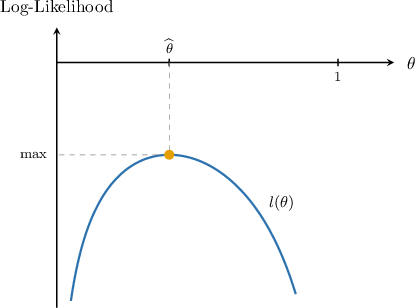

# Maximum Likelihood Estimation

Source: https://www.mathacademy.com/topics/3077?courseId=73
Topic ID: 3077

## Prerequisites

- [The Second Derivative Test](../ap-calculus-ab/339-the-second-derivative-test.md)
- [Log-Likelihood Functions for Continuous Probability Distributions](./4125-log-likelihood-functions-for-continuous-probability-distributions.md)

## Lesson

### Introduction

Suppose we have a random sample $X_1, X_2, X_3$ drawn from a population where $X_i\sim B(5,\theta),$ where $\theta$ is an unknown probability of success. Let's assume we conducted our sample and got the following data:

$$

x_1 = 4, \qquad x_2 = 1, \qquad x_3 = 1

$$

It can be shown that the log-likelihood function for this sample is

$$

l(\theta) = \ln 125 + 6 \ln \theta +9\ln(1-\theta).

$$

Our goal is to form an estimate for the unknown parameter $\theta.$ To do this, we find the value of $\theta$ that maximizes the probability of getting the observed sample data. In other words, we need to maximize the likelihood function $L(\theta).$ And, since the natural logarithm is an increasing function, a value of $\theta$ that maximizes the likelihood function $L(\theta)$ will also maximize the log-likelihood function $l(\theta).$

Estimates of an unknown parameter $\theta$ obtained by maximizing the likelihood function (or, equivalently, the log-likelihood function) are called **maximum likelihood estimates**. We'll use the usual $\hat{\theta}$ notation to denote a maximum likelihood estimate of $\theta.$

To find the maximum likelihood estimate of $\theta,$ we calculate the derivative of the log-likelihood function, set the derivative equal to zero, and solve for $\theta.$

First, we take the derivative of $l(\theta){:}$

$$

\begin{aligned}\frac{d𝑙}{d𝜃} & =\frac{d}{d𝜃}(ln⁡125+6ln⁡𝜃+9ln⁡(1−𝜃)) \\ & =\frac{6}{𝜃}+\frac{9}{1−𝜃}⋅(−1) \\ & =\frac{6}{𝜃}+\frac{9}{𝜃−1}.\end{aligned}

$$

Then, we set the derivative equal to $0$ and solve for $\theta{:}$

$$

\begin{aligned}\frac{6}{𝜃}+\frac{9}{𝜃−1} & =0 \\ \frac{6(𝜃−1)+9𝜃}{𝜃(𝜃−1)} & =0 \\ 6(𝜃−1)+9𝜃 & =0 \\ 15𝜃−6 & =0 \\ 15𝜃 & =6 \\ 𝜃 & =\frac{6}{15}\end{aligned}

$$

Therefore, for this sample, the maximum likelihood estimate of $\theta$ is $\widehat{\,\theta\,} = \dfrac{6}{15}.$

**Note**: It's easy to check that this is a maximum of $l(\theta)$ by calculating the second derivative. We'll omit this step.

### Example: Maximum Likelihood Estimators for Discrete Probability Distributions

#### Question

Given that the log-likelihood function for a particular sample of independent Bernoulli random variables is

$$

l(\theta) = 3\ln\theta + 4\ln(1-\theta),

$$

what is the maximum likelihood estimate $\widehat{\,\theta\,}$ from this sample?

#### Explanation

In order to find the maximum likelihood estimate of $\theta,$ we calculate the derivative of the log-likelihood function, set the derivative equal to zero, and solve for $\theta.$

First, we take the derivative of $l(\theta){:}$

$$

\begin{aligned}\frac{d𝑙}{d𝜃} & =\frac{d}{d𝜃}(3ln⁡𝜃+4ln⁡(1−𝜃)) \\ & =\frac{3}{𝜃}+\frac{4}{1−𝜃}⋅(−1) \\ & =\frac{3}{𝜃}+\frac{4}{𝜃−1}\end{aligned}

$$

Then, we set the derivative equal to $0$ and solve for $\theta{:}$

$$

\begin{aligned}\frac{3}{𝜃}+\frac{4}{𝜃−1} & =0 \\ \frac{3(𝜃−1)+4𝜃}{𝜃(𝜃−1)} & =0 \\ 3(𝜃−1)+4𝜃 & =0 \\ 7𝜃−3 & =0 \\ 7𝜃 & =3 \\ 𝜃 & =\frac{3}{7}\end{aligned}

$$

Therefore, for this sample, the maximum likelihood estimate of $\theta$ is $\widehat{\,\theta\,} = \dfrac{3}{7}.$

### Example: Maximum Likelihood Estimators for Continuous Probability Distributions

#### Question

Given that the log-likelihood function for a particular sample of independent normal random variables $X_i\sim N(\theta,1)$ is

$$

l(\theta) = -6\ln(2\pi)-8.4 + 12.1\, \! \theta - 6\ \! \theta^2,

$$

what is the maximum likelihood estimate $\widehat{\,\theta\,}$ for this sample? Round your answer to $3$ decimal places.

#### Explanation

In order to find the maximum likelihood estimate of $\theta,$ we calculate the derivative of the log-likelihood function, set the derivative equal to zero, and solve for $\theta.$

First, we take the derivative of $l(\theta){:}$

$$

\begin{aligned}\frac{d𝑙}{d𝜃} & =\frac{d}{d𝜃}(−6ln⁡(2𝜋)−8.4+12.1\,\,𝜃−6 \,𝜃^{2}) \\ & =12.1−12 \,𝜃\end{aligned}

$$

Then, we set the derivative equal to $0$ and solve for $\theta{:}$

$$

\begin{aligned}12.1−12 \,𝜃 & =0 \\ 12 \,𝜃 & =12.1 \\ 𝜃 & ≈1.008\end{aligned}

$$

Therefore, for this sample, the maximum likelihood estimate of $\theta$ is $\widehat{\,\theta\,} \approx 1.008,$ rounded to $3$ decimal places.

### Deriving a Maximum Likelihood Estimator for Bernoulli Distributions

Let's derive a general expression for the maximum likelihood estimator for the unknown parameter $\theta$ for a set of $n$ independent and identically distributed Bernoulli random variables.

Suppose $X_1,X_2,\ldots,X_{n}$ is an I.I.D random sample, where $X_i\sim \text{Bernoulli}(\theta)$ with unknown probability of success $\theta.$ For a particular sample $x_1, x_2, \ldots, x_{n},$ the log-likelihood function is given by

$$

l(\theta) = S\ln\theta + (n-S)\ln(1-\theta),

$$

where $\displaystyle S = \sum_ {i=1}^n x_i$ is the number of successes in the sample.

To compute a general expression for the maximum likelihood estimate, we differentiate $l(\theta),$ set the derivative equal to zero, and solve for $\theta.$

First, we take the derivative of $l(\theta){:}$

$$

\begin{aligned}\frac{d𝑙}{d𝜃} & =\frac{d}{d𝜃}(𝑆ln⁡𝜃+(𝑛−𝑆)ln⁡(1−𝜃)) \\ & =\frac{𝑆}{𝜃}+\frac{𝑛−𝑆}{1−𝜃}⋅(−1) \\ & =\frac{𝑆}{𝜃}+\frac{𝑛−𝑆}{𝜃−1}\end{aligned}

$$

Then, we set the derivative equal to $0$ and solve for $\theta{:}$

$$

\begin{aligned}\frac{𝑆}{𝜃}+\frac{𝑛−𝑆}{𝜃−1} & =0 \\ \frac{𝑆(𝜃−1)+(𝑛−𝑆)𝜃}{𝜃(𝜃−1)} & =0 \\ 𝑆(𝜃−1)+(𝑛−𝑆)𝜃 & =0 \\ 𝑆𝜃−𝑆+𝑛𝜃−𝑆𝜃 & =0 \\ 𝑛𝜃−𝑆 & =0 \\ 𝑛𝜃 & =𝑆 \\ 𝜃 & =\frac{𝑆}{𝑛} \\ 𝜃 & =\frac{1}{𝑛}\underset{\underset{𝑖=1}{∑}}{\overset{}{𝑛}}𝑥_{𝑖}\end{aligned}

$$

Therefore, the maximum likelihood estimate of $\theta$ is

$$

\widehat{\,\theta\,} = \dfrac{1}{n} \sum_ {i=1}^n x_i,

$$

which is simply the *mean of the sample*.

The maximum likelihood estimate for other common distributions can be derived similarly. Let's summarize the most important cases.

### A List of Important Maximum Likelihood Estimators

The table below summarizes the maximum likelihood estimates for several common probability distributions. These results can be derived by maximizing the corresponding log-likelihood function.
