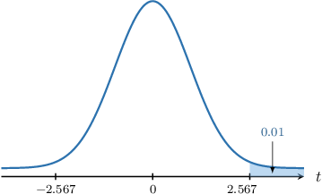
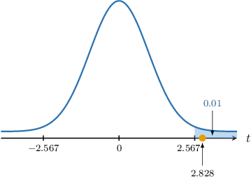

# Hypothesis Tests for One Mean: Unknown Population Variance

Source: https://www.mathacademy.com/topics/3311?courseId=73
Topic ID: 3311

## Prerequisites

- [The Student's T-Distribution](./3069-the-student-s-t-distribution.md)
- [Hypothesis Tests for One Mean: Known Population Variance](./3303-hypothesis-tests-for-one-mean-known-population-variance.md)

## Lesson

### Introduction

We've already seen how to conduct a hypothesis test for the mean $\mu$ of a normally distributed population in cases where the variance $\sigma^2$ is *known*. However, this situation is often unrealistic, as it's doubtful that we'll know the population variance yet not know the population mean.

A more realistic situation is that $\sigma^2$ is *unknown*, and we must estimate it from the sample data.

Recall that to compute an unbiased estimate of the population variance $\sigma^2,$ we use the sample variance $S^2,$ given by

$$

S^2 = \dfrac{1}{n-1} \sum_{i=1}^n \left( X_i - \overline{X} \right)^2

$$

where each $X_i$ is a sample element, $\overline{X}$ is the sample mean, and $n$ is the sample size.

It can be shown that the random variable

$$

\dfrac{\overline{X} - \mu}{S/\sqrt n} \sim T_{n-1}

$$

where $T_{n-1}$ is a student's $t$-distribution with $n-1$ degrees of freedom.

The key takeaway is that if the variance is *unknown*, we use a student's $t$-distribution instead of a normal distribution when conducting our hypothesis test. Other than that, the process is the same as before.

Let's take a look at a concrete example.

### Describing the Null and Alternative Hypotheses

Suppose the waiting time for emergency room visits at a particular hospital is normally distributed. The management's target is that the mean waiting time should be no longer than $10$ minutes. However, after some changes to their processes, the managers now believe that the mean waiting time is longer than $10$ minutes and decide to conduct a hypothesis test at the $1\%$ significance level.

The management samples $18$ patients and found that their mean waiting time is $\overline{x} = 11 \, \textrm{min}$ and the sample standard deviation is $s = 1.5 \, \textrm{min}.$ Is there sufficient evidence to conclude that the mean waiting time is greater than $10\,\textrm{min}?$

We are told that the population is normally distributed. However, we do not know the population variance $\sigma^2.$ Therefore, we will use the fact that the random variable

$$

\dfrac{\overline{X} - \mu}{S/\sqrt n}

$$

follows a student's $t$-distribution with $n-1$ degrees of freedom, where

- $\overline{X}$ is the sample mean,

- $\mu$ is the population mean,

- $S^2$ is the sample variance, and

- $n$ is the sample size.

Let's write down our null and alternative hypotheses:

- $H_0: \mu = 10\, \textrm{min}$ is the null hypothesis

- $H_1: \mu \gt 10\, \textrm{min}$ is the alternative (one-tailed) hypothesis

Next, we'll compute the critical region. Remember that the critical region contains all $t$-values that are *collectively* unlikely under the null hypothesis and therefore cause the null hypothesis to be rejected.

Let $T$ be a $t$-distributed random variable with $k=18-1 = 17$ degrees of freedom. To find the critical region for this test at the $\alpha = 1\%$ level of significance, we need to find a particular value $t_{17,0.01}$ such that

$$

P(T > t_{17,0.01}) = \alpha = 0.01.

$$

To do this, we can use the following percentage points table.

From the table,

$$

P(T > 2.567) = 0.01.

$$

So, we have that

- $t_{17,0.01} = 2.567$ is our critical value, and

- $T\geq 2.567$ the critical region.

Now that we've established the critical region, let's compute the test statistic.

### Computing the Test Statistic

We have the following critical region at the $1\%$ significance level.

We're told that out of a sample of $18$ patients, the mean of the sample was $11$ minutes, and the sample standard deviation was $1.5$ minutes. Therefore, we have the following sample data:

$$

\overline{x} = 11 \, \textrm{min}, \qquad s = 1.5 \, \textrm{min}, \qquad n = 18

$$

Assuming the null hypothesis, i.e., $\mu=10\,\textrm{min},$ we can compute the test statistic as follows:

$$

\begin{aligned}𝑡 & =\frac{\overset{𝑥}{}−𝜇}{𝑠/\sqrt{√𝑛}} \\ & =\frac{11−10}{1.5/\sqrt{√18}} \\ & ≈2.828\end{aligned}

$$

Notice that our test statistic ($2.828$) lies in the critical region, as shown below.

Therefore, we conclude the following:

- If we assume that the population mean is $\mu=10\,\textrm{min}$ (i.e., the null hypothesis is true), getting a sample with a mean of $\overline{x}=11\,\textrm{min}$ or more has a probability that is *smaller than* $0.01 = 1\%,$ our significance level.

- Therefore, we have a statistically significant result and reject the null hypothesis.

- In conclusion, there is *sufficient* evidence that, at the $1\%$ level of significance, we have $\mu \gt 10\,\textrm{min}.$

Let's now look at an example where the critical region lies on the left tail of the distribution.

### Example: Testing a Hypothesis Given a Normal Population: One-Tailed Tests

#### Question

Consider a sample of size $n=6$ from a normal population. We wish to carry out the hypothesis test at a $5\%$ significance level to determine whether there is sufficient evidence that the population mean $\mu$ is smaller than $2.$

Given that the mean of the sample is $\overline{x}=0$ and the sample standard deviation is $s=4,$ which of the following statements are true?

1. The **** critical region for the test statistic is approximately $T \leq -2.015$

2. At the $5\%$ level of significance, there is **** evidence that $\mu \lt 2$

3. At the $5\%$ level of significance, there is **** evidence that $\mu \lt 2$

**

#### Explanation

We are told that the population is normally distributed, but we do not know the population variance $\sigma.$

In cases like this, the random variable

$$

\dfrac{\overline{X} - \mu}{S/\sqrt{n}}

$$

follows a student's $t$-distribution $T_{n-1}$ with $n-1$ degrees of freedom, where

- $\overline{X}$ is the sample mean,

- $\mu$ is the population mean,

- $S^2$ is the sample variance, and

- $n$ is the sample size.

In our example:

- $H_0: \mu = 2$ is the null hypothesis

- $H_1: \mu \lt 2$ is the alternative (one-tailed) hypothesis

Assuming the null hypothesis, i.e., $\mu=2,$ we compute the test statistic:

$$

\begin{aligned}𝑡 & =\frac{\overset{𝑥}{}−𝜇}{𝑠/\sqrt{√𝑛}} \\ & =\frac{0−2}{4/\sqrt{√6}} \\ & ≈−1.225\end{aligned}

$$

Let's now examine our statements.

- Statement I is true. According to the table, the $5\%$ one-tailed critical value for a $t$-distributed random variable with degrees of freedom is $t \approx 2.015.$ $k \setminus p$ $0.100$ $0.050$ $0.025$ $0.010$ $0.005$ $4$ $\,1.533\,$ $\,2.132\,$ $\,2.776\,$ $\,3.747\,$ $\,4.604\,$ $5$ $\,1.476\,$ $\,\color{blue}2.015\,$ $\,2.571\,$ $\,3.365\,$ $\,4.032\,$ $6$ $\,1.440\,$ $\,1.943\,$ $\,2.447\,$ $\,3.143\,$ $\,3.707\,$ However, since the alternative hypothesis is $\mu \lt 2$, we must consider the left tail. So, our critical region is

- Statement II is true, while statement III is false. Our test statistic ($-1.225$) does not lie in the critical region, as shown below. So, we do not reject the null hypothesis $H_0.$ As a result, we conclude the following: $\qquad$ **

Therefore, the correct answer is "I and II only."

### A Two-Tailed Hypothesis Test

To conduct a **two-tailed** hypothesis test for the population mean with known population variance, we proceed similarly to the one-tailed case.

The only differences are the following:

- The *alternative hypothesis* will be $H_1: \mu \neq \mu_0.$

- We compute the *critical value* and write down the *critical region* by considering both tails of the distribution. Remember that for a two-tailed test, if the significance level is $\alpha,$ then we allow $\dfrac\alpha2$ at either tail.

Let's see an example.

### Example: Testing a Hypothesis Given a Normal Population: Two-Tailed Tests

#### Question

Consider a sample of size $n=17$ from a normal population. We wish to carry out a hypothesis test at the $5\%$ level of significance to determine whether there is sufficient evidence that the population mean $\mu$ does not equal $5.$

Given that the mean of the sample is $\overline{x}=7$ and the sample standard deviation $s=5,$ which of the following statements are true?

1. The **** critical region for the test statistic is approximately $T \leq -1.746$ or $T \geq 1.746$

2. At the $5\%$ level of significance, there is **** evidence that $\mu \neq 5$

3. At the $5\%$ level of significance, there is **** evidence that $\mu \neq 5$

**

#### Explanation

We are told that the population is normally distributed, but we do not know the population variance $\sigma.$

In cases like this, the random variable

$$

\dfrac{\overline{X} - \mu}{S/\sqrt{n}}

$$

follows a student's $t$-distribution $T_{n-1}$ with $n-1$ degrees of freedom, where

- $\overline{X}$ is the sample mean,

- $\mu$ is the population mean,

- $S^2$ is the sample variance, and

- $n$ is the sample size.

In our example:

- $H_0: \mu = 5$ is the null hypothesis

- $H_1: \mu \neq 5$ is the alternative (two-tailed) hypothesis

Assuming the null hypothesis, i.e., $\mu=5,$ we compute the test statistic:

$$

\begin{aligned}𝑡 & =\frac{\overset{𝑥}{}−𝜇}{𝑠/\sqrt{√𝑛}} \\ & =\frac{7−5}{5/\sqrt{√17}} \\ & ≈1.649\end{aligned}

$$

Let's now examine our statements.

- Statement I is false. According to the table, the $5\%$ ** critical value (the same as the $5\% \div 2 = 2.5\%$ ** critical value) for a $t$-distributed random variable with degrees of freedom is $t \approx 2.120.$ $k \setminus p$ $0.100$ $0.050$ $0.025$ $0.010$ $0.005$ $16$ $\,1.337\,$ $\,1.746\,$ $\,\color{blue}2.120\,$ $\,2.583\,$ $\,2.921\,$ $17$ $\,1.333\,$ $\,1.740\,$ $\,2.110\,$ $\,2.567\,$ $\,2.898\,$ $18$ $\,1.330\,$ $\,1.734\,$ $\,2.101\,$ $\,2.552\,$ $\,2.878\,$ Since we are considering both tails, our critical region is

- Statement II is true, while statement III is false. Our test statistic ($1.649$) does not lie in the critical region, as shown below. So, we do not reject the null hypothesis $H_0.$ As a result, we conclude the following: $\qquad$ **

Therefore, the correct answer is "II only."

### Large Samples

Up to now, we've assumed that the underlying population is normally distributed. However, if we have a *sufficiently large* sample, then according to the central limit theorem, we have the approximation

$$

\dfrac{\overline{X} - \mu}{\sigma/\sqrt n} \approx N(0,1).

$$

Moreover, since $n$ is sufficiently large, $\sigma^2$ can be approximated as $S^2.$ Therefore, we have that

$$

\dfrac{\overline{X} - \mu}{S/\sqrt n} \approx T_{n-1}.

$$

Typically, "sufficiently large" means that $n \geq 30.$

So, even though we might not know the underlying distribution, we can still use the following formula for the test statistic:

$$

t = \dfrac{\overline{x} - \mu}{s/\sqrt n}

$$

### Example: Testing a Hypothesis for a Large Sample

#### Question

Consider a sample of size $n=70$ from a population. We wish to carry out a hypothesis test at the $10\%$ significance level to determine whether there is sufficient evidence that the population mean $\mu$ is smaller than $24.$

Given that the mean of the sample is $\overline{x}=23$ and the sample standard deviation is $s=5,$ which of the following statements are true?

1. The critical region for the test statistic is approximately $T \leq -1.294$

2. At the $10\%$ level of significance, there is **** evidence that $\mu \lt 24$

3. At the $10\%$ level of significance, there is **** evidence that $\mu \lt 24$

**

#### Explanation

We do not know the distribution of the population, nor do we know the population variance $\sigma^2.$ However, the sample size $n = 70 \geq 30$ is **.

In cases like this, the random variable

$$

\dfrac{\overline{X} - \mu}{S/\sqrt n}

$$

can be approximated by the student's $t$-distribution $T_{n-1}$ with $n-1$ degrees of freedom, where

- $\overline{X}$ is the sample mean,

- $\mu$ is the population mean,

- $S^2$ is the sample variance, and

- $n$ is the sample size.

In our example:

- $H_0: \mu = 24$ is the null hypothesis

- $H_1: \mu \lt 24$ is the alternative (one-tailed) hypothesis

Assuming the null hypothesis, i.e., $\mu=24,$ we compute the test statistic:

$$

\begin{aligned}𝑡 & =\frac{\overset{𝑥}{}−𝜇}{𝑠/\sqrt{√𝑛}} \\ & =\frac{23−24}{5/\sqrt{√70}} \\ & ≈−1.673\end{aligned}

$$

Let's now examine our statements.

- Statement I is true. According to the table, the $10\%$ one-tailed critical value for a $t$-distributed random variable with degrees of freedom is $t \approx 1.294.$ $k \setminus p$ $0.100$ $0.050$ $0.025$ $0.010$ $0.005$ $69$ $\color{blue}\,1.294\,$ $\,1.667\,$ $\,1.995\,$ $\,2.382\,$ $\,2.649\,$ $70$ $\,1.294\,$ $\,1.667\,$ $\,1.994\,$ $\,2.381\,$ $\,2.648\,$ $71$ $\,1.294\,$ $\,1.667\,$ $\,1.994\,$ $\,2.380\,$ $\,2.647\,$ Since the alternative hypothesis is $\mu < 24,$ we must consider the left tail. So, our critical region is

- Statement II is false, while statement III is true. Our test statistic ($-1.673$) lies in the critical region, as shown below. So, we reject the null hypothesis $H_0.$ As a result, we conclude the following: $\qquad$ **

Therefore, the correct answer is "I and III only."

### Example: Applications of Hypothesis Testing

#### Question

A pharmaceutical company used a large group of people to test a new drug designed to reduce cholesterol levels. The mean cholesterol level for the group before the treatment was $\mu = 189$ milligrams per deciliter $(\textrm{mg/dL}).$

After treatment, a scientist sampled $40$ people from the group and found that the cholesterol levels of those sampled had a mean of $187\,\textrm{mg/dL}$ and a standard deviation of $s = 12\,\textrm{mg/dL}.$ The scientist wishes to conduct a hypothesis test to determine whether sufficient evidence exists to claim that the drug works.

By carrying out a hypothesis test at a $10\%$ significance level to determine whether there is sufficient evidence that the population mean $\mu$ is smaller than $189\,\textrm{mg/dL},$ determine which of the following statements are true:

1. The critical region for the test statistic is approximately $T \leq -1.304$

2. At the $10\%$ level of significance, there is **** evidence that $\mu \lt 189 \, \textrm{mg/dL}$

3. At the $10\%$ level of significance, there is **** evidence that $\mu \lt 189 \, \textrm{mg/dL}$

**

#### Explanation

We do not know the distribution of the population, nor do we know the population variance $\sigma^2.$ However, the sample size $n = 40 \geq 30$ is **.

In cases like this, the random variable

$$

\dfrac{\overline{X} - \mu}{S/\sqrt n}

$$

can be approximated by the student's $t$-distribution $T_{n-1}$ with $n-1$ degrees of freedom, where

- $\overline{X}$ is the sample mean,

- $\mu$ is the population mean,

- $S^2$ is the sample variance, and

- $n$ is the sample size.

In our example:

- $H_0: \mu = 189$ is the null hypothesis

- $H_1: \mu < 189$ is the alternative (one-tailed) hypothesis

Also, we have

$$

\overline{x} = 187 \, \textrm{mg/dL}, \qquad n = 40, \qquad s = 12 \, \textrm{mg/dL}.

$$

Assuming the null hypothesis, i.e., $\mu=189,$ we compute the test statistic:

$$

\begin{aligned}𝑡 & =\frac{\overset{𝑥}{}−𝜇}{𝑠/\sqrt{√𝑛}} \\ & =\frac{187−189}{12/\sqrt{√40}} \\ & ≈−1.054\end{aligned}

$$

Let's now examine our statements.

- Statement I is true. According to the table, the $10\%$ one-tailed critical value for a $t$-distributed random variable with degrees of freedom is $t \approx 1.304.$ $k \setminus p$ $0.100$ $0.050$ $0.025$ $0.010$ $0.005$ $39$ $\color{blue}\,1.304\,$ $\,1.685\,$ $\,2.023\,$ $\,2.426\,$ $\,2.708\,$ $40$ $\,1.303\,$ $\,1.684\,$ $\,2.021\,$ $\,2.423\,$ $\,2.704\,$ $41$ $\,1.303\,$ $\,1.683\,$ $\,2.020\,$ $\,2.421\,$ $\,2.701\,$ Since the alternative hypothesis is $\mu < 189,$ we must consider the left tail. So, our critical region is

- Statement II is true, while statement III is false. Our test statistic ($-1.054$) does not lie in the critical region, as shown below. So, we can't reject the null hypothesis $H_0.$ As a result, we conclude the following: $\qquad$ **

Therefore, the correct answer is "I and II only."
