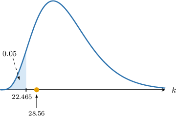
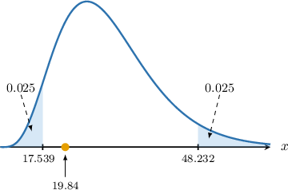
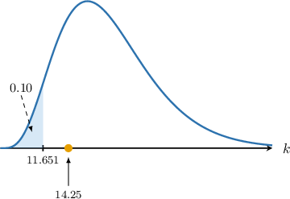

# Hypothesis Tests for One Variance

Source: https://www.mathacademy.com/topics/3314?courseId=73
Topic ID: 3314

## Prerequisites

- [The Chi-Square Distribution](./3023-the-chi-square-distribution.md)
- [Hypothesis Tests for One Mean: Known Population Variance](./3303-hypothesis-tests-for-one-mean-known-population-variance.md)
- [The Sample Variance](./3820-the-sample-variance.md)

## Lesson

### Introduction

In this lesson, we will discuss the sampling distribution of the sample variance $S^2$ and explain how this can be used to conduct hypothesis tests for the population variance $\sigma^2.$

First, consider a random sample $X_1, X_2, \ldots, X_n$ of size $n.$ The **sample variance** $S^2,$ defined as

$$

S^2 = \dfrac{1}{n-1} \sum_{i=1}^n \left( X_i - \overline{X} \right)^2

$$

is an unbiased estimate of the population variance $\sigma^2.$

In general, the distribution of $S^2$ is difficult to find. However, if the random sample is taken from a *normally distributed* population, that is

$$

X_i\sim N(\mu,\sigma^2), \qquad i=1,2,\ldots,n,

$$

then it can be shown that the sampling distribution of the random variable

$$

\dfrac{(n-1)S^2}{\sigma^2}

$$

follows a chi-square distribution $\chi^2(n-1)$ with $n-1$ degrees of freedom.

Let's see how we can use this information to conduct a hypothesis test for the variance $\sigma^2.$

### A Concrete Example

Consider a sample of size $n=24$ from a normal population, where an unbiased estimate for the population variance obtained from this sample is $s^2=2.5^2.$ We wish to carry out a hypothesis test at a $5\%$ significance level to determine whether there is sufficient evidence that the population variance $\sigma^2 > 3.$

We are told that the population is normally distributed, but we do not know the population variance $\sigma^2.$ In cases like this, the random variable

$$

K = \dfrac{(n-1)S^2}{\sigma^2}

$$

follows a chi-square distribution $\chi^2(\nu)$ with $\nu = n-1$ degrees of freedom, where

- $n$ is the sample size,

- $S^2$ is the sample variance, and

- $\sigma^2$ is the population variance.

In our example:

- $H_0: \sigma^2 = 3$ is the null hypothesis

- $H_1: \sigma^2 >3$ is the alternative (one-tailed) hypothesis

Assuming the null hypothesis, i.e., $\sigma^2=3,$ we compute the following test statistic:

$$

\begin{aligned}𝑘 & =\frac{(𝑛−1)𝑠^{2}}{𝜎^{2}} \\ & =\frac{23(2.5)^{2}}{3} \\ & ≈47.917\end{aligned}

$$

Next, we find the critical region. The $5\%$ right-tailed critical region is the set

$$

K\geq b,

$$

where $P(K\geq b)=5\%.$

The table below shows the part of the percentage points table for the chi-square distribution for particular probabilities $p$ and degrees of freedom $\nu.$

The number of degrees of freedom for this test is

$$

\nu = n-1 = 24 - 1 = 23.

$$

From the percentage points table of the chi-square distribution, we obtain that $b = 35.172.$ So, our critical region is

$$

K \geq 35.172.

$$

Our test statistic ($47.917$) lies in the critical region, as shown below.

*There is $\boxed{\color{blue}\textrm{sufficient}}$ evidence that, at the $5\%$ level of significance, we have $\sigma^2 > 3.$*

Let's now see an example of a left-tailed test.

### Example: Conducting One-Tailed Hypothesis Tests for Variance

#### Question

Consider a sample $X_1, X_2, \ldots, X_{36}$ of size $n=36$ from a normal population with the following sample data:

$$

\overline{x} = 15.2, \qquad \overline{x^2} = 235.8

$$

Conduct a hypothesis test at a $5\%$ significance level to determine whether there is sufficient evidence that the population variance $\sigma^2$ is smaller than $6.$

The table below shows the values $\chi_{\nu,p}$ such that $P(X > \chi_{\nu,p}) = p$ for some particular values of $\nu$ and $p,$ where $X$ follows a chi-square distribution $\chi^2(\nu)$ with $\nu$ degrees of freedom.

#### Explanation

We are told that the population is normally distributed, but we do not know the population variance $\sigma^2.$ In cases like this, the random variable

$$

K = \dfrac{(n-1)S^2}{\sigma^2}

$$

follows a chi-square distribution $\chi^2(\nu)$ with $\nu = n-1$ degrees of freedom, where

- $n$ is the sample size,

- $S^2$ is the sample variance, and

- $\sigma^2$ is the population variance.

In our example:

- $H_0: \sigma^2 = 6$ is the null hypothesis

- $H_1: \sigma^2 \lt 6$ is the alternative (one-tailed) hypothesis

First, we calculate an unbiased estimate of the population variance:

$$

\begin{aligned}𝑠^{2} & =\frac{𝑛}{𝑛−1}[\overset{𝑥^{2}}{}−(\overset{𝑥}{})^{2}] \\ & =\frac{36}{36−1}⋅(235.8−(15.2)^{2}) \\ & =4.896\end{aligned}

$$

Assuming the null hypothesis, i.e., $\sigma^2=6,$ we compute the test statistic:

$$

\begin{aligned}𝑘 & =\frac{(𝑛−1)𝑠^{2}}{𝜎^{2}} \\ & =\frac{35(4.896)}{6} \\ & =28.56\end{aligned}

$$

Next, we find the critical region.

Since the alternative hypothesis is $\sigma^2\lt 6$, we must consider the left tail. This means we need to find the value $a$ such that $P(K \leq a) = 0.05.$ Since

$$

\begin{aligned}𝑃(𝐾≥𝑎) & =1−𝑃(𝐾≤𝑎) \\ & =1−0.05 \\ & =0.95,\end{aligned}

$$

then according to the table, the $5\%$ left-tailed critical value for a chi-square random variable with $\nu = 36-1 = 35$ degrees of freedom is $a = 22.465.$

**

### Example: Conducting Two-Tailed Hypothesis Tests for Variance

#### Question

Consider a sample of size $n=32$ from a normal population, where an unbiased estimate for the population variance obtained from this sample is $s^2=0.8^2.$ Carry out a hypothesis test at a $5\%$ significance level to determine whether there is sufficient evidence that the population variance $\sigma^2 \neq 1.$

The table below shows the values $\chi_{\nu,p}$ such that $P(X > \chi_{\nu,p}) = p$ for some particular values of $\nu$ and $p,$ where $X$ follows a chi-square distribution $\chi^2(\nu)$ with $\nu$ degrees of freedom.

#### Explanation

We are told that the population is normally distributed, but we do not know the population variance $\sigma^2.$ In cases like this, the random variable

$$

K = \dfrac{(n-1)S^2}{\sigma^2}

$$

follows a chi-square distribution $\chi^2(\nu)$ with $\nu = n-1$ degrees of freedom, where

- $n$ is the sample size,

- $S^2$ is the sample variance, and

- $\sigma^2$ is the population variance.

In our example:

- $H_0: \sigma^2 = 1$ is the null hypothesis

- $H_1: \sigma^2 \neq 1$ is the alternative (two-tailed) hypothesis

Assuming the null hypothesis, i.e., $\sigma^2=1,$ we compute the test statistic:

$$

\begin{aligned}𝑘 & =\frac{(𝑛−1)𝑠^{2}}{𝜎^{2}} \\ & =\frac{31(0.8)^{2}}{1} \\ & =19.84\end{aligned}

$$

Next, we find the critical region. The $5\%$ two-tailed critical region is the set

$$

K\leq a\qquad \textrm{or}\qquad K\geq b,

$$

where $P(K\leq a)=2.5\%$ and $P(K\geq b)=2.5\%.$

From the percentage points table of the chi-square distribution, we obtain that $b = 48.232.$ Also, since

$$

\begin{aligned}𝑃(𝑋≥𝑎) & =1−𝑃(𝑋≤𝑎) \\ & =1−0.025 \\ & =0.975,\end{aligned}

$$

from the same table, we get that $a = 17.539{:}$

So, our critical region is

$$

K \leq 17.539 \qquad \text{or}\qquad K \geq 48.232.

$$

Our test statistic ($19.84$) does not lie in the critical region, as shown below.

**

### Example: Conducting Hypothesis Tests for Variance: Applications

#### Question

A hospital wants to assess if a recent staffing change has impacted the consistency of patient waiting times in the emergency department. The waiting times are known to be normally distributed, and the variance before the staffing changes was $\sigma^2 = 12 \, \textrm{min}^2$. The head of the department suspects that the variance has decreased since the staffing change. They collected data from $20$ patients and calculated an unbiased estimate for the population variance $s^2 = 9 \, \textrm{min}^2$.

The table below shows the values $\chi_{\nu,p}$ such that $P(X > \chi_{\nu,p}) = p$ for some particular values of $\nu$ and $p,$ where $X$ follows a chi-square distribution $\chi^2(\nu)$ with $\nu$ degrees of freedom.

Conduct a hypothesis test at $10\%$ significance level to determine whether sufficient evidence exists that the variance has decreased.

#### Explanation

We are told that the population is normally distributed, but we do not know the population variance $\sigma^2.$ In cases like this, the random variable

$$

K = \dfrac{(n-1)S^2}{\sigma^2}

$$

follows a chi-square distribution $\chi^2(\nu)$ with $\nu = n-1$ degrees of freedom, where

- $n$ is the sample size,

- $S^2$ is the sample variance, and

- $\sigma^2$ is the population variance.

In our example:

- $H_0: \sigma^2 = 12$ is the null hypothesis

- $H_1: \sigma^2 < 12$ is the alternative (one-tailed) hypothesis

Assuming the null hypothesis, i.e., $\sigma^2=12,$ we compute the test statistic:

$$

\begin{aligned}𝑘 & =\frac{(𝑛−1)𝑠^{2}}{𝜎^{2}} \\ & =\frac{19(9)}{12} \\ & =14.25\end{aligned}

$$

Next, we find the critical region.

Since the alternative hypothesis is $\sigma^2\lt 12,$ we must consider the left tail. This means we need to find the value $a$ such that $P(K \leq a) = 0.10.$ Since

$$

\begin{aligned}𝑃(𝐾≥𝑎) & =1−𝑃(𝐾≤𝑎) \\ & =1−0.10 \\ & =0.90,\end{aligned}

$$

According to the table, the $10\%$ left-tailed critical value is $10.865.$

So, our critical region is

$$

K \leq 11.651.

$$

Our test statistic ($14.25$) does not lie in the critical region, as shown below.

So, we do not reject the null hypothesis $H_0.$ As a result, we conclude the following:

**
