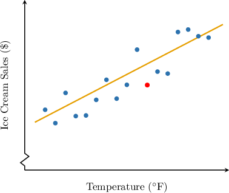
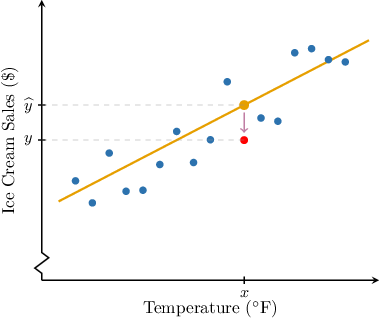
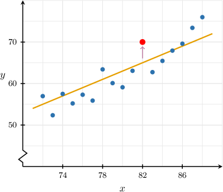
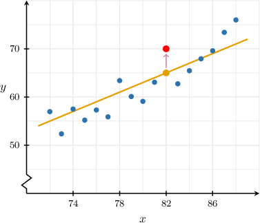
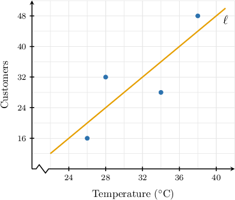
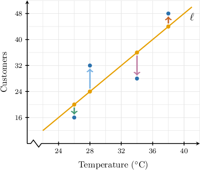
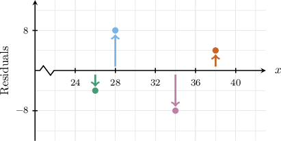
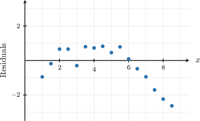
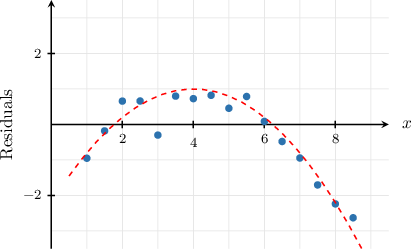

# Residuals and Residual Plots

Source: https://www.mathacademy.com/topics/3595?courseId=73
Topic ID: 3595

## Prerequisites

- [Making Predictions Using Trend Lines](../algebra-i/3753-making-predictions-using-trend-lines.md)

## Lesson

### Introduction

Given a dataset of paired numerical observations $(x,y)$ and the corresponding linear regression model $\widehat{y} =f(x),$ the **residual** for a particular observation $(x, y)$ is defined as

$$

\begin{aligned}Residual & =Actual−Estimated \\ & =𝑦−𝑓(𝑥) \\ & =𝑦−\overset{𝑦}{ˆ}.\end{aligned}

$$

We subtract the *estimated* value predicted by the model from the actual *observed* value.

To illustrate this concept graphically, consider the following example.

The owner of an ice cream shop keeps track of the average daily temperature $x$ (measured in $^\circ \mathrm{F}$) and the resulting daily ice cream sales $y$ (in dollars). The scatter plot for several randomly selected days and the corresponding linear regression line are shown below.

Suppose the equation of the regression line is

$$

y= 2.5 x +165.

$$

Let's use our regression line to compute the residual of the point with coordinates $\color{red}(82, 360)$ (shown in red on our graph).

First, notice that since the highlighted data point has coordinates ${\color{red}(82, 360)},$ our actual value is $y = {\color{red}360}.$

Next, we compute the predicted value using our linear regression model:

$$

\begin{aligned}\overset{𝑦}{ˆ} & =2.5𝑥+165 \\ & =2.5(82)+165 \\ & =370\end{aligned}

$$

Finally, we compute the residual:

$$

\begin{aligned}Residual & =Actual−Estimated \\ & =𝑦−\overset{𝑦}{ˆ} \\ & =360−370 \\ & =−10.\end{aligned}

$$

The residual tells us that the linear model *overestimates* the true volume of ice cream sales by $10$ when the outside temperature is $82^\circ\,\textrm{F}.$

### Example: Computing Residuals Using the Regression Line Equation

#### Question

Consider the data sets $x$ and $y$ of paired observations. The equation of the corresponding linear regression line for this data is

$$

y=0.5x+7.

$$

According to the model, what is the residual at $x=6$ if the actual value of $y$ corresponding to this value of $x$ is $12?$

#### Explanation

The residual equals the difference between the actual value of the dependent variable and the value estimated using the linear regression model:

$$

\textrm{Residual} = \text{Actual} - \textrm{Estimated}

$$

First, we compute the predicted value using our linear regression model:

$$

\begin{aligned}\overset{𝑦}{ˆ} & =0.5𝑥+7 \\ & =0.5(6)+7 \\ & =10\end{aligned}

$$

Therefore, the residual is

$$

\begin{aligned}Residual & =Actual−Estimated \\ & =𝑦−\overset{𝑦}{ˆ} \\ & =12−10 \\ & =2.\end{aligned}

$$

### Example: Determining Residuals From a Graph

#### Question

The scatter plot for the data sets $x$ and $y$ of paired observations and the corresponding linear regression line are shown above. According to the regression model, what is the residual for the highlighted datapoint?

#### Explanation

The residual equals the difference between the actual value of the dependent variable and the value estimated using the linear regression model:

$$

\textrm{Residual} = \text{Actual} - \textrm{Estimated}

$$

The highlighted datapoint has coordinates $(82,70).$ So, our actual value is $y=70.$

On the other hand, the point on the regression line that corresponds to $x=82$ has the $y$-coordinate $65.$ So, our estimated value is $\widehat{y}=65.$

As a result,

$$

\begin{aligned}Residual & =Actual−Estimated \\ & =𝑦−\overset{𝑦}{ˆ} \\ & =70−65 \\ & =5.\end{aligned}

$$

Therefore, the residual is $5.$

### Residual Plots

A **residual plot** displays the values of the independent variable along the horizontal axis and the residuals along the vertical axis.

The scatter plot below represents data from a four-day sample on the number of people visiting a swimming pool and the average daytime temperature, in degrees Celsius. The line $\ell$ is the corresponding linear regression line.

These residuals for each of the four data points are highlighted below:

If we calculate the numerical values for the residuals at each data point (from left to right), we get the following results:

$$

-4, \quad 8, \quad -8, \quad 4

$$

To compute our residual plot, we plot each $x$-value and its corresponding residual on some coordinate axes:

### Properties of Residual Plots

We should be aware of the following interpretations for residual plots:

- Any point *above* the horizontal axis represents a *positive* residual. A positive residual means that the regression model *underestimates* the observed value for $y$ at this point.

- Any point *below* the horizontal axis represents a *negative* residual. A negative residual means that the regression model *overestimates* the observed value for $y$ at this point.

Residual plots can also be used to assess whether a trend line is a "good" fit for the corresponding data:

- If a linear trend line is a good fit for the data, the residuals should be scattered randomly above and below the horizontal axis and be relatively close to zero.

- In cases where the residuals show some clear pattern, this usually indicates that the data has no linear trend.

The residuals are scattered randomly about the horizontal axis in our last example. However, they are not close to zero, indicating that the trend line is a weak fit for the data.

### Example: Interpreting Residual Plots

#### Question

The residual plot above was constructed after fitting a linear regression model on a set of bivariate numerical data $(x,y).$ Which of the following statements are true?

1. When $x=4,$ the regression equation underestimates the value of $y.$

2. The residuals appear to be randomly scattered about the horizontal axis (there are no obvious trends).

3. This linear regression is probably a good fit for the data.

#### Explanation

Let's examine the statements in turn.

- Statement I is true. The residual equals the actual value minus the estimated value: From the plot, the residual at $x=4$ is positive. So, we have that $\text{Actual} > \textrm{Estimated},$ and therefore the model underestimates this data point.

- Statement II is false. The plot shows the residuals tend to decrease as $x$ increases. So, there is a trend, as shown below.

- Statement III is false. Since the residuals are ** randomly scattered above and below the horizontal axis, our regression line is ** a good fit for the given data.

Therefore, the correct answer is "I only."
