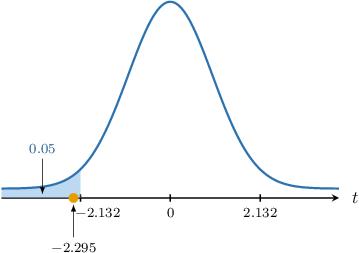
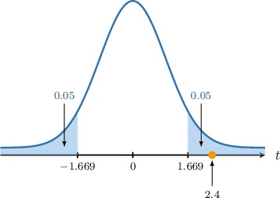
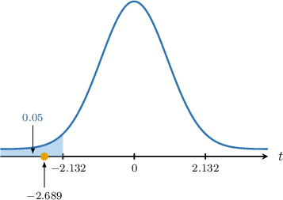

# Hypothesis Tests for Two Means: Paired-Sample T-Test

Source: https://www.mathacademy.com/topics/4944?courseId=73
Topic ID: 4944

## Prerequisites

- [Hypothesis Tests for One Mean: Unknown Population Variance](./3311-hypothesis-tests-for-one-mean-unknown-population-variance.md)
- [Hypothesis Tests for Two Means: Paired-Sample Z-Test](./3312-hypothesis-tests-for-two-means-paired-sample-z-test.md)

## Lesson

### Introduction

In a previous lesson, we learned that given two *paired* samples of size $n{:}$

$$

X_1, X_2, \ldots, X_n, \qquad Y_1, Y_2, \ldots, Y_n,

$$

we can reduce this to a set of single-sample observations by defining the difference between each observation as

$$

D_i = X_i - Y_i.

$$

If we assume that the differences are independent and identically distributed (I.I.D), then we have two cases:

- If each $D_i$ is normally distributed, then the distribution of the sample mean $\overline D$ is given by where $\mu$ is the population mean of $D_i,$ and $\sigma^2$ is the population variance of $D_i.$

- If each $D_i$ is not normally distributed but the sample size is large, then by the central limit theorem,

In either case, we can conduct the following right-tailed hypothesis test for the mean difference $\mu{:}$

- $H_0: \mu = 0$

- $H_1: \mu > 0$

Alternatively, we can conduct a left-tailed test:

- $H_0: \mu = 0$

- $H_1: \mu < 0$

We can also conduct a two-tailed test:

- $H_0: \mu = 0$

- $H_1: \mu \neq 0$

In most practical situations, $\sigma^2$ is unknown, so we must use the sample variance $S^2.$ This introduces additional variability, and the resulting random variable:

$$

T = \dfrac{\overline D - \mu}{S/\sqrt n}

$$

follows a $t$-distribution with $n-1$ degrees of freedom. This is *exact* if $D_i$ is normally distributed and *approximate* in the large sample case.

We can use this result to conduct hypothesis tests in the same way as before. Let's see some examples.

### Example: Hypothesis Tests for Means of Paired-Samples: One-Tailed Tests

#### Question

Consider a sample $x_1, x_2, x_3, x_4, x_5$ from a random variable $X,$ and a sample $y_1, y_2, y_3, y_4, y_5$ from a random variable $Y,$ shown in the table above. Given that the two samples are paired, and $D=X-Y$ follows a normal distribution with unknown mean $\mu$ and unknown variance $\sigma^2,$ carry out a hypothesis test at the $5\%$ significance level to determine whether there is sufficient evidence that $\mu \lt 0.$

**

#### Explanation

Note that the samples are paired, and the differences between each pair of observations are normally distributed with unknown mean and variance.

In cases like this, the random variable

$$

\dfrac {\overline{D} - \mu}{S / \sqrt{n}}

$$

can be approximated by the student's $t$-distribution $T_{n-1}$ with $n-1$ degrees of freedom, where

- $\overline{D}$ is the sample mean of the differences,

- $\mu$ is the population mean of $D,$

- $S^2$ is the sample variance of the differences, and

- $n$ is the sample size.

We also have the following point estimate for $\mu{:}$

$$

\overline{d}=\overline{x}-\overline{y} = \dfrac1n \sum_{i} d_i

$$

In our example:

- $H_0: \mu = 0$ is the null hypothesis

- $H_1: \mu \lt 0$ is the alternative (one-tailed) hypothesis

Now, we compute the differences in the paired observations:

Then, we find a point estimate for $\mu{:}$

$$

\overline{d} = \dfrac{0-5-0-5-8}{5} = -3.6

$$

Next, we compute our point estimate $s^2$ of $\sigma^2$ (remember to divide by $n-1$):

$$

\begin{aligned}𝑠^{2} & =\frac{(0+3.6)^{2}+(−5+3.6)^{2}+(0+3.6)^{2}+(−5+3.6)^{2}+(−8+3.6)^{2}}{4} \\ & =12.3\end{aligned}

$$

Assuming the null hypothesis, i.e., $\mu=0,$ we compute the test statistic:

$$

\begin{aligned}𝑡 & =\frac{\overset{𝑑}{–}−𝜇}{𝑠/\sqrt{√𝑛}} \\ & =\frac{−3.6−0}{\sqrt{√12.3}/\sqrt{√5}} \\ & ≈−2.295\end{aligned}

$$

According to the table, the $5\%$ one-tailed critical value for $n=5-1=4$ degrees of freedom is $t \approx 2.132.$ Since the alternative hypothesis is $\mu \lt 0,$ we must consider the left tail. So, our critical region is

$$

T \leq \boxed{\color{blue}-2.132}.

$$

Our test statistic ($-2.295$) lies in the critical region, as shown below.

So, we reject the null hypothesis $H_0.$ As a result, we conclude the following:

$\qquad$ There is $\boxed{\color{blue}\textrm{sufficient}}$ evidence that, at the $5\%$ level of significance, we have $\mu \lt 0.$

### Example: Hypothesis Tests for Means of Paired-Samples: Two-Tailed Tests

#### Question

Consider two paired samples of size $n=64$ from the random variables $X$ and $Y.$ Given that the mean of the differences $d_i = x_i - y_i$ is $\overline{d} = 1.8,$ and the variance of those differences is $s^2=6^2,$ carry out a hypothesis test at the $10\%$ significance level to determine whether there is sufficient evidence that $\mu \neq 0,$ where $\mu$ is the mean of $D=X-Y.$

**

#### Explanation

We do not know the distribution of the difference $D,$ nor do we know the population variance $\sigma^2.$ However, the sample size $n = 64\geq 30$ is **.

In cases like this, the random variable

$$

\dfrac{\overline{D} - \mu}{S/\sqrt n}

$$

can be approximated by the student's $t$-distribution $T_{n-1}$ with $n-1$ degrees of freedom, where

where

- $\overline{D}$ is the sample mean of the differences,

- $\mu$ is the population mean of the variable $D,$

- $S^2$ is the sample variance of the differences, and

- $n$ is the sample size.

We also have the following point estimate for $\mu{:}$

$$

\overline{d}=\overline{x}-\overline{y}

$$

In our example:

- $H_0: \mu = 0$ is the null hypothesis

- $H_1: \mu \neq 0$ is the alternative (two-tailed) hypothesis

Assuming the null hypothesis, i.e., $\mu=0,$ we compute the test statistic:

$$

\begin{aligned}𝑡 & =\frac{\overset{𝑑}{–}−𝜇}{𝑠/\sqrt{√𝑛}} \\ & =\frac{1.8−0}{6/\sqrt{√64}} \\ & =2.4\end{aligned}

$$

According to the table, the $10\%$ two-tailed critical value for $k=64-1=63$ degrees of freedom (the same as the $10\% \div 2 = 5\%$ one-tailed critical value) is $t \approx 1.669.$ Since we are considering both tails, our critical region is

$$

T \leq \boxed{\color{blue}-1.669} \qquad \textrm{or} \qquad T \geq \boxed{\color{blue}1.669}.

$$

Our test statistic ($2.4$) lies in the critical region, as shown below.

So, we reject the null hypothesis $H_0.$ As a result, we conclude the following:

$\qquad$ There is $\boxed{\color{blue}\textrm{sufficient}}$ evidence that, at the $10\%$ level of significance, we have $\mu \neq 0.$

### Example: Hypothesis Tests for Means of Paired-Samples: Applications

#### Question

An observer recorded the times it takes five contestants to eat their first and last cookie in a cookie-eating contest. The contestants' times (in seconds) are represented in the table above. The differences between the two observations are normally distributed with unknown means and variance $\mu$ and $\sigma^2$, respectively.

Carry out a hypothesis test at the $5\%$ significance level to determine whether there is sufficient evidence that the time the contestants' took to eat a cookie slowed as they ate more cookies.

**

#### Explanation

Note that the samples are paired, and the differences between each pair of observations are normally distributed with unknown mean and variance.

In cases like this, the random variable

$$

\dfrac {\overline{D} - \mu}{S / \sqrt{n}}

$$

can be approximated by the student's $t$-distribution $T_{n-1}$ with $n-1$ degrees of freedom, where

- $\overline{D}$ is the sample mean of the differences,

- $\mu$ is the population mean of $D,$

- $S^2$ is the sample variance of the differences, and

- $n$ is the sample size.

We also have the following point estimate for $\mu{:}$

$$

\overline{d}=\overline{x}-\overline{y} = \dfrac1n \sum_{i} d_i

$$

In our example:

- $H_0: \mu = 0$ is the null hypothesis (the times remains the same)

- $H_1: \mu < 0$ is the alternative (one-tailed) hypothesis (the times slowed)

Now, we compute the differences in the paired observations:

Then, we find a point estimate for $\mu{:}$

$$

\overline{d} = \dfrac{-4+(-4)+(-5)+(-12)+0}{5} = -5

$$

Next, we compute our point estimate of $s^2$ of $\sigma^2$ (remember to divide by $n-1$):

$$

\begin{aligned}𝑠 & =\sqrt{√\frac{(−4−(−5))^{2}+(−4−(−5))^{2}+(−5−(−5))^{2}+(−12−(−5))^{2}+(0−(−5))^{2}}{4}} \\ & =\sqrt{√19}\end{aligned}

$$

Assuming the null hypothesis, i.e., $\mu=0,$ we compute the test statistic:

$$

\begin{aligned}𝑡 & =\frac{\overset{𝑑}{–}−𝜇}{𝑠/\sqrt{√𝑛}} \\ & =\frac{−5−0}{\sqrt{√19}/\sqrt{√5}} \\ & ≈−2.565\end{aligned}

$$

According to the table, the $5\%$ one-tailed critical value for $n=5-1=4$ degrees of freedom is $t \approx 2.132.$ Since the alternative hypothesis is $\mu \lt 0,$ we must consider the left tail. So, our critical region is

$$

T \leq \boxed{\color{blue}-2.132}.

$$

Our test statistic ($-2.689$) lies in the critical region, as shown below.

There is $\boxed{\color{blue}\textrm{sufficient}}$ evidence that, at the $5\%$ level of significance, we have that the contestants' times slowed the more cookies they ate.
