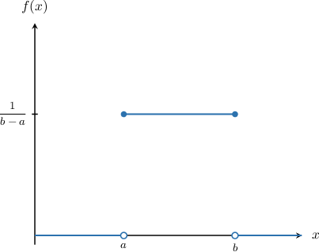

# The Continuous Uniform Distribution

Source: https://www.mathacademy.com/topics/791?courseId=73
Topic ID: 791

## Prerequisites

- [Continuous Random Variables Over Infinite Domains](./4100-continuous-random-variables-over-infinite-domains.md)

## Lesson

### Introduction

A continuous random variable $X$ follows a **continuous uniform distribution** on the interval $[a,b]$ if all values of $X$ are equally likely on $[a,b].$

Intuitively, the familiar statement "choose a random number between $a$ and $b$" can be translated as "observe a value from the continuous uniform distribution on $[a,b].$"

The probability density function for the continuous uniform distribution on an interval $[a,b]$ takes the following form:

$$

\begin{aligned}\frac{1}{𝑏−𝑎},\, & 𝑎≤𝑥≤𝑏, \\ 0,\, & otherwise\end{aligned}

$$

This corresponds to the following graph:

Notice that the probability density of the continuous uniform distribution on $[a,b]$ is just $1$ divided by the length of the interval. This ensures that our probability density function has the same value everywhere in the interval and integrates to $1{:}$

$$

\begin{aligned}∫_{𝑏𝑎}^{}\frac{1}{𝑏−𝑎}\,d𝑥 & =\frac{𝑥}{𝑏−𝑎}_{𝑏𝑎}^{} \\ & =\frac{𝑏−𝑎}{𝑏−𝑎} \\ & =1\,✓\end{aligned}

$$

When a random variable $X$ follows a continuous uniform distribution on the interval $[a,b],$ we often write

$$

X\sim U[a,b]

$$

and say that "$X$ is uniformly distributed on the interval $[a,b].$"

### Example: Computing a "Less Than" Probability for a Uniformly Distributed Continuous Random Variable

#### Question

Given that the continuous random variable $X$ is uniformly distributed on the interval $\left[0, 10\right],$ compute $P\left(X \leq 7\right).$

#### Explanation

The probability density function for a uniformly distributed continuous random variable $X$ on an interval $[a,b]$ is given by

$$

\begin{aligned}\frac{1}{𝑏−𝑎},\, & 𝑎≤𝑥≤𝑏, \\ 0,\, & otherwise.\end{aligned}

$$

Our random variable $X$ is uniformly distributed on the interval $\left[0, 10\right],$ so it has the following probability density function:

$$

\begin{aligned}\frac{1}{10},\, & 0≤𝑥≤10, \\ 0,\, & otherwise.\end{aligned}

$$

So, we have

$$

\begin{aligned}𝑃(𝑋≤7) & =𝑃(0≤𝑋≤7) \\ & =∫_{70}^{}𝑓(𝑥)\,d𝑥 \\ & =∫_{70}^{}\frac{1}{10}\,d𝑥 \\ & =\frac{7−0}{10} \\ & =\frac{7}{10}.\end{aligned}

$$

### Example: Computing the Probability of a Uniformly Distributed Random Variable Over an Interval

#### Question

Given that the continuous random variable $X$ is uniformly distributed on the interval $[-1, 4],$ compute $P(0< X < 3).$

#### Explanation

The probability density function for a uniformly distributed continuous random variable $X$ on an interval $[a,b]$ is given by

$$

\begin{aligned}\frac{1}{𝑏−𝑎},\, & 𝑎≤𝑥≤𝑏, \\ 0,\, & otherwise.\end{aligned}

$$

Our random variable $X$ is uniformly distributed on the interval $[-1,4],$ so it has the following probability density function:

$$

\begin{aligned}\frac{1}{5},\, & −1≤𝑥≤4, \\ 0,\, & otherwise.\end{aligned}

$$

So, we have

$$

\begin{aligned}𝑃(0<𝑋<3) & =𝑃(0<𝑋<3) \\ & =∫_{30}^{}𝑓(𝑥)\,d𝑥 \\ & =∫_{30}^{}\frac{1}{5}\,d𝑥 \\ & =\frac{3−0}{5} \\ & =\frac{3}{5}.\end{aligned}

$$

### Example: Computing a "Greater Than" Probability for a Uniformly Distributed Continuous Random Variable

#### Question

Given that the continuous random variable $Y$ is uniformly distributed on the interval $\left[1, 16\right],$ compute $P\left(Y \geq 10\right).$

#### Explanation

The probability density function for a uniformly distributed continuous random variable $Y$ on an interval $[a,b]$ is given by

$$

\begin{aligned}\frac{1}{𝑏−𝑎},\, & 𝑎≤𝑦≤𝑏, \\ 0,\, & otherwise.\end{aligned}

$$

Our random variable $Y$ is uniformly distributed on the interval $\left[1, 16\right],$ so it has the following probability density function:

$$

\begin{aligned}\frac{1}{15},\, & 1≤𝑦≤16, \\ 0,\, & otherwise.\end{aligned}

$$

So, we have

$$

\begin{aligned}𝑃(𝑌≥10) & =𝑃(10≤𝑌≤16) \\ & =∫_{1610}^{}𝑓(𝑦)\,d𝑦 \\ & =∫_{1610}^{}\frac{1}{15}\,d𝑦 \\ & =\frac{16−10}{15} \\ & =\frac{6}{15} \\ & =\frac{2}{5}.\end{aligned}

$$
