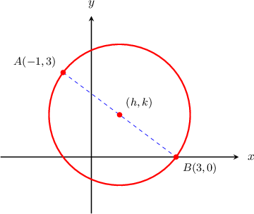
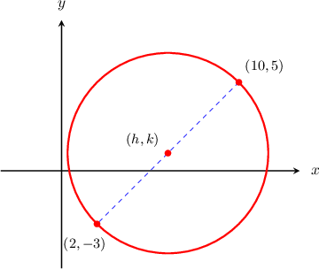
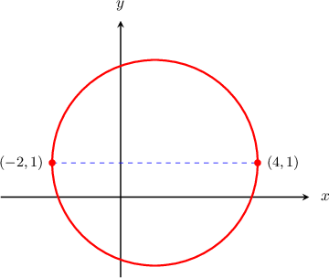

# Circles in the Coordinate Plane

Source: https://www.mathacademy.com/topics/1183?courseId=120
Topic ID: 1183

## Prerequisites

- [The Distance Formula](../geometry/459-the-distance-formula.md)
- [Midpoints in the Coordinate Plane](../geometry/485-midpoints-in-the-coordinate-plane.md)
- [Circles](../geometry/1404-circles.md)

## Lesson

### Introduction

Suppose that the points $A$ and $B$ have coordinates $(-1,3)$ and $(3,0),$ and are the endpoints of the diameter of a circle, shown below.

Since $\overline{AB}$ is a diameter of the circle, the center of the circle is the midpoint of $\overline{AB}.$ So, we can find the coordinates of the center using the midpoint formula:

$$

\begin{aligned}(ℎ,𝑘) & =(\frac{𝑥_{1}+𝑥_{2}}{2},\frac{𝑦_{1}+𝑦_{2}}{2}) \\ & =(\frac{3−1}{2},\frac{0+3}{2}) \\ & =(\frac{2}{2},\frac{3}{2}) \\ & =(1,1.5)\end{aligned}

$$

Therefore, the coordinates of the center of the circle are $(1,1.5).$

### Example: Determining the Center of a Circle on the Coordinate Plane Using the Midpoint Formula

#### Question

Find the coordinates $(h,k)$ of the center of the circle above given that the points $(2,-3)$ and $(10,5)$ lie on a diameter of the circle.

#### Explanation

The center of the circle is located at the midpoint of the diameter. Therefore, we can calculate it using the midpoint formula:

$$

\begin{aligned} (h,k) &= \left( \dfrac{x_1+x_2}{2}, \dfrac {y_1+y_2}{2}\right) \\[2pt] &= \left(\dfrac{10+2}2,\dfrac{5+(-3)}2\right) \\[2pt] &= \left(\dfrac{12}2,\dfrac{2}2\right) \\[2pt] &= (6, 1). \end{aligned}

$$

### The Radius of a Circle

Suppose that the points $(-2,1)$ and $(4,1)$ lie on a diameter of a circle. What is the radius of the circle?

We can find the length of the diameter using the distance formula:

$$

\begin{aligned}𝑑 & =\sqrt{√(𝑥_{1}−𝑥_{2})^{2}+(𝑦_{1}−𝑦_{2})^{2}} \\ & =\sqrt{√(−2−4)^{2}+(1−1)^{2}} \\ & =\sqrt{√(−6)^{2}} \\ & =6\end{aligned}

$$

The radius is half the diameter:

$$

r = \dfrac{d}{2} = \dfrac{6}{2}=3

$$

### Example: Finding the Radius of a Circle on the Coordinate Plane Using the Distance Formula

#### Question

The points $A$ and $B$ have coordinates $(-5,3)$ and $(-3,7)$, respectively, and the segment $\overline{AB}$ is a diameter of a circle. Find the radius of the circle.

#### Explanation

The diameter can be calculated using the distance formula:

$$

\begin{aligned}𝑑 & =\sqrt{√(𝑥_{1}−𝑥_{2})^{2}+(𝑦_{1}−𝑦_{2})^{2}} \\ & =\sqrt{√(−5−(−3))^{2}+(3−7)^{2}} \\ & =\sqrt{√(−2)^{2}+(−4)^{2}} \\ & =\sqrt{√4+16} \\ & =\sqrt{√20} \\ & =2\sqrt{√5}\end{aligned}

$$

The radius is half the diameter:

$$

r = \dfrac{d}{2} = \dfrac{2\sqrt{5}}{2} = \sqrt{5}

$$

### Example: Determining the Center and Radius of a Circle on the Coordinate Plane

#### Question

The segment $\overline{CD}$ is the diameter of a circle where the points $C$ and $D$ have coordinates $(7a,6a)$ and $(a,-2a)$, respectively, with $a>0.$ Find the coordinates of the center and the radius of the circle.

#### Explanation

The center of the circle is located at the midpoint of the diameter. So, we can calculate the coordinates of the center using the midpoint formula:

$$

\begin{aligned}(ℎ,𝑘) & =(\frac{𝑥_{1}+𝑥_{2}}{2},\frac{𝑦_{1}+𝑦_{2}}{2}) \\ & =(\frac{7𝑎+𝑎}{2},\frac{6𝑎+(−2𝑎)}{2}) \\ & =(\frac{8𝑎}{2},\frac{4𝑎}{2}) \\ & =(4𝑎,2𝑎).\end{aligned}

$$

The radius can be found by calculating the distance between the center $(4a, 2a)$ and a point on the circle, such as $C(7a,6a)\mathbin{:}$

$$

\begin{aligned}𝑟 & =\sqrt{√(𝑥_{1}−𝑥_{2})^{2}+(𝑦_{1}−𝑦_{2})^{2}} \\ & =\sqrt{√(4𝑎−7𝑎)^{2}+(2𝑎−6𝑎)^{2}} \\ & =\sqrt{√(−3𝑎)^{2}+(−4𝑎)^{2}} \\ & =\sqrt{√9𝑎^{2}+16𝑎^{2}} \\ & =\sqrt{√25𝑎^{2}} \\ & =5|𝑎|.\end{aligned}

$$

Finally, since $a>0,$ we have that

$$

r = 5\vert a \vert = 5a.

$$

Therefore, the center of the circle is at $(4a, 2a)$ and the radius is $5a.$
