# Perpendicular Bisectors of Chords

Source: https://www.mathacademy.com/topics/1185?courseId=120
Topic ID: 1185

## Prerequisites

- [The Pythagorean Theorem](../geometry/433-the-pythagorean-theorem.md)
- [The SSS Congruence Criterion](../geometry/531-the-sss-congruence-criterion.md)
- [Circles](../geometry/1404-circles.md)
- [Medians and Centroids of Triangles](../geometry/1524-medians-and-centroids-of-triangles.md)
- [Heights of Triangles](../grade-7/1644-heights-of-triangles.md)

## Lesson

### Introduction

In this lesson, we'll learn about the two-way relationship between a chord and a radius (or diameter) passing through the midpoint of the chord.

Before we start, we need to note an important fact about isosceles triangles. Consider the isosceles triangle below.

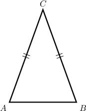

Let's draw the median $\overline{CM}$ of this triangle that bisects the base.

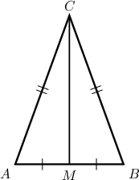

Notice that $\triangle AMC\cong\triangle BMC$ by the SSS criterion. So corresponding parts of congruent triangles give $\angle AMC = \angle BMC$. Since they are a linear pair, each must be a right angle.

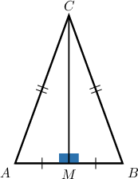

This means that the median $\overline{CM}$ is also the height of the triangle corresponding to the side $\overline{AB}.$

Conversely, we can also show that the altitude corresponding to the base bisects the base. Therefore, we have the following result:

*The median of a triangle is the same as its height precisely when the triangle is isosceles and the median is drawn from the apex to the base.*

Next, we’ll see how this symmetry shows that the radius to the midpoint of a chord is perpendicular to the chord.

### A Worked Example

Consider the circle below. Here, point $O$ is the center of the circle, and the diameter $\overline{DF}$ bisects chord $\overline{HJ}$ at point $K.$

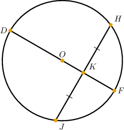

First, let's draw the radii $\overline{OH}$ and $\overline{OJ}.$ Doing this, we obtain the following figure.

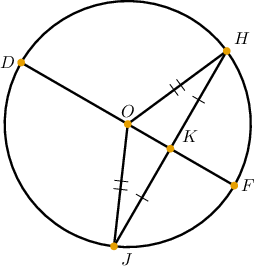

Now, note the following:

- Since $OH=OJ,$ we have that $\triangle HOJ$ is isosceles.

- In $\triangle HOJ,$ the segment $\overline{OK}$ is the median that bisects the base.

- Since $\triangle HOJ$ is isosceles, it follows that $\overline{OK}$ *is also a height* of the triangle, which means that $\overline{OK} \perp \overline{HJ}.$

Our updated diagram is given below.

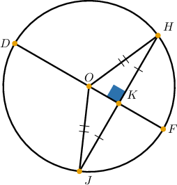

So, we have the following result:

*If a radius (diameter) bisects a chord of a circle, then the radius (diameter) is perpendicular to the chord.*

The converse is also true:

*If a radius (diameter) intersects a chord of a circle and is perpendicular to the chord, then the radius (diameter) bisects the chord.*

Let's see why it works in the next example.

### Example: Reasoning About Intersecting Diameters and Chords

#### Question

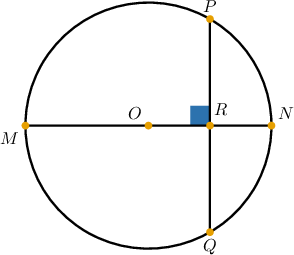

In the circle shown above, point $O$ is the center, diameter $\overline{MN}$ is perpendicular to chord $\overline{PQ}$ and intersects it at point $R.$ Explain why $\overline{OR}$ is a median of $\triangle OPQ.$

#### Explanation

First, let's draw the radii $\overline{OP}$ and $\overline{OQ}.$ Doing this, we obtain the following figure.

Since $OP=OQ,$ we have that $\triangle OPQ$ is isosceles. In this triangle, $OR$ is the height drawn to the base. Therefore, $\overline{OR}$ is also a median, and $PR = RQ.$

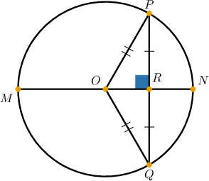

### Example: Finding the Length of a Chord When the Diameter Bisects the Chord

#### Question

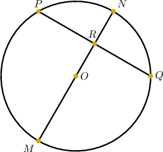

In the circle above, point $O$ is the center, and diameter $\overline{MN}$ bisects chord $\overline{PQ}$ at point $R.$ Find $PQ$ if the radius of the circle is $13 \: \text{cm}$ and $OR=5 \: \text{cm}.$

#### Explanation

First, let's draw the radii $\overline{OP}$ and $\overline{OQ}.$

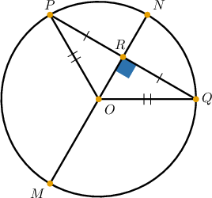

Since $OP = OQ,$ we have that $\triangle OPQ$ is isosceles. In this triangle, $\overline{OR}$ is the median drawn to the base. Thus, $\overline{OR}$ is also a height, and we get $\overline{OR} \perp \overline{PQ}.$

Now $\triangle ORQ$ is right. So, using the Pythagorean theorem, we have the following equation:

$$

\begin{aligned}𝑂𝑅^{2}+𝑅𝑄^{2} & =𝑂𝑄^{2} \\ (5)^{2}+𝑅𝑄^{2} & =(13)^{2} \\ 25+𝑅𝑄^{2} & =169 \\ 𝑅𝑄^{2} & =144 \\ 𝑅𝑄 & =12\end{aligned}

$$

Therefore, we have that

$$

\begin{aligned}𝑃𝑄 & =2𝑅𝑄 \\ & =2⋅12 \\ & =24\,cm.\end{aligned}

$$

### Example: Finding the Length of a Chord When the Diameter and Chord are Perpendicular

#### Question

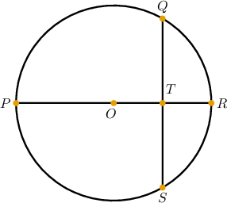

In the circle above, point $O$ is the center, and diameter $\overline{PR}$ is perpendicular to chord $\overline{QS}$ at point $T.$ Find $QS$ if the radius of the circle is $34 \: \text{cm}$ and $TR=18 \: \text{cm}.$

#### Explanation

First, let's draw the radii $\overline{OQ}$ and $\overline{OS}.$

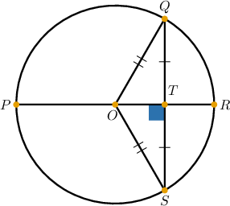

Since $OQ = OS,$ we have that $\triangle OSQ$ is isosceles. In this triangle, $\overline{OT}$ is the height drawn to the base. Thus, $\overline{OT}$ is also a median, and we get $TS = TQ.$

Now, we obtain that

$$

\begin{aligned}𝑂𝑇 & =𝑂𝑅−𝑇𝑅 \\ & =34−18 \\ & =16.\end{aligned}

$$

Finally, $\triangle OTS$ is right. So, using the Pythagorean theorem, we have the following equation:

$$

\begin{aligned}𝑂𝑇^{2}+𝑇𝑆^{2} & =𝑂𝑆^{2} \\ (16)^{2}+𝑇𝑆^{2} & =(34)^{2} \\ 256+𝑇𝑆^{2} & =1156 \\ 𝑇𝑆^{2} & =900 \\ 𝑇𝑆 & =\sqrt{√900} \\ & =30\end{aligned}

$$

Therefore, we have that

$$

\begin{aligned}𝑄𝑆 & =2𝑇𝑆 \\ & =2⋅30 \\ & =60\,cm.\end{aligned}

$$
