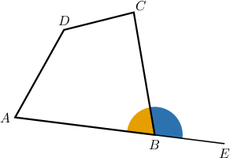
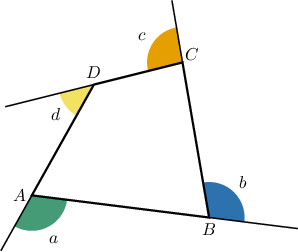
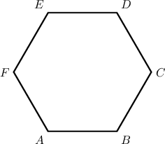
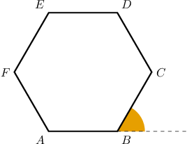
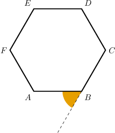
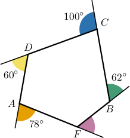
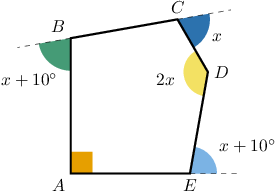
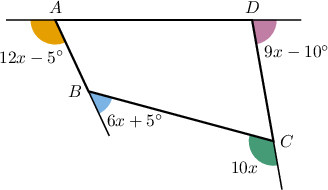

# Exterior Angles of Polygons

Source: https://www.mathacademy.com/topics/1321?courseId=120
Topic ID: 1321

## Prerequisites

- [Interior Angles of Polygons](../grade-8/1319-interior-angles-of-polygons.md)
- [Exterior Angles of Triangles](../grade-8/1458-exterior-angles-of-triangles.md)

## Lesson

### Introduction

Consider the polygon $ABCD$, where the side $\overline{AB}$ is extended beyond the vertex $B.$

We call $\color{blue}\angle{CBE}$ the **exterior angle** of the vertex $B$.

Given a polygon's vertex, the interior and exterior angles are supplementary. So, for the vertex $B,$ we have:

$$

\underbrace{\color{YellowOrange}m\angle{ABC}}_{\large\text{Interior}} \:+\: \underbrace{\color{blue}m\angle{CBE}}_{\large\text{Exterior}} = 180^\circ

$$

We have the following theorem:

The measures of the exterior angles of any simple polygon sum to $360^\circ.$

We'll show why this theorem is true at the end of the lesson.

Let's label the exterior angles of our polygon below:

According to our theorem, these four angles sum to $360^\circ.$

$$

a+b+c+d = 360^\circ

$$

### Example: Identifying Exterior Angles

#### Question

Consider the hexagon shown below. Draw an exterior angle of $\angle B.$

#### Explanation

To construct an exterior angle of $\angle B,$ we extend $\overline{AB}$ past $B.$ The angle between $\overline{BC}$ and the extension of $\overline{AB}$ is an exterior angle of $\angle B.$

Another way to construct an exterior angle of $\angle B$ is to extend $\overline{CB}$ past $B.$ The angle between $\overline{AB}$ and the extension of $\overline{CB}$ is also an exterior angle of $\angle B.$

### Example: Calculating Exterior Angles

#### Question

In the figure above, determine the measure of the exterior angle of $\angle{F}.$

#### Explanation

Let us call $x$ the exterior angle of $\angle F.$ Since the sum of the exterior angles of a polygon is $360^{\circ}$, we have

$$

\begin{aligned}100^{∘}+60^{∘}+78^{∘}+62^{∘}+𝑥 & =360^{∘} \\ 300^{∘}+𝑥 & =360^{∘} \\ 𝑥 & =360^{∘}−300^{∘} \\ 𝑥 & =60^{∘}.\end{aligned}

$$

### Example: Determining an Unknown Quantity Using Exterior Angles

#### Question

Find the value of $x.$

#### Explanation

Note that the measure of the exterior angle at $A$ is $180^\circ - 90^\circ=90^\circ$ and the measure of the exterior angle at $D$ is $180^\circ - 2x.$

Since the sum of the exterior angles of a polygon is $360^{\circ},$ we have

$$

\begin{aligned}90^{∘}+(𝑥+10^{∘})+(180^{∘}−2𝑥)+𝑥+(𝑥+10^{∘}) & =360^{∘} \\ 𝑥+290^{∘} & =360^{∘} \\ 𝑥 & =70^{∘}.\end{aligned}

$$

### Example: Calculating an Exterior Angle by Determining an Unknown Quantity

#### Question

For the quadrilateral above, determine the measure of the exterior angle of $\angle A.$

#### Explanation

Since the sum of the exterior angles of a polygon is $360^{\circ}$, we have

$$

\begin{aligned}(12𝑥−5^{∘})+(6𝑥+5^{∘})+(10𝑥)+(9𝑥−10^{∘}) & =360^{∘} \\ 37𝑥−10^{∘} & =360^{∘} \\ 37𝑥 & =360^{∘}+10^{∘} \\ 37𝑥 & =370^{∘} \\ 𝑥 & =10^{∘}.\end{aligned}

$$

Therefore, the measure of the exterior angle of $\angle A$ equals

$$

\begin{aligned}12𝑥−5^{∘} & =12(10^{∘})−5^{∘} \\ & =120^{∘}−5^{∘} \\ & =115^{∘}.\end{aligned}

$$

### Proving the Theorem

Why do the exterior angles of a polygon always sum to $360^\circ?$

Suppose we have an $n$-sided polygon. Then, we have the following:

- There are $n$ pairs of interior-exterior angles, each pair being supplementary (i.e., their measures add to $180^\circ).$

- Therefore, the sum of the measures of *all* interior-exterior pairs equals ${\color{blue}n\cdot 180^\circ}.$

- In a previous lesson, we saw that the sum of the *interior* angles equals ${\color{red}{(n-2)\cdot 180^\circ}}.$

Therefore, to get the sum of the *exterior* angles, we subtract ${\color{red}{(n-2)\cdot 180^\circ}}$ from ${\color{blue}n\cdot 180^\circ}$ as follows:

$$

\begin{aligned}Sum of Exterior Angles & =𝑛⋅180^{∘}−(𝑛−2)⋅180^{∘} \\ & =𝑛⋅180^{∘}−𝑛⋅180^{∘}+2⋅180^{∘} \\ & =𝑛⋅180^{∘}−𝑛⋅180^{∘}+2⋅180^{∘} \\ & =2⋅180^{∘} \\ & =360^{∘}\end{aligned}

$$

This proves that the sum of the exterior angles of a (simple) polygon equals $360^\circ.$
