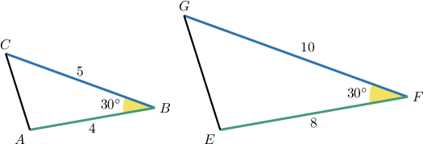
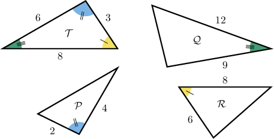
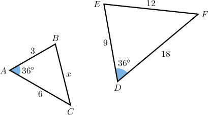
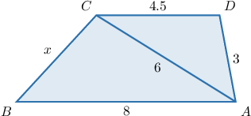
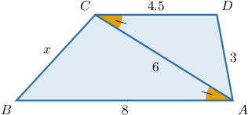
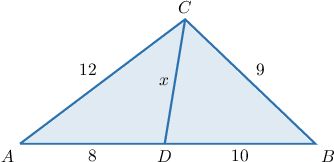
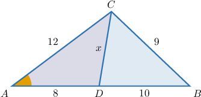

# The SAS Similarity Criterion

Source: https://www.mathacademy.com/topics/1366?courseId=120
Topic ID: 1366

## Prerequisites

- [Side Lengths and Angle Measures of Similar Polygons](../geometry/1367-side-lengths-and-angle-measures-of-similar-polygons.md)
- [Consecutive Angles](../grade-8/4104-consecutive-angles.md)

## Lesson

### Introduction

The **side-angle-side (SAS) similarity criterion** can be used as a shortcut to prove that two triangles are similar. It states the following:

*Two triangles are similar if the ratio of the lengths of two pairs of corresponding sides is the same, and the angles included by these sides are congruent.*

To demonstrate, consider the two triangles shown below.

We see that we have a pair of congruent angles,

$$

\angle{B}\cong \angle{F}.

$$

Also, the ratios of the side lengths that include these congruent angles are equal.

$$

\begin{aligned}\frac{𝐴𝐵}{𝐸𝐹} & =\frac{4}{8}=\frac{1}{2} \\ \frac{𝐵𝐶}{𝐹𝐺} & =\frac{5}{10}=\frac{1}{2}\end{aligned}

$$

Therefore, the SAS criterion guarantees that the two triangles are similar, and we can write

$$

\triangle ABC \sim \triangle EFG .

$$

### Example: Identifying Congruent Triangles Using the SAS Criterion

#### Question

According to the SAS criterion only, which of the following triangles are similar to $\mathcal{T}?$

#### Explanation

The SAS (side-angle-side) similarity criterion states the following:

Two triangles are similar if the ratio of the lengths of two pairs of corresponding sides is the same, and the angles included by these sides are congruent.

With that in mind, let's examine each of the given triangles.

- $\mathcal{P}$ is similar to $\mathcal{T}$ by SAS since the ratios of the lengths of the sides corresponding to the congruent angles are equal:

- $\mathcal{Q}$ is similar to $\mathcal{T}$ by SAS since the ratios of the lengths of the sides corresponding to the congruent angles are equal:

- $\mathcal{R}$ is ** similar to $\mathcal{T}$ by SAS since the ratios of the lengths of the sides corresponding to the congruent angles are not equal:

Therefore, the correct answer is "$\mathcal{P}$ and $\mathcal{Q}$ only."

### Example: Calculating the Length of a Side of a Triangle Using the SAS Criterion

#### Question

Given the triangles below, find the value of $x.$

#### Explanation

Notice that we have a pair of congruent angles:

$$

m\angle A = m\angle D=36^\circ

$$

Also, the lengths of the sides enclosing the congruent angles are in proportion:

$$

\begin{aligned}\frac{𝐴𝐵}{𝐷𝐸} & =\frac{𝐴𝐶}{𝐷𝐹} \\ \frac{3}{9} & =\frac{6}{18} \\ \frac{1}{3} & =\frac{1}{3}\end{aligned}

$$

Consequently, $\triangle ABC\sim \triangle DEF$ by the SAS similarity criterion.

Now, we can solve for $x.$ This gives

$$

\begin{aligned}\frac{𝐵𝐶}{𝐸𝐹} & =\frac{𝐴𝐶}{𝐷𝐹} \\ \frac{𝑥}{12} & =\frac{1}{3} \\ 𝑥 & =4\,.\end{aligned}

$$

### Example: Applying the SAS Criterion to Triangles Enclosed Between Parallel Lines

#### Question

Given that $\overline{AB} \parallel \overline{CD},$ find $x.$

#### Explanation

Since $\overline{AB} \parallel \overline{CD},$ we have that

$$

\angle ACD \cong \angle CAB

$$

since they are alternate interior angles.

Moreover, the lengths of the sides enclosing the congruent angles are in proportion:

$$

\begin{aligned}\frac{𝐴𝐵}{𝐴𝐶} & =\frac{8}{6}=\frac{4}{3} \\ \frac{𝐴𝐶}{𝐶𝐷} & =\frac{6}{4.5}=\frac{4}{3}\end{aligned}

$$

So, by the SAS similarity criterion, we have that $\triangle BAC\sim \triangle ACD.$ As a result, the ratios of all the corresponding sides must be the same. Therefore,

$$

\begin{aligned}\frac{𝐵𝐶}{𝐷𝐴} & =\frac{4}{3} \\ \frac{𝑥}{3} & =\frac{4}{3} \\ 𝑥 & =\frac{4}{3}⋅3 \\ & =4.\end{aligned}

$$

### Example: Applying the SAS Criterion to Triangles With a Common Angle

#### Question

Given the diagram below, find the value of $x.$

#### Explanation

First, notice that the triangles $\triangle CAB$ and $\triangle DAC$ have a common angle $\angle A.$

Moreover, the lengths of the sides enclosing the congruent angles are in proportion:

$$

\begin{aligned}\frac{𝐶𝐴}{𝐷𝐴} & =\frac{𝐴𝐵}{𝐴𝐶} \\ \frac{12}{8} & =\frac{10+8}{12} \\ \frac{3}{2} & =\frac{3}{2}\end{aligned}

$$

So, $\triangle CAB \sim \triangle DAC$ by the SAS similarity criterion. As a result, the ratios of all the corresponding sides must be the same. Therefore,

$$

\begin{aligned}\frac{𝐶𝐵}{𝐷𝐶} & =\frac{3}{2} \\ \frac{9}{𝑥} & =\frac{3}{2} \\ \frac{𝑥}{9} & =\frac{2}{3} \\ 𝑥 & =9⋅\frac{2}{3} \\ 𝑥 & =6.\end{aligned}

$$
