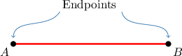
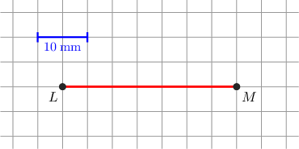
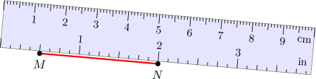

# Measures of Segments

Source: https://www.mathacademy.com/topics/1379?courseId=120
Topic ID: 1379

## Prerequisites

- [Units of Length](../grade-4/236-units-of-length.md)
- [Subtracting a Negative Number](../grade-7/297-subtracting-a-negative-number.md)
- [Points, Lines, Rays, and Segments](../grade-4/1378-points-lines-rays-and-segments.md)

## Lesson

### Introduction

A **line segment** is part of a line that's bounded by two points, called the **endpoints** of the segment. A line segment with endpoints $A$ and $B,$ like the one shown below, is denoted by $\overline{AB}.$

The **measure** of a line segment is its length. For a line segment $\overline{AB},$ the measure is denoted by $AB$ (with no line on top) to distinguish it from the line segment itself.

**Watch out!** The line segment $\overline{AB}$ and its measure $AB$ are *not* the same thing. The line segment $\overline{AB}$ is a geometric object, while its measure $AB$ (with no line on top) is a number. It's similar to how a person is a physical entity, while their height is a number.

**Note:** We could also express the segment as $\overline{BA},$ switching the order of the endpoints. The notations $\overline{BA}$ and $\overline{AB}$ represent the same exact segment. We could also write the length of the segment as $BA$ or $AB.$

### Example: Understanding Line Segment Notation

#### Question

Suppose that a line segment has a length of $2\,\textrm{m},$ and that $A$ and $B$ are its endpoints. Which of the following statements are true?

1. $\overline{AB} = 2\,\textrm{m}$

2. $\overline{BA} = 2\,\textrm{m}$

3. $AB = 2\,\textrm{m}$

#### Explanation

Let's check each statement in turn.

- Statement I is false. The notation $\overline{AB}$ represents the line segment itself, not the length of the line segment. Therefore, the expression ${\overline{AB}}=2\,\textrm{m}$ is not valid. Instead, it should say $AB = 2 \, \textrm{m}.$

- Statement II is false. Since $\overline{BA}$ represents the line segment itself, not the length of the line segment. Therefore, the expression ${\overline{BA}}=2\,\textrm{m}$ is not valid.

- Statement III is true. The notation $AB$ represents the length of the line segment $\overline{AB},$ and this line segments has a length of $2\,\textrm{m}.$ Therefore, is a correct statement.

Therefore, the correct answer is "III only".

### Example: Calculating the Measure of a Line Segment on a Grid

#### Question

What is the measure of the line segment $\overline{ML}$ shown below?

#### Explanation

Note that the length of a side of one cell is

$$

\dfrac{10\,\textrm{mm}}{2} = 5\,\textrm{mm}.

$$

The line segment has a length of $7$ cells, so the total measure is

$$

ML = 7 \cdot 5\,\textrm{mm} = 35\,\textrm{mm}.

$$

### Measuring a Line Segment

To measure a line segment, we use a ruler as follows:

1. Align the ruler along the line segment in such a way that one of the endpoints corresponds to the zero-mark on the ruler.

2. Read the measurements that correspond to the second endpoint of the segment.

Given that this particular ruler measures length in centimeters ($\textrm{cm}$), we conclude that

$$

AB = 5\,\textrm{cm}.

$$

### Example: Calculating the Measure of a Line Segment Using a Ruler

#### Question

The ruler shown below allows measuring length both in $\textrm{cm}$ (centimeters) and $\textrm{in}$ (inches). Determine the measure of the line segment $\overline{MN}.$

#### Explanation

Note that $M$ is not aligned with the zero-mark on the ruler.

To find the length, we read the values that correspond to the points $M$ and $N,$ and take the difference.

From the picture, we see that $M$ corresponds to $0.5\,\textrm{in}$ while $N$ corresponds to $2\,\textrm{in}.$

Therefore,

$$

\begin{aligned}𝑀𝑁=2\,in−0.5\,in=1.5\,in.\end{aligned}

$$

### Example: Calculating the Measure of a Line Segment on a Number Line

#### Question

Find the length of the line segment $\overline{AB}$ shown below.

#### Explanation

To find the length, we read the values that correspond to the points $A$ and $B$ and take the difference.

From the diagram, we see that $A$ corresponds to $10$ units while $B$ corresponds to $50$ units.

Therefore, we conclude that

$$

AB = 50 - 10 = 40\,\textrm{units}.

$$
